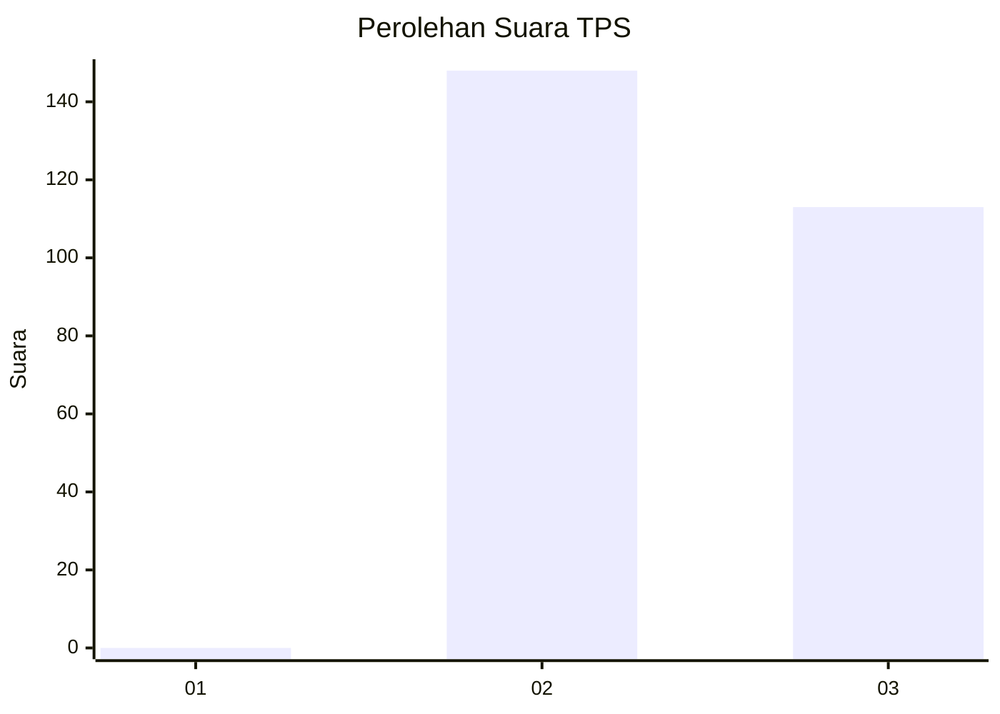
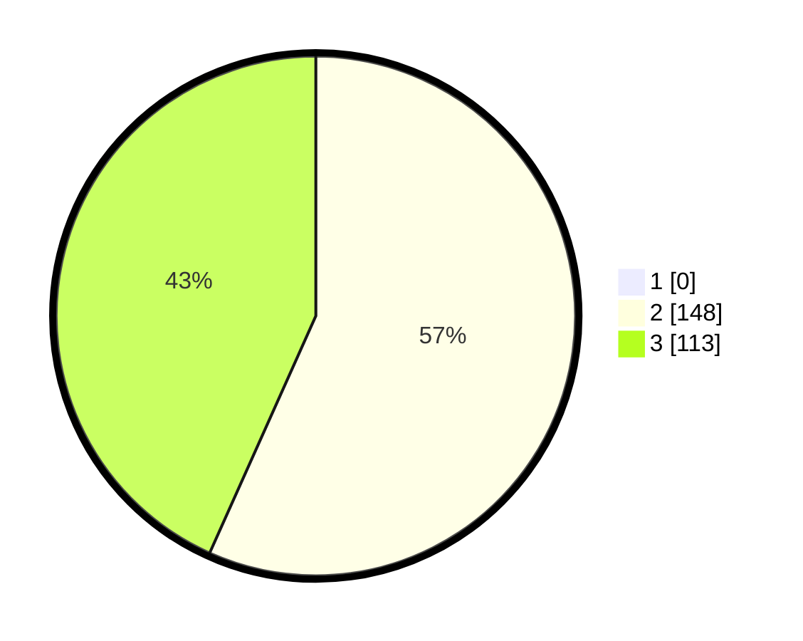

# Hasil

## Grafik

## Tabel

| No. | Nama Paslon    | Suara | Suara (raw) | Persentase |
|:--- |:-------------- | -----:| -----------:| ----------:|
| 1   | ANIES MUHAIMIN | 0     | [0][p-1]    | 0,00       |
| 2   | PRABOWO GIBRAN | 148   | [148][p-2]  | 56,70      |
| 3   | GANJAR MAHFUD  | 113   | [113][p-3]  | 43,30      |

[p-1]: https://github.com/gigit-pemilu/pemilu-2024-51-bali/blob/main/pilpres/hitung-suara/sub/51-bali/sub/04-gianyar/sub/06-tegallalang/sub/2005-pupuan/sub/014-tps/sub/paslon-1.txt
[p-2]: https://github.com/gigit-pemilu/pemilu-2024-51-bali/blob/main/pilpres/hitung-suara/sub/51-bali/sub/04-gianyar/sub/06-tegallalang/sub/2005-pupuan/sub/014-tps/sub/paslon-2.txt
[p-3]: https://github.com/gigit-pemilu/pemilu-2024-51-bali/blob/main/pilpres/hitung-suara/sub/51-bali/sub/04-gianyar/sub/06-tegallalang/sub/2005-pupuan/sub/014-tps/sub/paslon-3.txt

## Foto C Plano

https://sirekap-obj-formc.kpu.go.id/46f0/pemilu/ppwp/51/04/06/20/05/5104062005014-20240214-212507--e0bebea8-97bb-4a73-a636-bb97e8f1ba8e.jpg

https://sirekap-obj-formc.kpu.go.id/46f0/pemilu/ppwp/51/04/06/20/05/5104062005014-20240214-213110--ce0872f1-ae90-4157-8cd7-becc2481abd7.jpg

https://sirekap-obj-formc.kpu.go.id/46f0/pemilu/ppwp/51/04/06/20/05/5104062005014-20240214-213447--eaa942a5-b7e7-4945-bb64-0f0ae6fb34e7.jpg

## Metadata

| Key        | Value               |
| ---------- | ------------------- |
| Time Stamp | 2024-02-15 12:00:28 |

