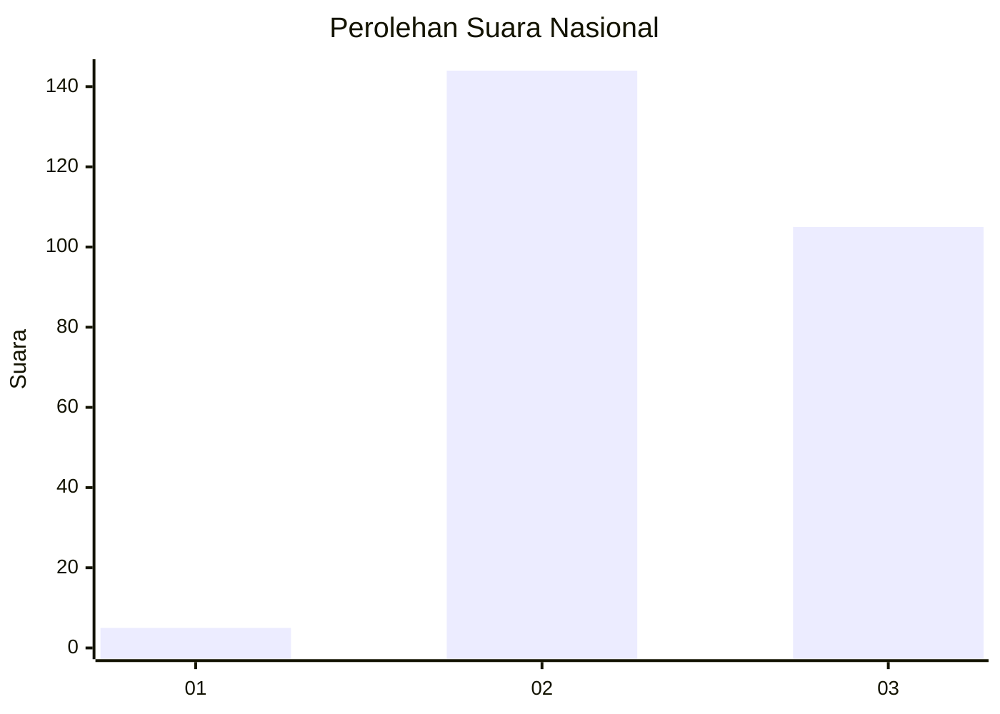
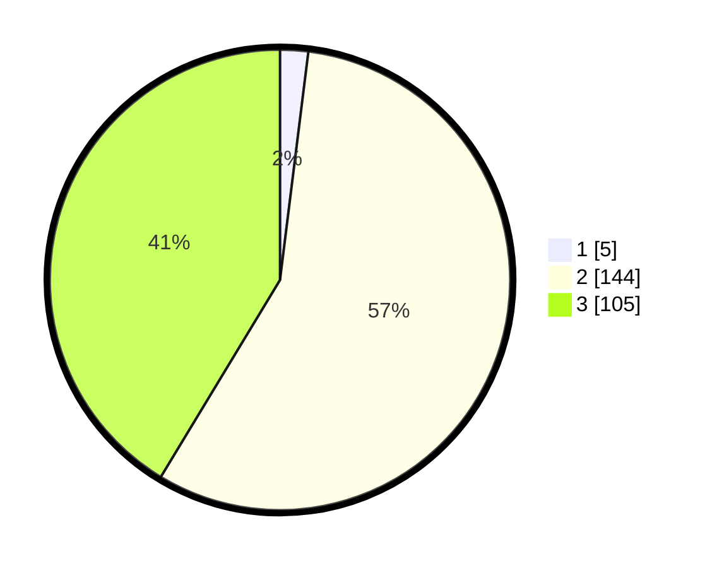

# Hasil

## Grafik

## Tabel

| No. | Nama Paslon    | Suara | Suara (raw) | Persentase |
|:--- |:-------------- | -----:| -----------:| ----------:|
| 1   | ANIES MUHAIMIN | 5     | [5][p-1]    | 1,97       |
| 2   | PRABOWO GIBRAN | 144   | [144][p-2]  | 56,69      |
| 3   | GANJAR MAHFUD  | 105   | [105][p-3]  | 41,34      |

[p-1]: https://github.com/gigit-pemilu/pemilu-2024/blob/main/pilpres/hitung-suara/sub/51-bali/sub/04-gianyar/sub/06-tegallalang/sub/2005-pupuan/sub/017-tps/sub/paslon-1.txt
[p-2]: https://github.com/gigit-pemilu/pemilu-2024/blob/main/pilpres/hitung-suara/sub/51-bali/sub/04-gianyar/sub/06-tegallalang/sub/2005-pupuan/sub/017-tps/sub/paslon-2.txt
[p-3]: https://github.com/gigit-pemilu/pemilu-2024/blob/main/pilpres/hitung-suara/sub/51-bali/sub/04-gianyar/sub/06-tegallalang/sub/2005-pupuan/sub/017-tps/sub/paslon-3.txt

## Foto C Plano

https://sirekap-obj-formc.kpu.go.id/2b1b/pemilu/ppwp/51/04/06/20/05/5104062005017-20240214-210228--b07ad340-db27-41ae-a435-8669aa1c2098.jpg

https://sirekap-obj-formc.kpu.go.id/2b1b/pemilu/ppwp/51/04/06/20/05/5104062005017-20240214-202742--79048b37-31d5-4475-9a34-99c53cbcbc36.jpg

https://sirekap-obj-formc.kpu.go.id/2b1b/pemilu/ppwp/51/04/06/20/05/5104062005017-20240214-203034--df81107f-a162-4b75-848d-98bb1b5afb13.jpg

## Metadata

| Key        | Value               |
| ---------- | ------------------- |
| Time Stamp | 2024-02-14 21:46:01 |

