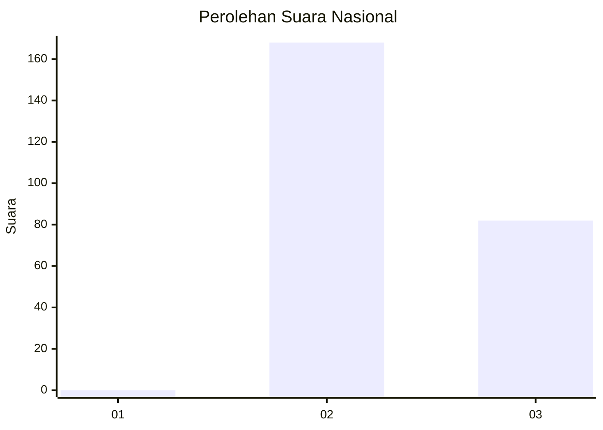
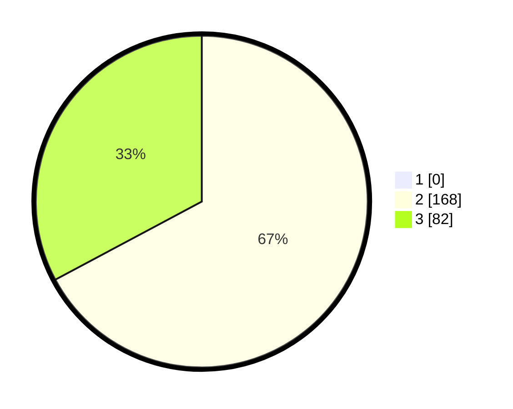

# Hasil

## Grafik

## Tabel

| No. | Nama Paslon    | Suara | Suara (raw) | Persentase |
|:--- |:-------------- | -----:| -----------:| ----------:|
| 1   | ANIES MUHAIMIN | 0     | [0][p-1]    | 0,00       |
| 2   | PRABOWO GIBRAN | 168   | [168][p-2]  | 67,20      |
| 3   | GANJAR MAHFUD  | 82    | [82][p-3]   | 32,80      |

[p-1]: https://github.com/gigit-pemilu/pemilu-2024/blob/main/pilpres/hitung-suara/sub/51-bali/sub/04-gianyar/sub/06-tegallalang/sub/2005-pupuan/sub/018-tps/sub/paslon-1.txt
[p-2]: https://github.com/gigit-pemilu/pemilu-2024/blob/main/pilpres/hitung-suara/sub/51-bali/sub/04-gianyar/sub/06-tegallalang/sub/2005-pupuan/sub/018-tps/sub/paslon-2.txt
[p-3]: https://github.com/gigit-pemilu/pemilu-2024/blob/main/pilpres/hitung-suara/sub/51-bali/sub/04-gianyar/sub/06-tegallalang/sub/2005-pupuan/sub/018-tps/sub/paslon-3.txt

## Foto C Plano

https://sirekap-obj-formc.kpu.go.id/d025/pemilu/ppwp/51/04/06/20/05/5104062005018-20240214-211508--74fc2741-5bdf-4f14-992d-42514ed75cb7.jpg

https://sirekap-obj-formc.kpu.go.id/d025/pemilu/ppwp/51/04/06/20/05/5104062005018-20240214-211710--29ea33ca-54c9-43fa-b8d2-2fa3033f73d3.jpg

https://sirekap-obj-formc.kpu.go.id/d025/pemilu/ppwp/51/04/06/20/05/5104062005018-20240214-211844--beeff4c0-51d1-4922-9794-b2e7bf166ea7.jpg

## Metadata

| Key        | Value               |
| ---------- | ------------------- |
| Time Stamp | 2024-02-15 12:00:28 |

