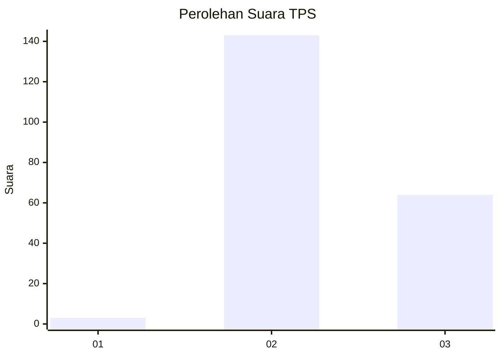

# Hasil

## Grafik

## Tabel

| No. | Nama Paslon    | Suara | Suara (raw) | Persentase |
|:--- |:-------------- | -----:| -----------:| ----------:|
| 1   | ANIES MUHAIMIN | 3     | [3][p-1]    | 1,43       |
| 2   | PRABOWO GIBRAN | 143   | [143][p-2]  | 68,10      |
| 3   | GANJAR MAHFUD  | 64    | [64][p-3]   | 30,48      |

[p-1]: https://github.com/gigit-pemilu/pemilu-2024-51-bali/blob/main/pilpres/hitung-suara/sub/51-bali/sub/04-gianyar/sub/06-tegallalang/sub/2005-pupuan/sub/020-tps/sub/paslon-1.txt
[p-2]: https://github.com/gigit-pemilu/pemilu-2024-51-bali/blob/main/pilpres/hitung-suara/sub/51-bali/sub/04-gianyar/sub/06-tegallalang/sub/2005-pupuan/sub/020-tps/sub/paslon-2.txt
[p-3]: https://github.com/gigit-pemilu/pemilu-2024-51-bali/blob/main/pilpres/hitung-suara/sub/51-bali/sub/04-gianyar/sub/06-tegallalang/sub/2005-pupuan/sub/020-tps/sub/paslon-3.txt

## Foto C Plano

https://sirekap-obj-formc.kpu.go.id/755a/pemilu/ppwp/51/04/06/20/05/5104062005020-20240214-213245--224297d4-3126-4289-86a9-b448426dd551.jpg

https://sirekap-obj-formc.kpu.go.id/755a/pemilu/ppwp/51/04/06/20/05/5104062005020-20240214-213230--e6458477-5e34-41bd-b25d-26b8c2344e3a.jpg

https://sirekap-obj-formc.kpu.go.id/755a/pemilu/ppwp/51/04/06/20/05/5104062005020-20240214-213209--09571338-4f62-43dd-a93a-deb945e1170d.jpg

## Metadata

| Key        | Value               |
| ---------- | ------------------- |
| Time Stamp | 2024-02-15 12:00:28 |

