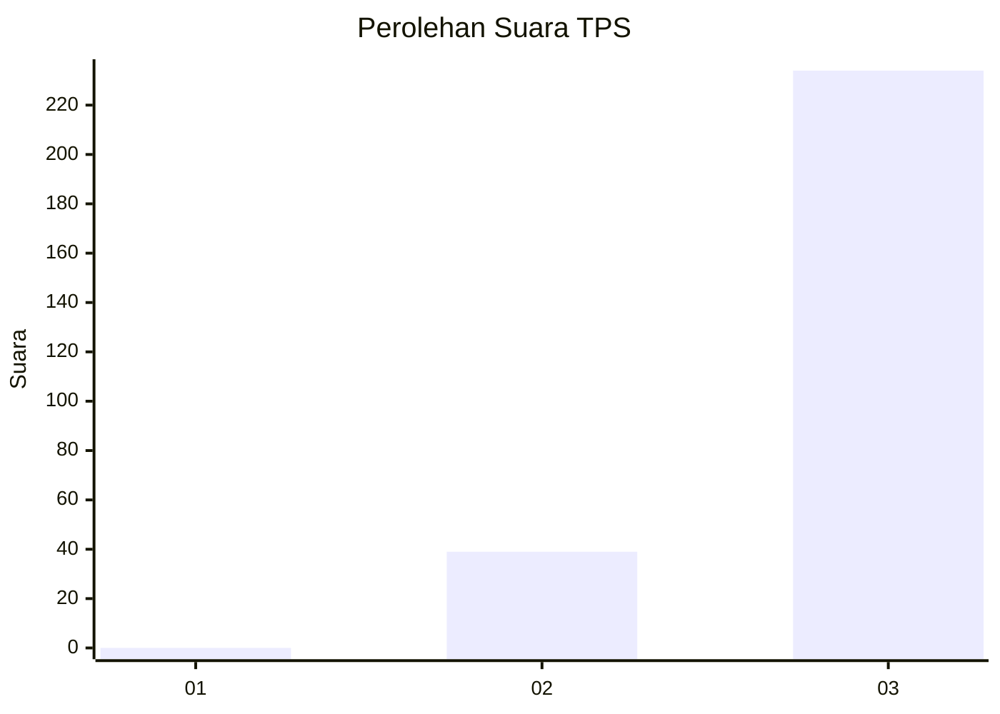
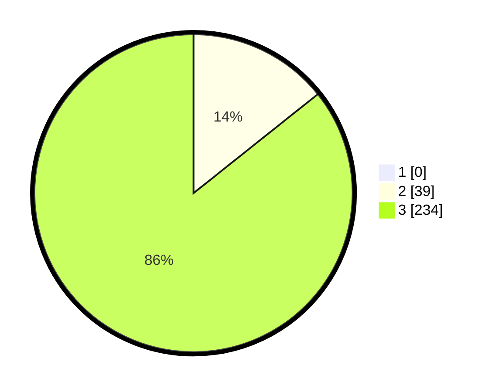

# Hasil

## Grafik

## Tabel

| No. | Nama Paslon    | Suara | Suara (raw) | Persentase |
|:--- |:-------------- | -----:| -----------:| ----------:|
| 1   | ANIES MUHAIMIN | 0     | [0][p-1]    | 0,00       |
| 2   | PRABOWO GIBRAN | 39    | [39][p-2]   | 14,29      |
| 3   | GANJAR MAHFUD  | 234   | [234][p-3]  | 85,71      |

[p-1]: https://github.com/gigit-pemilu/pemilu-2024-51-bali/blob/main/pilpres/hitung-suara/sub/51-bali/sub/04-gianyar/sub/06-tegallalang/sub/2006-sebatu/sub/001-tps/sub/paslon-1.txt
[p-2]: https://github.com/gigit-pemilu/pemilu-2024-51-bali/blob/main/pilpres/hitung-suara/sub/51-bali/sub/04-gianyar/sub/06-tegallalang/sub/2006-sebatu/sub/001-tps/sub/paslon-2.txt
[p-3]: https://github.com/gigit-pemilu/pemilu-2024-51-bali/blob/main/pilpres/hitung-suara/sub/51-bali/sub/04-gianyar/sub/06-tegallalang/sub/2006-sebatu/sub/001-tps/sub/paslon-3.txt

## Foto C Plano

https://sirekap-obj-formc.kpu.go.id/4580/pemilu/ppwp/51/04/06/20/06/5104062006001-20240214-232614--1a6e96f9-bea1-45cb-b115-cab434e941f0.jpg

https://sirekap-obj-formc.kpu.go.id/4580/pemilu/ppwp/51/04/06/20/06/5104062006001-20240214-141812--c42ba37e-401b-4690-8654-47d976ffb30b.jpg

https://sirekap-obj-formc.kpu.go.id/4580/pemilu/ppwp/51/04/06/20/06/5104062006001-20240214-141714--f885fe3d-4813-4a35-b77a-887b3a4f47f9.jpg

## Metadata

| Key        | Value               |
| ---------- | ------------------- |
| Time Stamp | 2024-02-15 00:41:44 |

