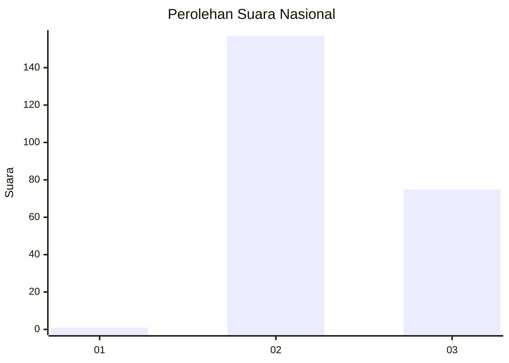
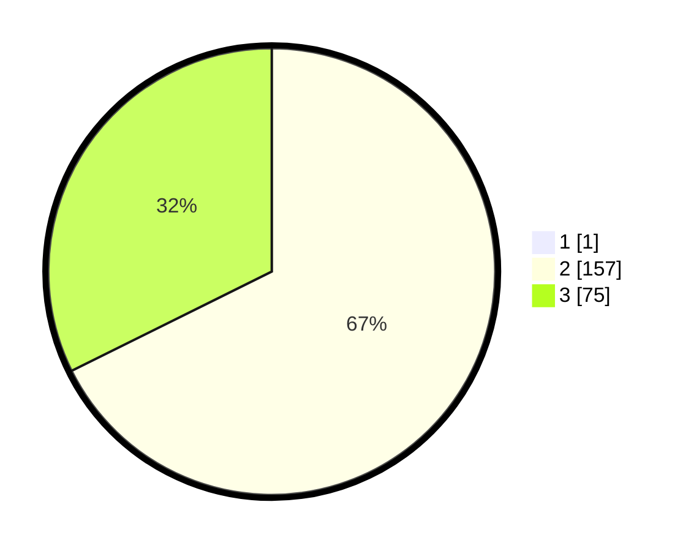

# Hasil

## Grafik

## Tabel

| No. | Nama Paslon    | Suara | Suara (raw) | Persentase |
|:--- |:-------------- | -----:| -----------:| ----------:|
| 1   | ANIES MUHAIMIN | 1     | [1][p-1]    | 0,43       |
| 2   | PRABOWO GIBRAN | 157   | [157][p-2]  | 67,38      |
| 3   | GANJAR MAHFUD  | 75    | [75][p-3]   | 32,19      |

[p-1]: https://github.com/gigit-pemilu/pemilu-2024/blob/main/pilpres/hitung-suara/sub/51-bali/sub/04-gianyar/sub/06-tegallalang/sub/2006-sebatu/sub/007-tps/sub/paslon-1.txt
[p-2]: https://github.com/gigit-pemilu/pemilu-2024/blob/main/pilpres/hitung-suara/sub/51-bali/sub/04-gianyar/sub/06-tegallalang/sub/2006-sebatu/sub/007-tps/sub/paslon-2.txt
[p-3]: https://github.com/gigit-pemilu/pemilu-2024/blob/main/pilpres/hitung-suara/sub/51-bali/sub/04-gianyar/sub/06-tegallalang/sub/2006-sebatu/sub/007-tps/sub/paslon-3.txt

## Foto C Plano

https://sirekap-obj-formc.kpu.go.id/6b79/pemilu/ppwp/51/04/06/20/06/5104062006007-20240214-220151--caf40afe-781f-4af7-8399-e1b91a43f7a3.jpg

https://sirekap-obj-formc.kpu.go.id/6b79/pemilu/ppwp/51/04/06/20/06/5104062006007-20240214-220337--7110904e-911d-4118-b4f5-38d5a97b2e40.jpg

https://sirekap-obj-formc.kpu.go.id/6b79/pemilu/ppwp/51/04/06/20/06/5104062006007-20240214-220423--945a6f3e-c52f-47e8-b729-91f4e8222383.jpg

## Metadata

| Key        | Value               |
| ---------- | ------------------- |
| Time Stamp | 2024-02-15 15:00:29 |

