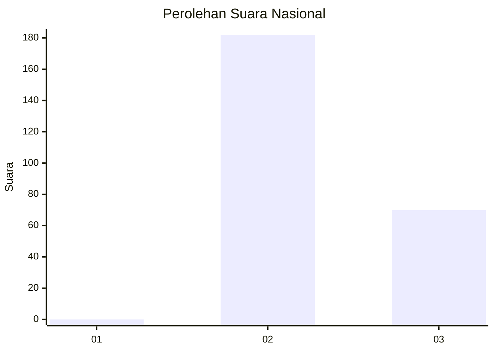
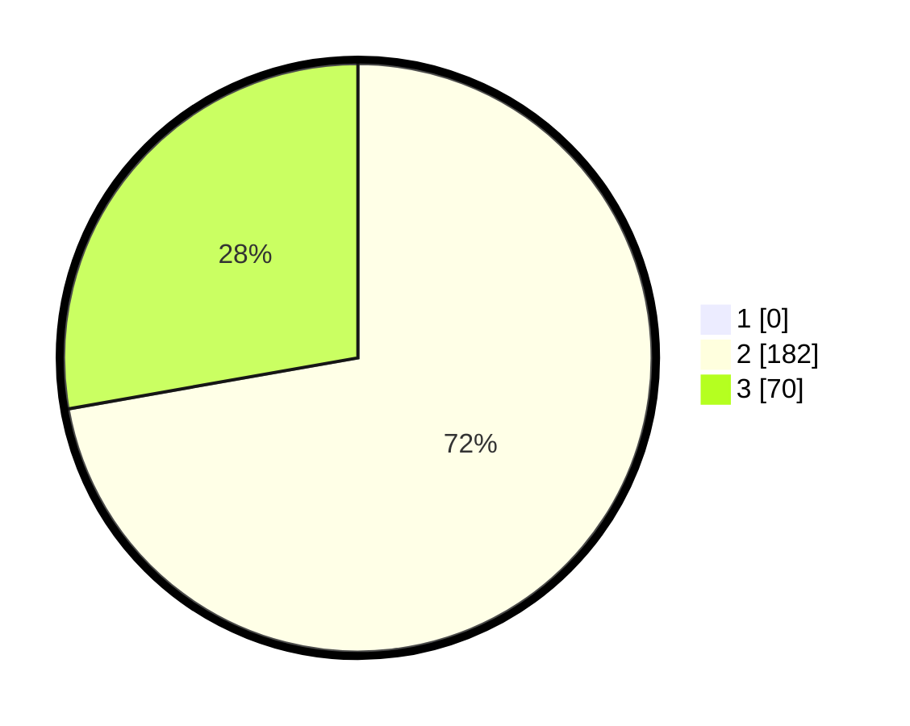

# Hasil

## Grafik

## Tabel

| No. | Nama Paslon    | Suara | Suara (raw) | Persentase |
|:--- |:-------------- | -----:| -----------:| ----------:|
| 1   | ANIES MUHAIMIN | 0     | [0][p-1]    | 0,00       |
| 2   | PRABOWO GIBRAN | 182   | [182][p-2]  | 72,22      |
| 3   | GANJAR MAHFUD  | 70    | [70][p-3]   | 27,78      |

[p-1]: https://github.com/gigit-pemilu/pemilu-2024/blob/main/pilpres/hitung-suara/sub/51-bali/sub/04-gianyar/sub/06-tegallalang/sub/2006-sebatu/sub/008-tps/sub/paslon-1.txt
[p-2]: https://github.com/gigit-pemilu/pemilu-2024/blob/main/pilpres/hitung-suara/sub/51-bali/sub/04-gianyar/sub/06-tegallalang/sub/2006-sebatu/sub/008-tps/sub/paslon-2.txt
[p-3]: https://github.com/gigit-pemilu/pemilu-2024/blob/main/pilpres/hitung-suara/sub/51-bali/sub/04-gianyar/sub/06-tegallalang/sub/2006-sebatu/sub/008-tps/sub/paslon-3.txt

## Foto C Plano

https://sirekap-obj-formc.kpu.go.id/b7d4/pemilu/ppwp/51/04/06/20/06/5104062006008-20240214-190409--cd77a35c-3eb4-4b42-83c2-c75a64bc33bd.jpg

https://sirekap-obj-formc.kpu.go.id/b7d4/pemilu/ppwp/51/04/06/20/06/5104062006008-20240214-190349--1f3bdc66-90a4-4200-bdd7-834264185807.jpg

https://sirekap-obj-formc.kpu.go.id/b7d4/pemilu/ppwp/51/04/06/20/06/5104062006008-20240214-160108--2fb80457-0be8-4f47-9b91-d09660f911c9.jpg

## Metadata

| Key        | Value               |
| ---------- | ------------------- |
| Time Stamp | 2024-02-15 12:00:28 |

