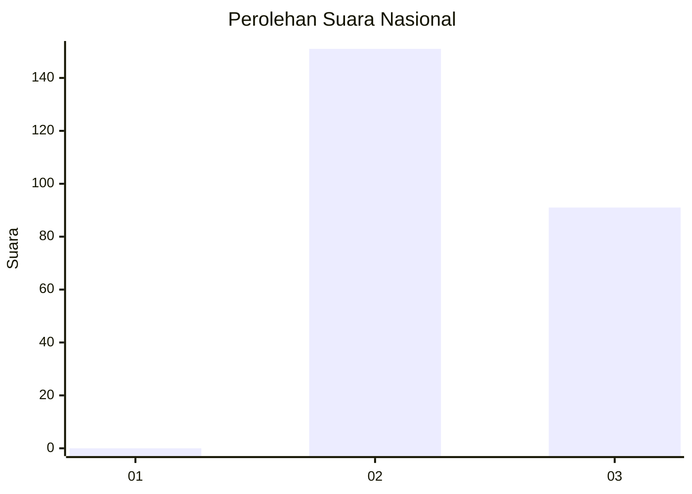
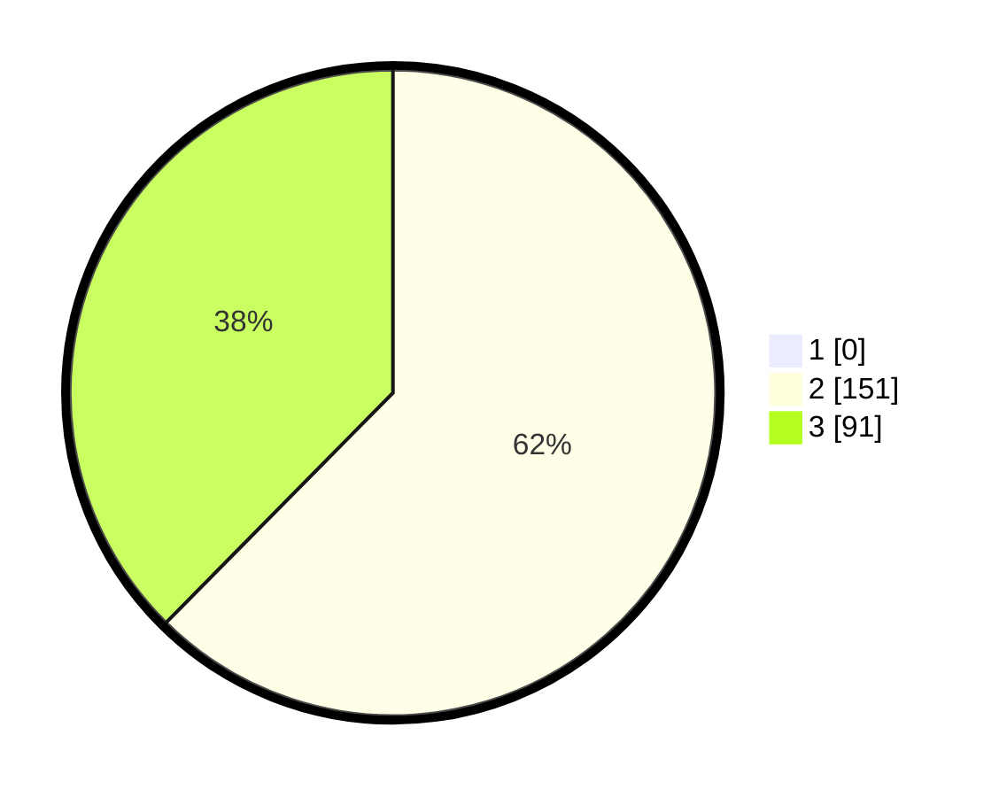

# Hasil

## Grafik

## Tabel

| No. | Nama Paslon    | Suara | Suara (raw) | Persentase |
|:--- |:-------------- | -----:| -----------:| ----------:|
| 1   | ANIES MUHAIMIN | 0     | [0][p-1]    | 0,00       |
| 2   | PRABOWO GIBRAN | 151   | [151][p-2]  | 62,40      |
| 3   | GANJAR MAHFUD  | 91    | [91][p-3]   | 37,60      |

[p-1]: https://github.com/gigit-pemilu/pemilu-2024/blob/main/pilpres/hitung-suara/sub/51-bali/sub/04-gianyar/sub/06-tegallalang/sub/2006-sebatu/sub/009-tps/sub/paslon-1.txt
[p-2]: https://github.com/gigit-pemilu/pemilu-2024/blob/main/pilpres/hitung-suara/sub/51-bali/sub/04-gianyar/sub/06-tegallalang/sub/2006-sebatu/sub/009-tps/sub/paslon-2.txt
[p-3]: https://github.com/gigit-pemilu/pemilu-2024/blob/main/pilpres/hitung-suara/sub/51-bali/sub/04-gianyar/sub/06-tegallalang/sub/2006-sebatu/sub/009-tps/sub/paslon-3.txt

## Foto C Plano

https://sirekap-obj-formc.kpu.go.id/e65e/pemilu/ppwp/51/04/06/20/06/5104062006009-20240214-155529--6b13e5aa-e26d-412f-b055-b1b8e96c134c.jpg

https://sirekap-obj-formc.kpu.go.id/e65e/pemilu/ppwp/51/04/06/20/06/5104062006009-20240214-203652--574f27d7-8508-46bc-92c8-f2e01edc5045.jpg

https://sirekap-obj-formc.kpu.go.id/e65e/pemilu/ppwp/51/04/06/20/06/5104062006009-20240214-155537--6a40ceb4-c0c3-4572-9547-d3f2a8cca5ee.jpg

## Metadata

| Key        | Value               |
| ---------- | ------------------- |
| Time Stamp | 2024-02-15 12:00:28 |

