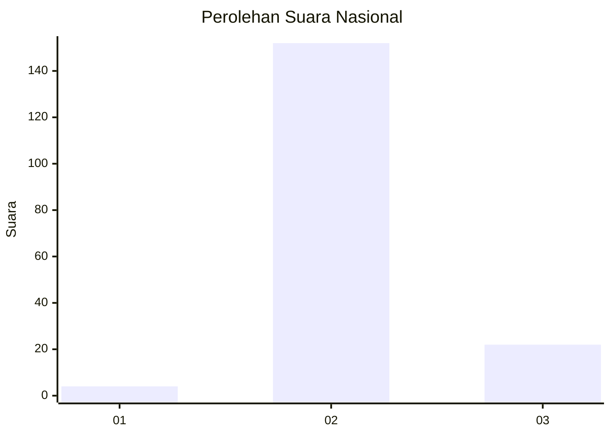
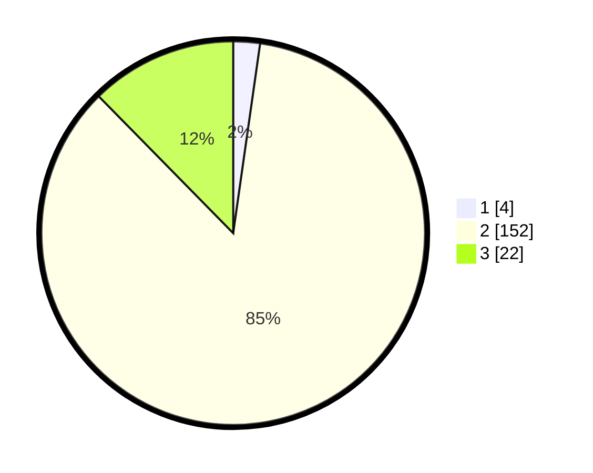

# Hasil

## Grafik

## Tabel

| No. | Nama Paslon    | Suara | Suara (raw) | Persentase |
|:--- |:-------------- | -----:| -----------:| ----------:|
| 1   | ANIES MUHAIMIN | 4     | [4][p-1]    | 2,25       |
| 2   | PRABOWO GIBRAN | 152   | [152][p-2]  | 85,39      |
| 3   | GANJAR MAHFUD  | 22    | [22][p-3]   | 12,36      |

[p-1]: https://github.com/gigit-pemilu/pemilu-2024/blob/main/pilpres/hitung-suara/sub/51-bali/sub/04-gianyar/sub/06-tegallalang/sub/2006-sebatu/sub/022-tps/sub/paslon-1.txt
[p-2]: https://github.com/gigit-pemilu/pemilu-2024/blob/main/pilpres/hitung-suara/sub/51-bali/sub/04-gianyar/sub/06-tegallalang/sub/2006-sebatu/sub/022-tps/sub/paslon-2.txt
[p-3]: https://github.com/gigit-pemilu/pemilu-2024/blob/main/pilpres/hitung-suara/sub/51-bali/sub/04-gianyar/sub/06-tegallalang/sub/2006-sebatu/sub/022-tps/sub/paslon-3.txt

## Foto C Plano

https://sirekap-obj-formc.kpu.go.id/f5d2/pemilu/ppwp/51/04/06/20/06/5104062006022-20240214-235107--a5a1b4d6-1ab0-4526-b075-bfc2284b793d.jpg

https://sirekap-obj-formc.kpu.go.id/f5d2/pemilu/ppwp/51/04/06/20/06/5104062006022-20240214-235311--50a0f595-36a8-47d3-ac43-47c7bb3e89ea.jpg

https://sirekap-obj-formc.kpu.go.id/f5d2/pemilu/ppwp/51/04/06/20/06/5104062006022-20240214-235439--bf1c3404-4c5c-41f9-9ebd-27eb66c28706.jpg

## Metadata

| Key        | Value               |
| ---------- | ------------------- |
| Time Stamp | 2024-02-15 15:00:29 |

