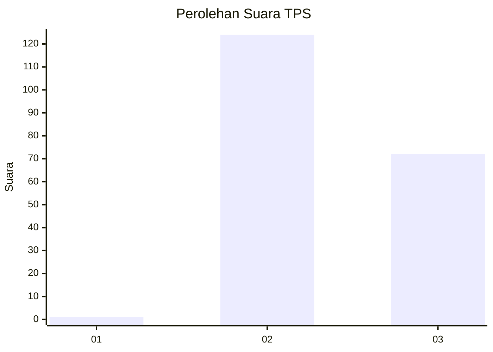
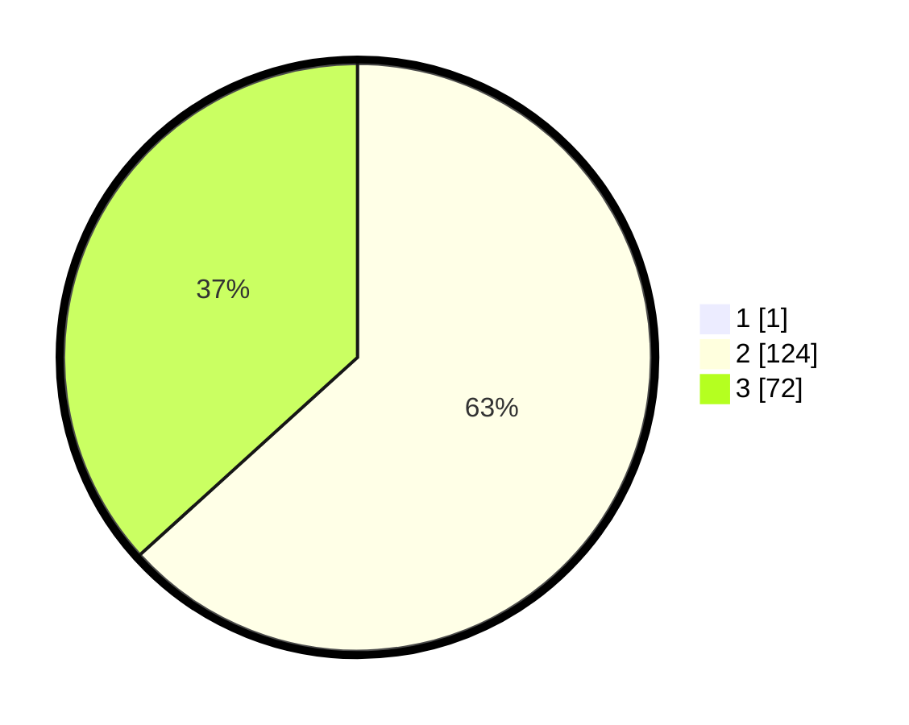

# Hasil

## Grafik

## Tabel

| No. | Nama Paslon    | Suara | Suara (raw) | Persentase |
|:--- |:-------------- | -----:| -----------:| ----------:|
| 1   | ANIES MUHAIMIN | 1     | [1][p-1]    | 0,51       |
| 2   | PRABOWO GIBRAN | 124   | [124][p-2]  | 62,94      |
| 3   | GANJAR MAHFUD  | 72    | [72][p-3]   | 36,55      |

[p-1]: https://github.com/gigit-pemilu/pemilu-2024-51-bali/blob/main/pilpres/hitung-suara/sub/51-bali/sub/04-gianyar/sub/06-tegallalang/sub/2006-sebatu/sub/027-tps/sub/paslon-1.txt
[p-2]: https://github.com/gigit-pemilu/pemilu-2024-51-bali/blob/main/pilpres/hitung-suara/sub/51-bali/sub/04-gianyar/sub/06-tegallalang/sub/2006-sebatu/sub/027-tps/sub/paslon-2.txt
[p-3]: https://github.com/gigit-pemilu/pemilu-2024-51-bali/blob/main/pilpres/hitung-suara/sub/51-bali/sub/04-gianyar/sub/06-tegallalang/sub/2006-sebatu/sub/027-tps/sub/paslon-3.txt

## Foto C Plano

https://sirekap-obj-formc.kpu.go.id/affe/pemilu/ppwp/51/04/06/20/06/5104062006027-20240214-202721--f0e03a99-68e0-4e7a-a2f2-49d7bb802801.jpg

https://sirekap-obj-formc.kpu.go.id/affe/pemilu/ppwp/51/04/06/20/06/5104062006027-20240214-191656--bfb3ac1d-2516-453c-acd6-4667b63da46e.jpg

https://sirekap-obj-formc.kpu.go.id/affe/pemilu/ppwp/51/04/06/20/06/5104062006027-20240214-191721--e68c449f-d528-4b32-bb46-b24e2d938683.jpg

## Metadata

| Key        | Value               |
| ---------- | ------------------- |
| Time Stamp | 2024-02-15 03:06:03 |

