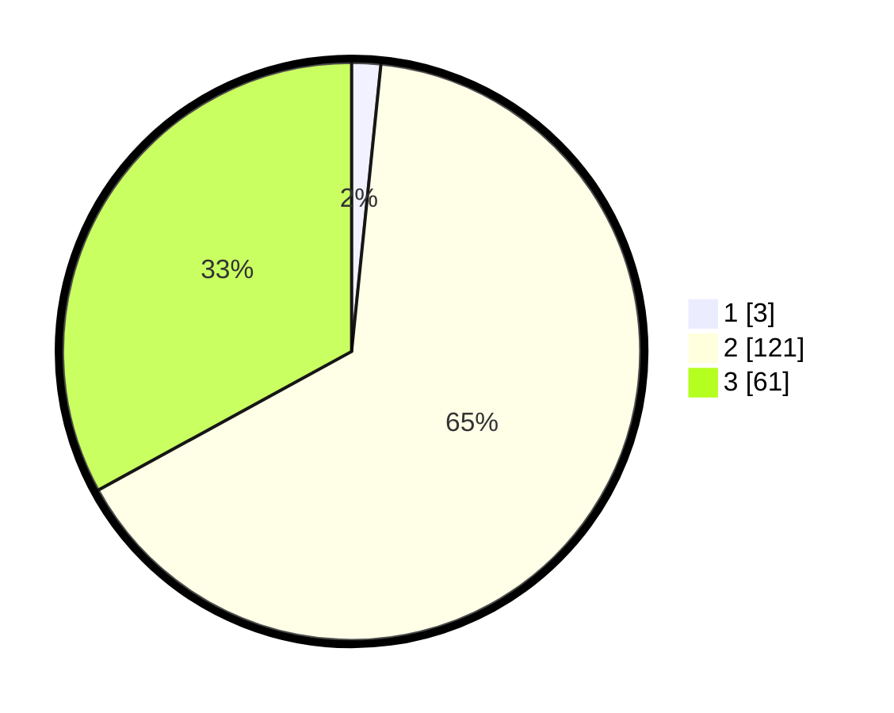

# Hasil

## Grafik

## Tabel

| No. | Nama Paslon    | Suara | Suara (raw) | Persentase |
|:--- |:-------------- | -----:| -----------:| ----------:|
| 1   | ANIES MUHAIMIN | 3     | [3][p-1]    | 1,62       |
| 2   | PRABOWO GIBRAN | 121   | [121][p-2]  | 65,41      |
| 3   | GANJAR MAHFUD  | 61    | [61][p-3]   | 32,97      |

[p-1]: https://github.com/gigit-pemilu/pemilu-2024-51-bali/blob/main/pilpres/hitung-suara/sub/51-bali/sub/04-gianyar/sub/06-tegallalang/sub/2006-sebatu/sub/028-tps/sub/paslon-1.txt
[p-2]: https://github.com/gigit-pemilu/pemilu-2024-51-bali/blob/main/pilpres/hitung-suara/sub/51-bali/sub/04-gianyar/sub/06-tegallalang/sub/2006-sebatu/sub/028-tps/sub/paslon-2.txt
[p-3]: https://github.com/gigit-pemilu/pemilu-2024-51-bali/blob/main/pilpres/hitung-suara/sub/51-bali/sub/04-gianyar/sub/06-tegallalang/sub/2006-sebatu/sub/028-tps/sub/paslon-3.txt

## Foto C Plano

https://sirekap-obj-formc.kpu.go.id/e416/pemilu/ppwp/51/04/06/20/06/5104062006028-20240214-200539--7d3634c0-0db6-4e41-b52f-0013b2ad58ee.jpg

https://sirekap-obj-formc.kpu.go.id/e416/pemilu/ppwp/51/04/06/20/06/5104062006028-20240214-200610--527dfa5e-f6dd-4d00-997d-c9ced6f7a5ef.jpg

https://sirekap-obj-formc.kpu.go.id/e416/pemilu/ppwp/51/04/06/20/06/5104062006028-20240214-200643--8f4d3b21-3646-44b6-99a1-66e226fddad4.jpg

## Metadata

| Key        | Value               |
| ---------- | ------------------- |
| Time Stamp | 2024-02-15 15:00:29 |

