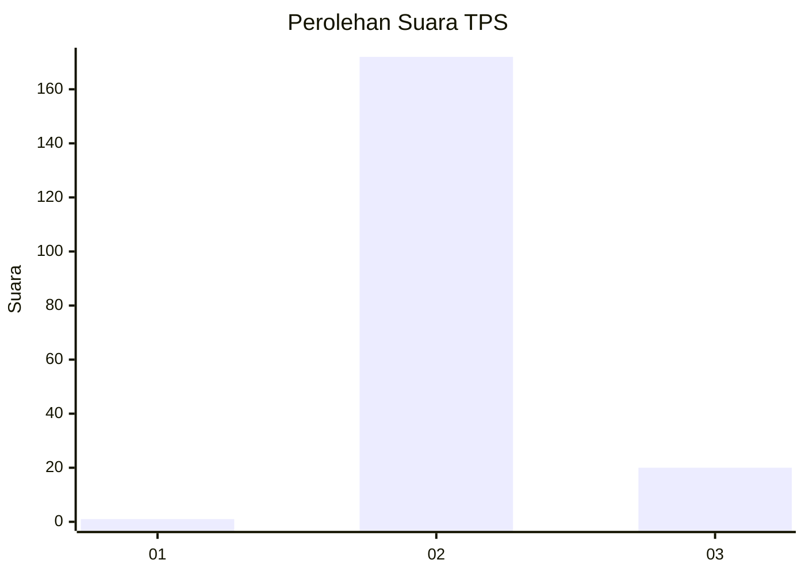
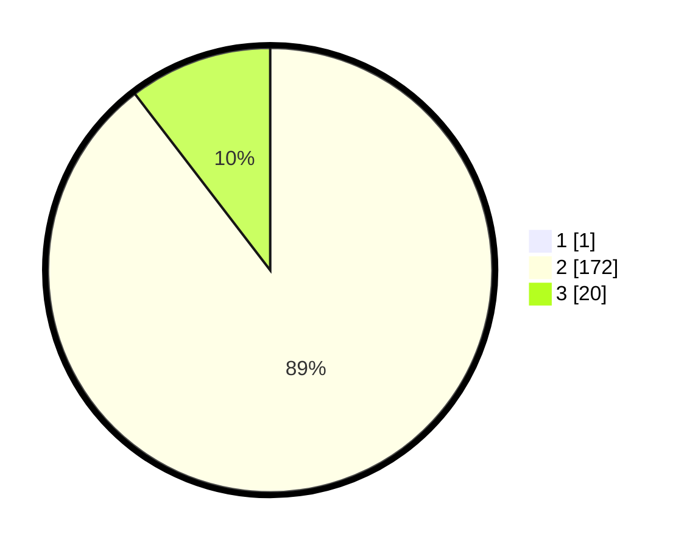

# Hasil

## Grafik

## Tabel

| No. | Nama Paslon    | Suara | Suara (raw) | Persentase |
|:--- |:-------------- | -----:| -----------:| ----------:|
| 1   | ANIES MUHAIMIN | 1     | [1][p-1]    | 0,52       |
| 2   | PRABOWO GIBRAN | 172   | [172][p-2]  | 89,12      |
| 3   | GANJAR MAHFUD  | 20    | [20][p-3]   | 10,36      |

[p-1]: https://github.com/gigit-pemilu/pemilu-2024-51-bali/blob/main/pilpres/hitung-suara/sub/51-bali/sub/04-gianyar/sub/06-tegallalang/sub/2007-taro/sub/002-tps/sub/paslon-1.txt
[p-2]: https://github.com/gigit-pemilu/pemilu-2024-51-bali/blob/main/pilpres/hitung-suara/sub/51-bali/sub/04-gianyar/sub/06-tegallalang/sub/2007-taro/sub/002-tps/sub/paslon-2.txt
[p-3]: https://github.com/gigit-pemilu/pemilu-2024-51-bali/blob/main/pilpres/hitung-suara/sub/51-bali/sub/04-gianyar/sub/06-tegallalang/sub/2007-taro/sub/002-tps/sub/paslon-3.txt

## Foto C Plano

https://sirekap-obj-formc.kpu.go.id/f19b/pemilu/ppwp/51/04/06/20/07/5104062007002-20240214-215623--13b01cbc-ebfc-4112-8f4b-ae32e284c1e0.jpg

https://sirekap-obj-formc.kpu.go.id/f19b/pemilu/ppwp/51/04/06/20/07/5104062007002-20240214-215701--2fe2b00b-6e6d-406b-a87d-9e1216d8e472.jpg

https://sirekap-obj-formc.kpu.go.id/f19b/pemilu/ppwp/51/04/06/20/07/5104062007002-20240214-215706--984e1c96-1223-477f-964a-5f82243bc4b1.jpg

## Metadata

| Key        | Value               |
| ---------- | ------------------- |
| Time Stamp | 2024-02-15 12:00:28 |

