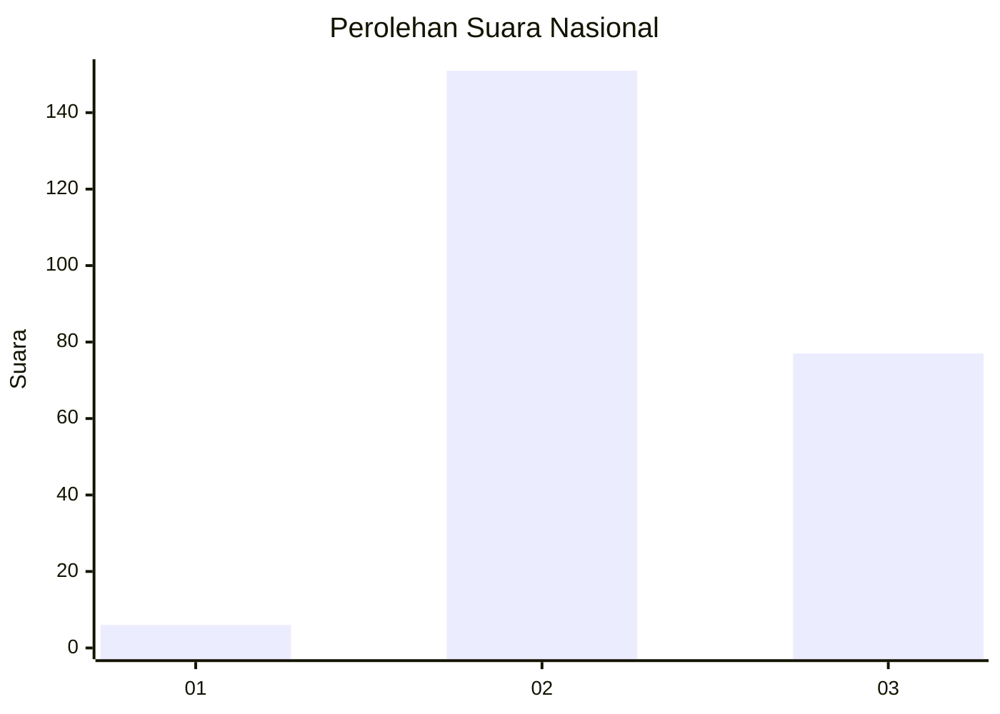
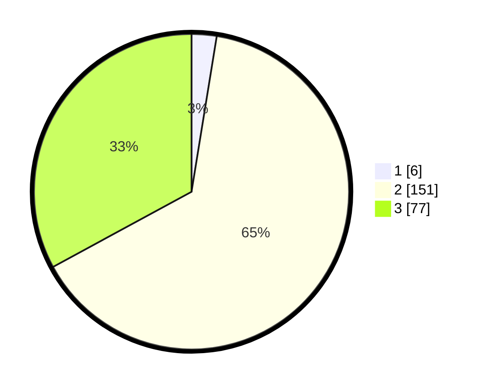

# Hasil

## Grafik

## Tabel

| No. | Nama Paslon    | Suara | Suara (raw) | Persentase |
|:--- |:-------------- | -----:| -----------:| ----------:|
| 1   | ANIES MUHAIMIN | 6     | [6][p-1]    | 2,56       |
| 2   | PRABOWO GIBRAN | 151   | [151][p-2]  | 64,53      |
| 3   | GANJAR MAHFUD  | 77    | [77][p-3]   | 32,91      |

[p-1]: https://github.com/gigit-pemilu/pemilu-2024/blob/main/pilpres/hitung-suara/sub/51-bali/sub/04-gianyar/sub/06-tegallalang/sub/2007-taro/sub/004-tps/sub/paslon-1.txt
[p-2]: https://github.com/gigit-pemilu/pemilu-2024/blob/main/pilpres/hitung-suara/sub/51-bali/sub/04-gianyar/sub/06-tegallalang/sub/2007-taro/sub/004-tps/sub/paslon-2.txt
[p-3]: https://github.com/gigit-pemilu/pemilu-2024/blob/main/pilpres/hitung-suara/sub/51-bali/sub/04-gianyar/sub/06-tegallalang/sub/2007-taro/sub/004-tps/sub/paslon-3.txt

## Foto C Plano

https://sirekap-obj-formc.kpu.go.id/3db5/pemilu/ppwp/51/04/06/20/07/5104062007004-20240214-213543--9aefc27b-e185-4753-a1f4-f1e76c685310.jpg

https://sirekap-obj-formc.kpu.go.id/3db5/pemilu/ppwp/51/04/06/20/07/5104062007004-20240214-213724--e39746d5-ce04-4e67-a969-e006838e597c.jpg

https://sirekap-obj-formc.kpu.go.id/3db5/pemilu/ppwp/51/04/06/20/07/5104062007004-20240214-213800--617a6390-0eba-4a64-ad36-5dcf5f1b9406.jpg

## Metadata

| Key        | Value               |
| ---------- | ------------------- |
| Time Stamp | 2024-02-15 15:00:29 |

