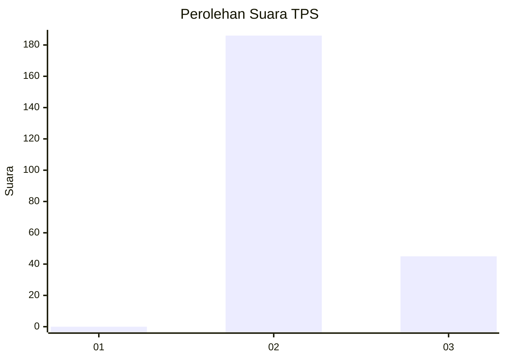
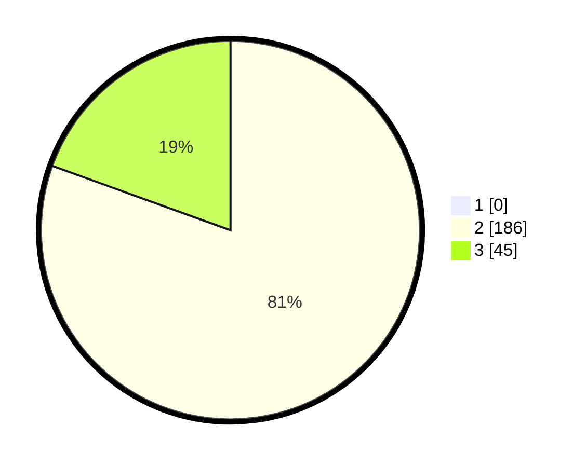

# Hasil

## Grafik

## Tabel

| No. | Nama Paslon    | Suara | Suara (raw) | Persentase |
|:--- |:-------------- | -----:| -----------:| ----------:|
| 1   | ANIES MUHAIMIN | 0     | [0][p-1]    | 0,00       |
| 2   | PRABOWO GIBRAN | 186   | [186][p-2]  | 80,52      |
| 3   | GANJAR MAHFUD  | 45    | [45][p-3]   | 19,48      |

[p-1]: https://github.com/gigit-pemilu/pemilu-2024-51-bali/blob/main/pilpres/hitung-suara/sub/51-bali/sub/04-gianyar/sub/06-tegallalang/sub/2007-taro/sub/005-tps/sub/paslon-1.txt
[p-2]: https://github.com/gigit-pemilu/pemilu-2024-51-bali/blob/main/pilpres/hitung-suara/sub/51-bali/sub/04-gianyar/sub/06-tegallalang/sub/2007-taro/sub/005-tps/sub/paslon-2.txt
[p-3]: https://github.com/gigit-pemilu/pemilu-2024-51-bali/blob/main/pilpres/hitung-suara/sub/51-bali/sub/04-gianyar/sub/06-tegallalang/sub/2007-taro/sub/005-tps/sub/paslon-3.txt

## Foto C Plano

https://sirekap-obj-formc.kpu.go.id/8e21/pemilu/ppwp/51/04/06/20/07/5104062007005-20240215-161213--778f6359-1a58-4d14-add5-31fba97aa557.jpg

https://sirekap-obj-formc.kpu.go.id/8e21/pemilu/ppwp/51/04/06/20/07/5104062007005-20240215-161322--85c30c9c-a2c1-4f09-87f0-85656dcbd4e8.jpg

https://sirekap-obj-formc.kpu.go.id/8e21/pemilu/ppwp/51/04/06/20/07/5104062007005-20240215-161435--5f57a067-06d9-4e4b-818a-0c0364708a80.jpg

## Metadata

| Key        | Value               |
| ---------- | ------------------- |
| Time Stamp | 2024-02-15 19:30:26 |

