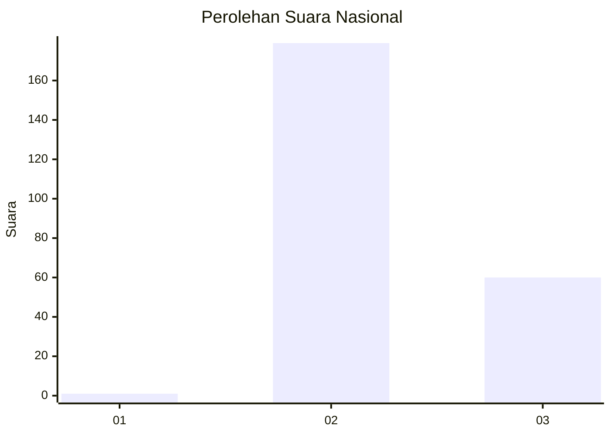
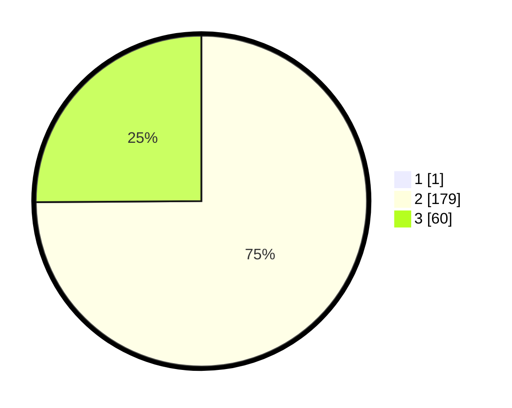

# Hasil

## Grafik

## Tabel

| No. | Nama Paslon    | Suara | Suara (raw) | Persentase |
|:--- |:-------------- | -----:| -----------:| ----------:|
| 1   | ANIES MUHAIMIN | 1     | [1][p-1]    | 0,42       |
| 2   | PRABOWO GIBRAN | 179   | [179][p-2]  | 74,58      |
| 3   | GANJAR MAHFUD  | 60    | [60][p-3]   | 25,00      |

[p-1]: https://github.com/gigit-pemilu/pemilu-2024/blob/main/pilpres/hitung-suara/sub/51-bali/sub/04-gianyar/sub/06-tegallalang/sub/2007-taro/sub/007-tps/sub/paslon-1.txt
[p-2]: https://github.com/gigit-pemilu/pemilu-2024/blob/main/pilpres/hitung-suara/sub/51-bali/sub/04-gianyar/sub/06-tegallalang/sub/2007-taro/sub/007-tps/sub/paslon-2.txt
[p-3]: https://github.com/gigit-pemilu/pemilu-2024/blob/main/pilpres/hitung-suara/sub/51-bali/sub/04-gianyar/sub/06-tegallalang/sub/2007-taro/sub/007-tps/sub/paslon-3.txt

## Foto C Plano

https://sirekap-obj-formc.kpu.go.id/0031/pemilu/ppwp/51/04/06/20/07/5104062007007-20240215-052930--b24ab229-48a3-420d-b2bb-201046d59c6b.jpg

https://sirekap-obj-formc.kpu.go.id/0031/pemilu/ppwp/51/04/06/20/07/5104062007007-20240215-052936--7420e83e-1151-4cba-8b9e-e2fe70c369dc.jpg

https://sirekap-obj-formc.kpu.go.id/0031/pemilu/ppwp/51/04/06/20/07/5104062007007-20240215-052943--f6410ea0-e31e-4db2-95d5-655561b72551.jpg

## Metadata

| Key        | Value               |
| ---------- | ------------------- |
| Time Stamp | 2024-02-15 15:00:29 |

