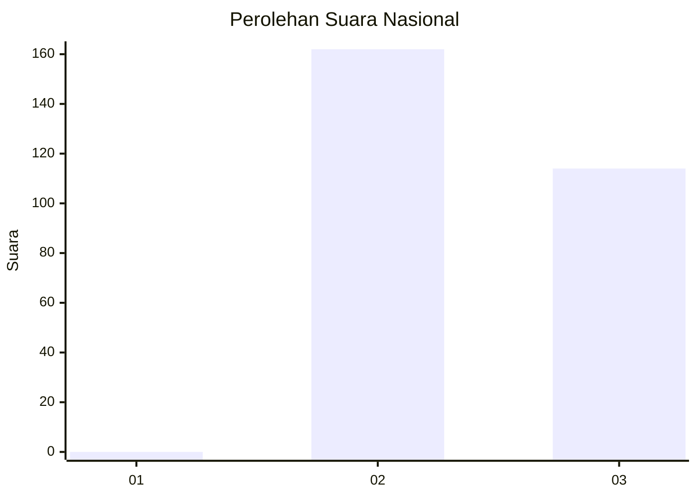
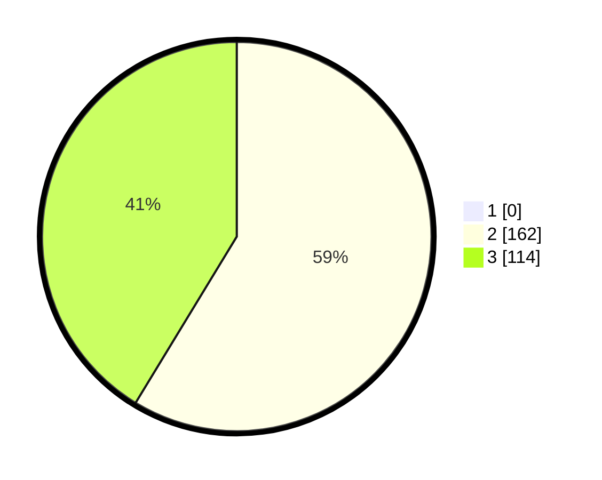

# Hasil

## Grafik

## Tabel

| No. | Nama Paslon    | Suara | Suara (raw) | Persentase |
|:--- |:-------------- | -----:| -----------:| ----------:|
| 1   | ANIES MUHAIMIN | 0     | [0][p-1]    | 0,00       |
| 2   | PRABOWO GIBRAN | 162   | [162][p-2]  | 58,70      |
| 3   | GANJAR MAHFUD  | 114   | [114][p-3]  | 41,30      |

[p-1]: https://github.com/gigit-pemilu/pemilu-2024/blob/main/pilpres/hitung-suara/sub/51-bali/sub/04-gianyar/sub/06-tegallalang/sub/2007-taro/sub/010-tps/sub/paslon-1.txt
[p-2]: https://github.com/gigit-pemilu/pemilu-2024/blob/main/pilpres/hitung-suara/sub/51-bali/sub/04-gianyar/sub/06-tegallalang/sub/2007-taro/sub/010-tps/sub/paslon-2.txt
[p-3]: https://github.com/gigit-pemilu/pemilu-2024/blob/main/pilpres/hitung-suara/sub/51-bali/sub/04-gianyar/sub/06-tegallalang/sub/2007-taro/sub/010-tps/sub/paslon-3.txt

## Foto C Plano

https://sirekap-obj-formc.kpu.go.id/272f/pemilu/ppwp/51/04/06/20/07/5104062007010-20240214-193833--206bccea-127b-4293-ae2e-7b2f8ffdde8c.jpg

https://sirekap-obj-formc.kpu.go.id/272f/pemilu/ppwp/51/04/06/20/07/5104062007010-20240214-193904--35e36df6-ee7c-4d94-ba7c-34ad5708247a.jpg

https://sirekap-obj-formc.kpu.go.id/272f/pemilu/ppwp/51/04/06/20/07/5104062007010-20240214-193928--3a8927bf-5adf-44b8-8407-0c59c24370d5.jpg

## Metadata

| Key        | Value               |
| ---------- | ------------------- |
| Time Stamp | 2024-02-14 21:46:01 |

