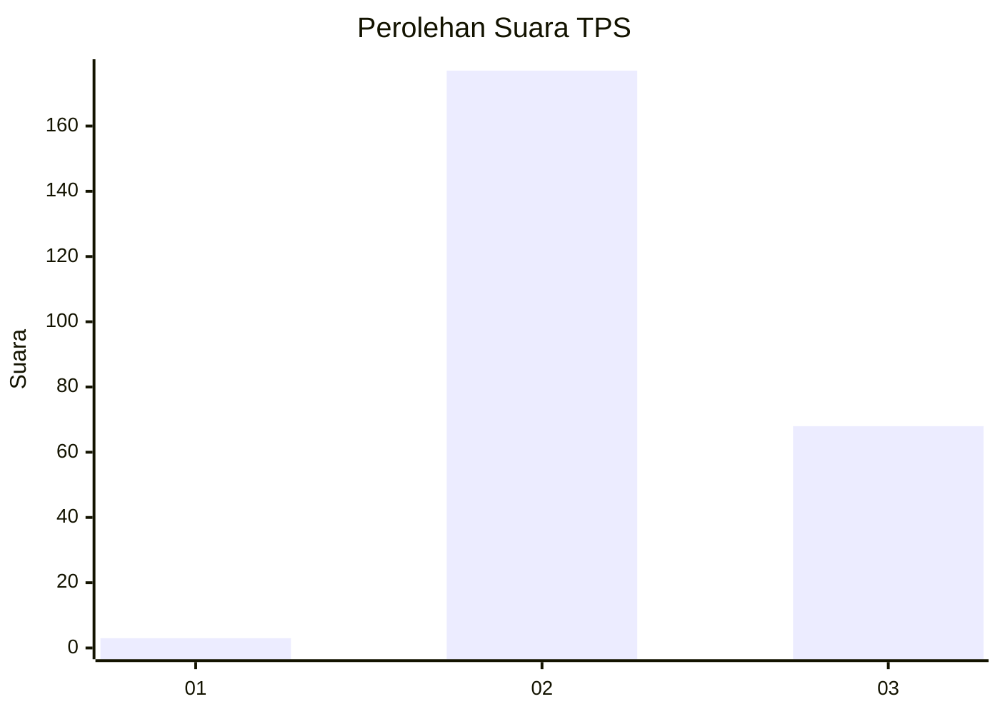
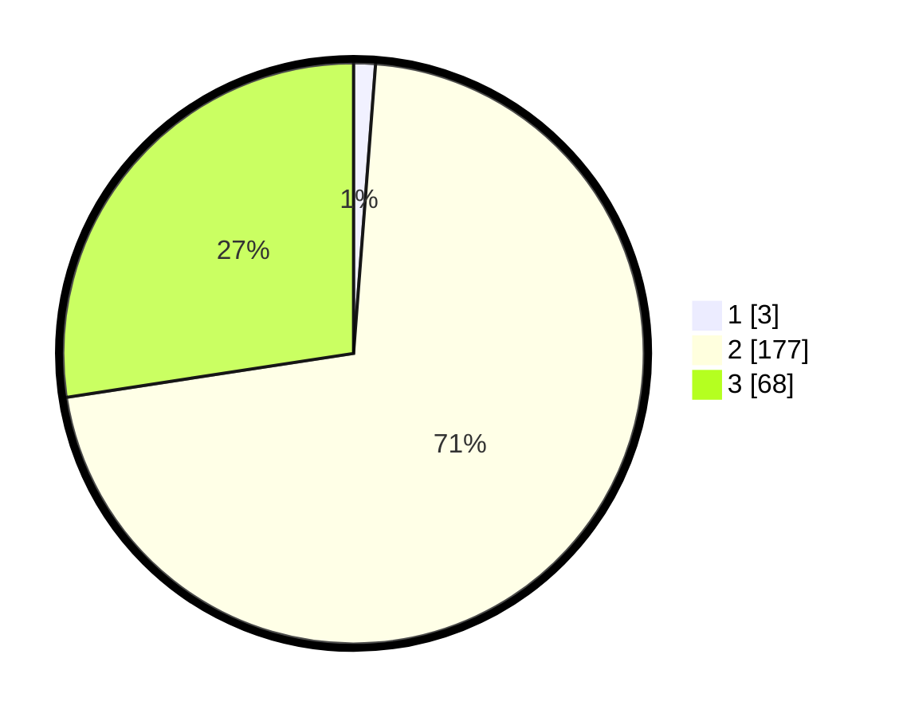

# Hasil

## Grafik

## Tabel

| No. | Nama Paslon    | Suara | Suara (raw) | Persentase |
|:--- |:-------------- | -----:| -----------:| ----------:|
| 1   | ANIES MUHAIMIN | 3     | [3][p-1]    | 1,21       |
| 2   | PRABOWO GIBRAN | 177   | [177][p-2]  | 71,37      |
| 3   | GANJAR MAHFUD  | 68    | [68][p-3]   | 27,42      |

[p-1]: https://github.com/gigit-pemilu/pemilu-2024-51-bali/blob/main/pilpres/hitung-suara/sub/51-bali/sub/04-gianyar/sub/06-tegallalang/sub/2007-taro/sub/014-tps/sub/paslon-1.txt
[p-2]: https://github.com/gigit-pemilu/pemilu-2024-51-bali/blob/main/pilpres/hitung-suara/sub/51-bali/sub/04-gianyar/sub/06-tegallalang/sub/2007-taro/sub/014-tps/sub/paslon-2.txt
[p-3]: https://github.com/gigit-pemilu/pemilu-2024-51-bali/blob/main/pilpres/hitung-suara/sub/51-bali/sub/04-gianyar/sub/06-tegallalang/sub/2007-taro/sub/014-tps/sub/paslon-3.txt

## Foto C Plano

https://sirekap-obj-formc.kpu.go.id/ffb9/pemilu/ppwp/51/04/06/20/07/5104062007014-20240214-202621--9639ae44-84a8-4880-b589-072c3dc5dc05.jpg

https://sirekap-obj-formc.kpu.go.id/ffb9/pemilu/ppwp/51/04/06/20/07/5104062007014-20240214-202818--ffb9c84e-53a5-426d-adb0-3fcf22eb3ab4.jpg

https://sirekap-obj-formc.kpu.go.id/ffb9/pemilu/ppwp/51/04/06/20/07/5104062007014-20240214-202724--1634e5c7-f563-4234-b541-359d29b3913b.jpg

## Metadata

| Key        | Value               |
| ---------- | ------------------- |
| Time Stamp | 2024-02-15 12:00:28 |

