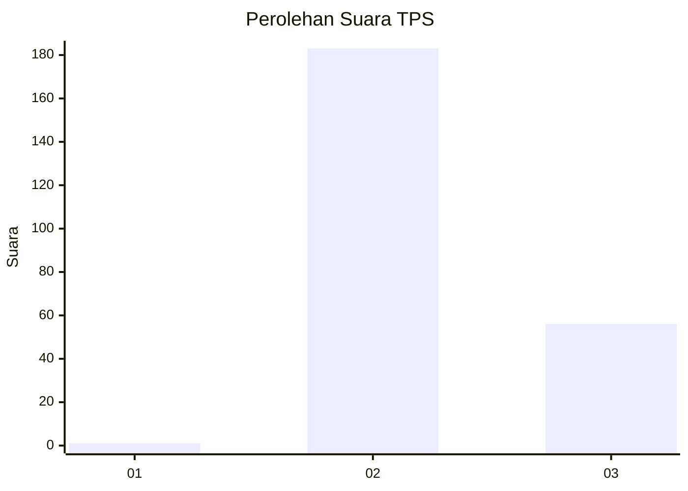
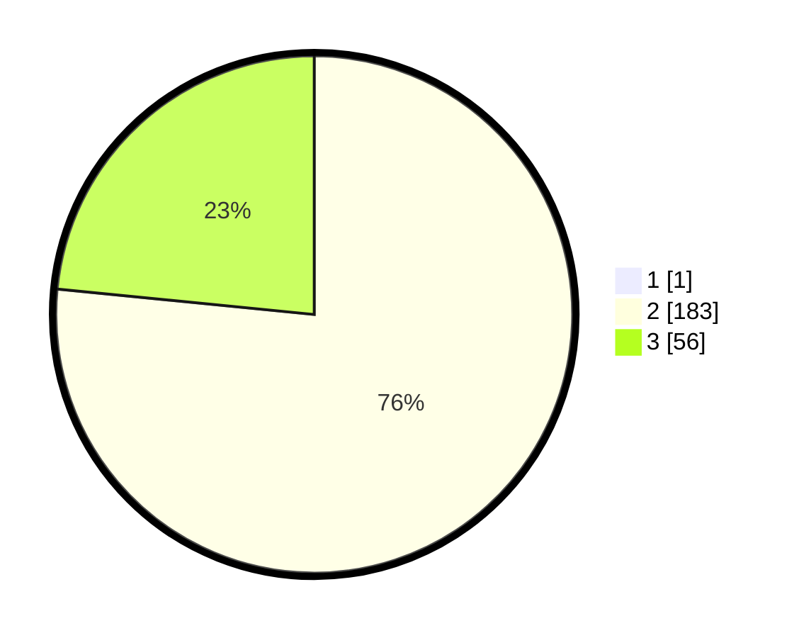

# Hasil

## Grafik

## Tabel

| No. | Nama Paslon    | Suara | Suara (raw) | Persentase |
|:--- |:-------------- | -----:| -----------:| ----------:|
| 1   | ANIES MUHAIMIN | 1     | [1][p-1]    | 0,42       |
| 2   | PRABOWO GIBRAN | 183   | [183][p-2]  | 76,25      |
| 3   | GANJAR MAHFUD  | 56    | [56][p-3]   | 23,33      |

[p-1]: https://github.com/gigit-pemilu/pemilu-2024-51-bali/blob/main/pilpres/hitung-suara/sub/51-bali/sub/04-gianyar/sub/06-tegallalang/sub/2007-taro/sub/015-tps/sub/paslon-1.txt
[p-2]: https://github.com/gigit-pemilu/pemilu-2024-51-bali/blob/main/pilpres/hitung-suara/sub/51-bali/sub/04-gianyar/sub/06-tegallalang/sub/2007-taro/sub/015-tps/sub/paslon-2.txt
[p-3]: https://github.com/gigit-pemilu/pemilu-2024-51-bali/blob/main/pilpres/hitung-suara/sub/51-bali/sub/04-gianyar/sub/06-tegallalang/sub/2007-taro/sub/015-tps/sub/paslon-3.txt

## Foto C Plano

https://sirekap-obj-formc.kpu.go.id/d8d8/pemilu/ppwp/51/04/06/20/07/5104062007015-20240214-221301--dc7c6b4c-c59a-4896-824b-f12d6fc1ef92.jpg

https://sirekap-obj-formc.kpu.go.id/d8d8/pemilu/ppwp/51/04/06/20/07/5104062007015-20240214-221751--8ca1f471-4af0-4a78-9293-c323336e37b8.jpg

https://sirekap-obj-formc.kpu.go.id/d8d8/pemilu/ppwp/51/04/06/20/07/5104062007015-20240214-221633--0df99013-24d7-4293-930d-493d9f9e1549.jpg

## Metadata

| Key        | Value               |
| ---------- | ------------------- |
| Time Stamp | 2024-02-15 12:00:28 |

