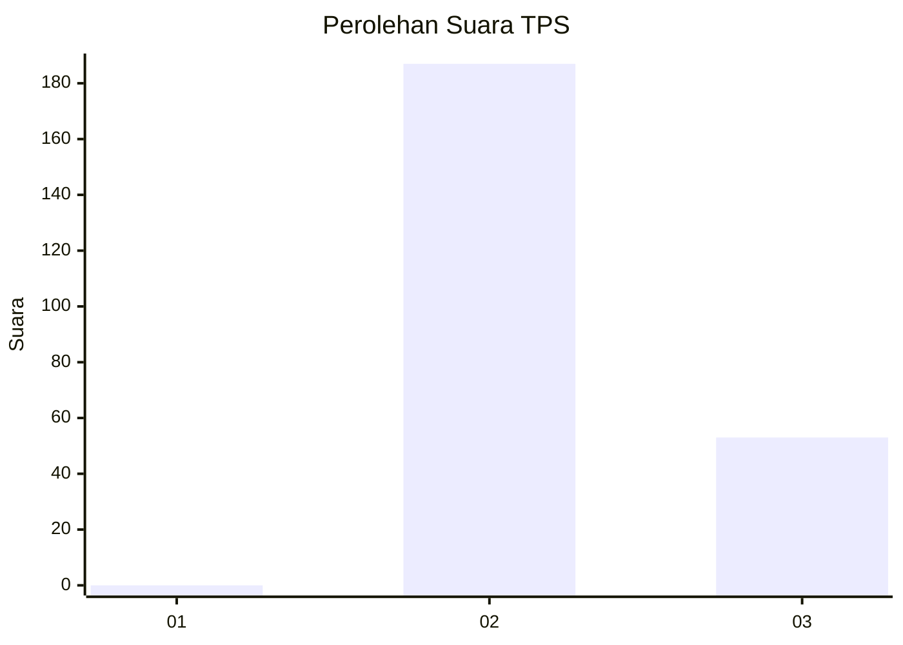
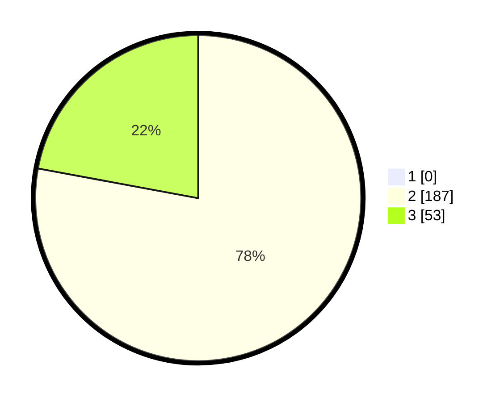

# Hasil

## Grafik

## Tabel

| No. | Nama Paslon    | Suara | Suara (raw) | Persentase |
|:--- |:-------------- | -----:| -----------:| ----------:|
| 1   | ANIES MUHAIMIN | 0     | [0][p-1]    | 0,00       |
| 2   | PRABOWO GIBRAN | 187   | [187][p-2]  | 77,92      |
| 3   | GANJAR MAHFUD  | 53    | [53][p-3]   | 22,08      |

[p-1]: https://github.com/gigit-pemilu/pemilu-2024-51-bali/blob/main/pilpres/hitung-suara/sub/51-bali/sub/04-gianyar/sub/06-tegallalang/sub/2007-taro/sub/016-tps/sub/paslon-1.txt
[p-2]: https://github.com/gigit-pemilu/pemilu-2024-51-bali/blob/main/pilpres/hitung-suara/sub/51-bali/sub/04-gianyar/sub/06-tegallalang/sub/2007-taro/sub/016-tps/sub/paslon-2.txt
[p-3]: https://github.com/gigit-pemilu/pemilu-2024-51-bali/blob/main/pilpres/hitung-suara/sub/51-bali/sub/04-gianyar/sub/06-tegallalang/sub/2007-taro/sub/016-tps/sub/paslon-3.txt

## Foto C Plano

https://sirekap-obj-formc.kpu.go.id/89a2/pemilu/ppwp/51/04/06/20/07/5104062007016-20240214-214817--eecce2a8-edb6-4023-b418-aea345f3ae22.jpg

https://sirekap-obj-formc.kpu.go.id/89a2/pemilu/ppwp/51/04/06/20/07/5104062007016-20240214-215629--faec4030-0ad0-44b7-b007-6b79e0de4ba1.jpg

https://sirekap-obj-formc.kpu.go.id/89a2/pemilu/ppwp/51/04/06/20/07/5104062007016-20240214-215854--de3a09fb-5cb8-41c8-b033-0a61d1b01f11.jpg

## Metadata

| Key        | Value               |
| ---------- | ------------------- |
| Time Stamp | 2024-02-15 15:00:29 |

