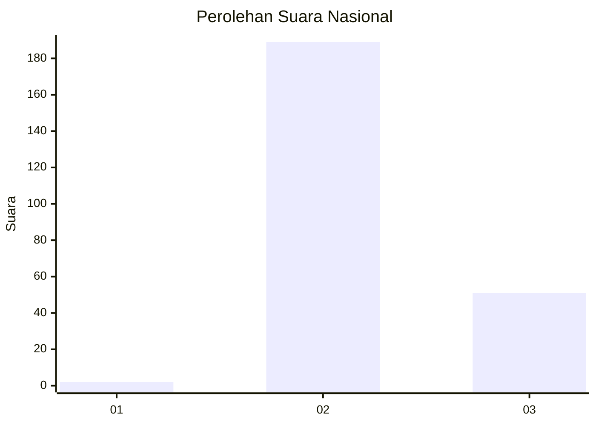
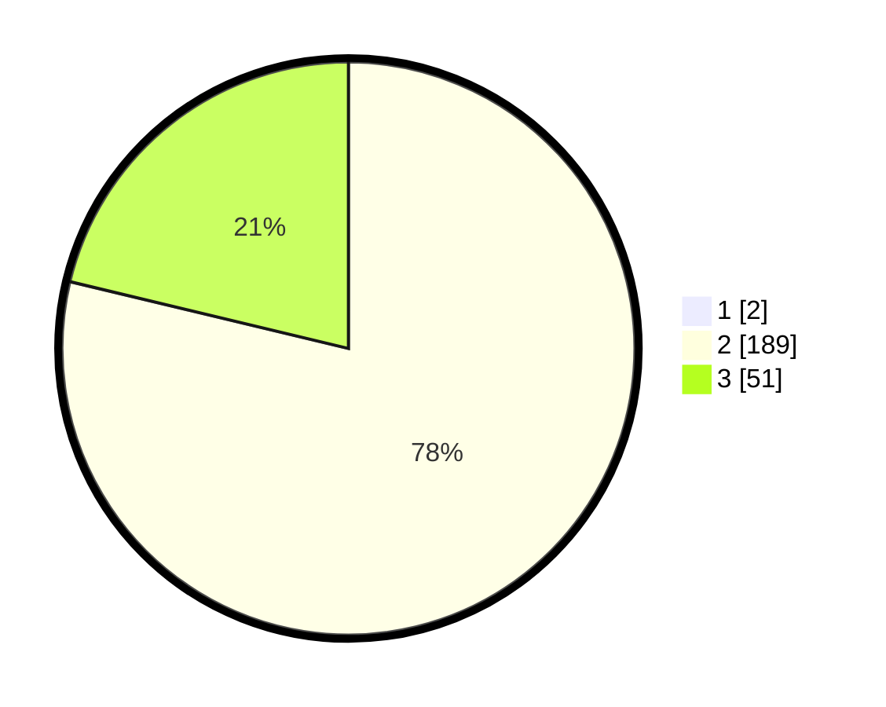

# Hasil

## Grafik

## Tabel

| No. | Nama Paslon    | Suara | Suara (raw) | Persentase |
|:--- |:-------------- | -----:| -----------:| ----------:|
| 1   | ANIES MUHAIMIN | 2     | [2][p-1]    | 0,83       |
| 2   | PRABOWO GIBRAN | 189   | [189][p-2]  | 78,10      |
| 3   | GANJAR MAHFUD  | 51    | [51][p-3]   | 21,07      |

[p-1]: https://github.com/gigit-pemilu/pemilu-2024/blob/main/pilpres/hitung-suara/sub/51-bali/sub/04-gianyar/sub/06-tegallalang/sub/2007-taro/sub/017-tps/sub/paslon-1.txt
[p-2]: https://github.com/gigit-pemilu/pemilu-2024/blob/main/pilpres/hitung-suara/sub/51-bali/sub/04-gianyar/sub/06-tegallalang/sub/2007-taro/sub/017-tps/sub/paslon-2.txt
[p-3]: https://github.com/gigit-pemilu/pemilu-2024/blob/main/pilpres/hitung-suara/sub/51-bali/sub/04-gianyar/sub/06-tegallalang/sub/2007-taro/sub/017-tps/sub/paslon-3.txt

## Foto C Plano

https://sirekap-obj-formc.kpu.go.id/3e90/pemilu/ppwp/51/04/06/20/07/5104062007017-20240214-235707--83773c69-b5dc-42a9-911e-e2ced16da990.jpg

https://sirekap-obj-formc.kpu.go.id/3e90/pemilu/ppwp/51/04/06/20/07/5104062007017-20240214-235156--faa97ed1-99f0-4f1c-b0ca-2ad554e326b7.jpg

https://sirekap-obj-formc.kpu.go.id/3e90/pemilu/ppwp/51/04/06/20/07/5104062007017-20240214-235248--d174b920-c438-4223-91dc-dcb9394852bc.jpg

## Metadata

| Key        | Value               |
| ---------- | ------------------- |
| Time Stamp | 2024-02-15 23:29:50 |

