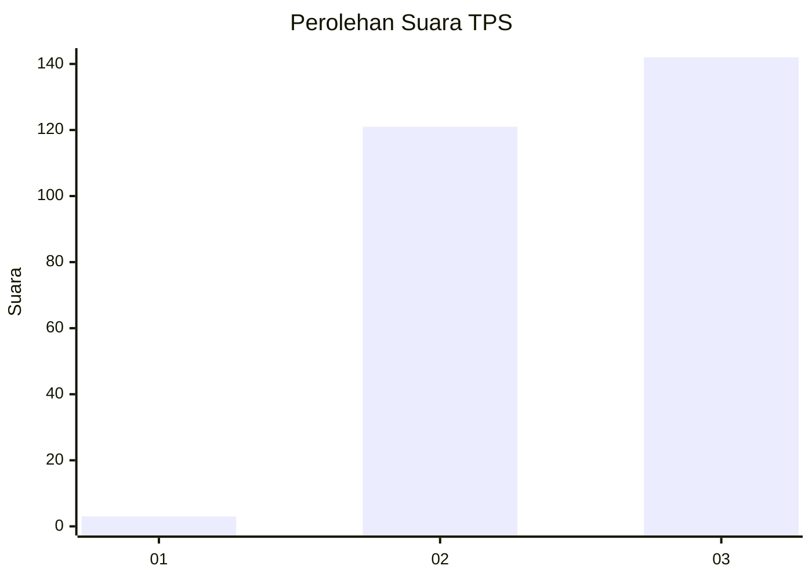
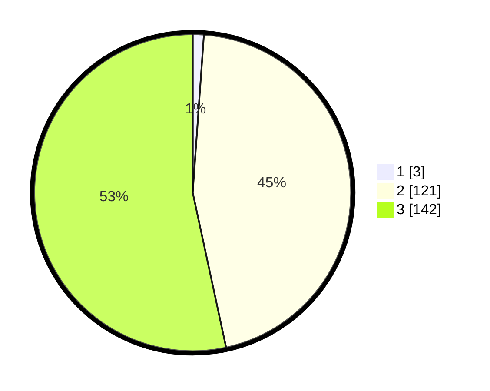

# Hasil

## Grafik

## Tabel

| No. | Nama Paslon    | Suara | Suara (raw) | Persentase |
|:--- |:-------------- | -----:| -----------:| ----------:|
| 1   | ANIES MUHAIMIN | 3     | [3][p-1]    | 1,13       |
| 2   | PRABOWO GIBRAN | 121   | [121][p-2]  | 45,49      |
| 3   | GANJAR MAHFUD  | 142   | [142][p-3]  | 53,38      |

[p-1]: https://github.com/gigit-pemilu/pemilu-2024-51-bali/blob/main/pilpres/hitung-suara/sub/51-bali/sub/04-gianyar/sub/06-tegallalang/sub/2007-taro/sub/019-tps/sub/paslon-1.txt
[p-2]: https://github.com/gigit-pemilu/pemilu-2024-51-bali/blob/main/pilpres/hitung-suara/sub/51-bali/sub/04-gianyar/sub/06-tegallalang/sub/2007-taro/sub/019-tps/sub/paslon-2.txt
[p-3]: https://github.com/gigit-pemilu/pemilu-2024-51-bali/blob/main/pilpres/hitung-suara/sub/51-bali/sub/04-gianyar/sub/06-tegallalang/sub/2007-taro/sub/019-tps/sub/paslon-3.txt

## Foto C Plano

https://sirekap-obj-formc.kpu.go.id/cc7f/pemilu/ppwp/51/04/06/20/07/5104062007019-20240214-212442--5d50377e-7dc8-4d2d-bf95-a11710430713.jpg

https://sirekap-obj-formc.kpu.go.id/cc7f/pemilu/ppwp/51/04/06/20/07/5104062007019-20240214-212515--bba028c0-0c5c-4945-9f31-50790fe61fee.jpg

https://sirekap-obj-formc.kpu.go.id/cc7f/pemilu/ppwp/51/04/06/20/07/5104062007019-20240214-212559--59b1b253-9b4c-4660-afc6-816490585174.jpg

## Metadata

| Key        | Value               |
| ---------- | ------------------- |
| Time Stamp | 2024-02-15 15:00:29 |

