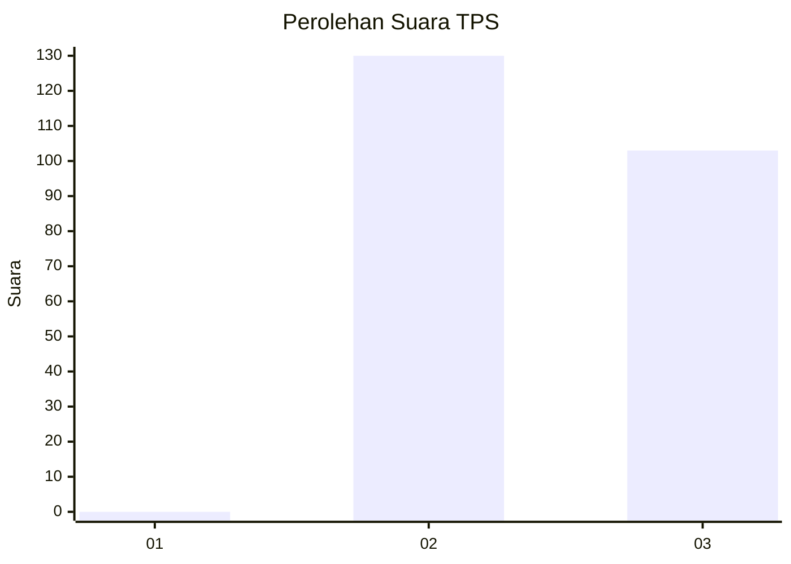
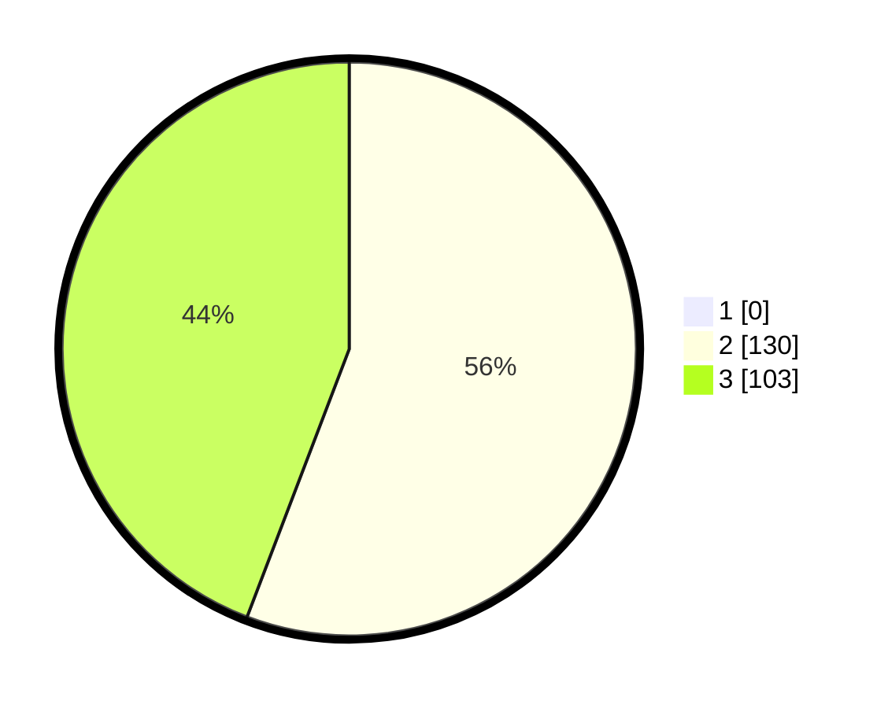

# Hasil

## Grafik

## Tabel

| No. | Nama Paslon    | Suara | Suara (raw) | Persentase |
|:--- |:-------------- | -----:| -----------:| ----------:|
| 1   | ANIES MUHAIMIN | 0     | [0][p-1]    | 0,00       |
| 2   | PRABOWO GIBRAN | 130   | [130][p-2]  | 55,79      |
| 3   | GANJAR MAHFUD  | 103   | [103][p-3]  | 44,21      |

[p-1]: https://github.com/gigit-pemilu/pemilu-2024-51-bali/blob/main/pilpres/hitung-suara/sub/51-bali/sub/04-gianyar/sub/06-tegallalang/sub/2007-taro/sub/021-tps/sub/paslon-1.txt
[p-2]: https://github.com/gigit-pemilu/pemilu-2024-51-bali/blob/main/pilpres/hitung-suara/sub/51-bali/sub/04-gianyar/sub/06-tegallalang/sub/2007-taro/sub/021-tps/sub/paslon-2.txt
[p-3]: https://github.com/gigit-pemilu/pemilu-2024-51-bali/blob/main/pilpres/hitung-suara/sub/51-bali/sub/04-gianyar/sub/06-tegallalang/sub/2007-taro/sub/021-tps/sub/paslon-3.txt

## Foto C Plano

https://sirekap-obj-formc.kpu.go.id/c45b/pemilu/ppwp/51/04/06/20/07/5104062007021-20240214-194339--f4679560-9ec4-454b-a48a-516e086e1125.jpg

https://sirekap-obj-formc.kpu.go.id/c45b/pemilu/ppwp/51/04/06/20/07/5104062007021-20240214-194346--10cbdc4e-a1fc-4cb5-8645-bc331dda3d24.jpg

https://sirekap-obj-formc.kpu.go.id/c45b/pemilu/ppwp/51/04/06/20/07/5104062007021-20240214-194351--d67a1379-23bd-48eb-b455-52b99a8aac78.jpg

## Metadata

| Key        | Value               |
| ---------- | ------------------- |
| Time Stamp | 2024-02-15 15:00:29 |

