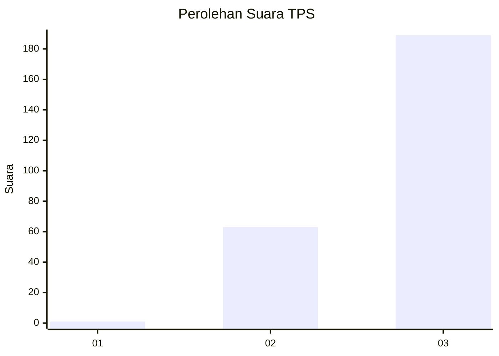
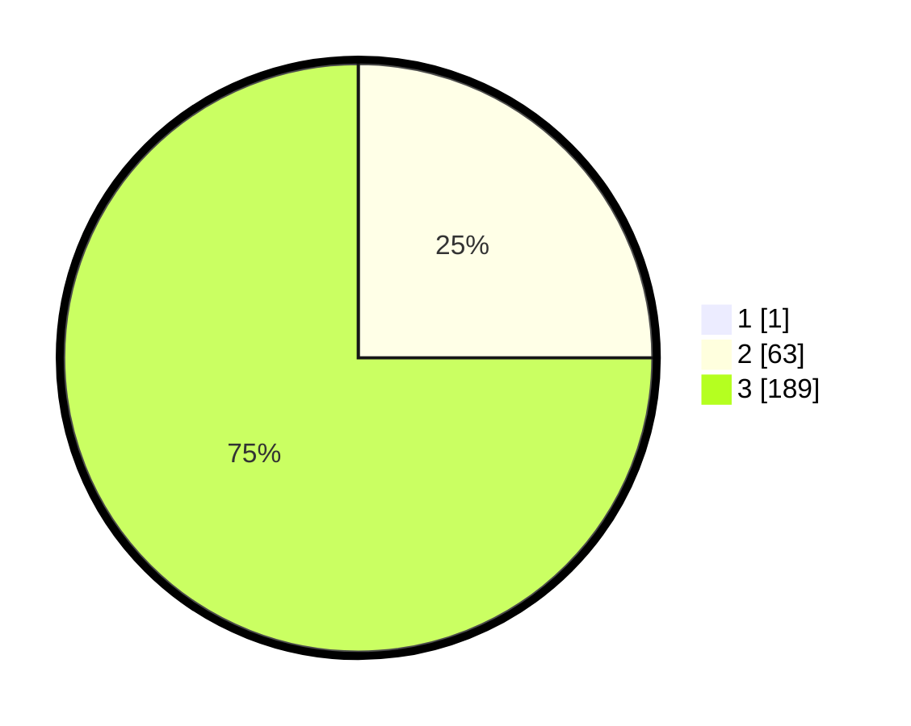

# Hasil

## Grafik

## Tabel

| No. | Nama Paslon    | Suara | Suara (raw) | Persentase |
|:--- |:-------------- | -----:| -----------:| ----------:|
| 1   | ANIES MUHAIMIN | 1     | [1][p-1]    | 0,40       |
| 2   | PRABOWO GIBRAN | 63    | [63][p-2]   | 24,90      |
| 3   | GANJAR MAHFUD  | 189   | [189][p-3]  | 74,70      |

[p-1]: https://github.com/gigit-pemilu/pemilu-2024-51-bali/blob/main/pilpres/hitung-suara/sub/51-bali/sub/04-gianyar/sub/06-tegallalang/sub/2007-taro/sub/026-tps/sub/paslon-1.txt
[p-2]: https://github.com/gigit-pemilu/pemilu-2024-51-bali/blob/main/pilpres/hitung-suara/sub/51-bali/sub/04-gianyar/sub/06-tegallalang/sub/2007-taro/sub/026-tps/sub/paslon-2.txt
[p-3]: https://github.com/gigit-pemilu/pemilu-2024-51-bali/blob/main/pilpres/hitung-suara/sub/51-bali/sub/04-gianyar/sub/06-tegallalang/sub/2007-taro/sub/026-tps/sub/paslon-3.txt

## Foto C Plano

https://sirekap-obj-formc.kpu.go.id/ac96/pemilu/ppwp/51/04/06/20/07/5104062007026-20240216-185001--0f46d778-411b-4f8b-b4b5-efb79a6189d8.jpg

https://sirekap-obj-formc.kpu.go.id/ac96/pemilu/ppwp/51/04/06/20/07/5104062007026-20240216-194646--f9ab9658-2e3a-4874-bd1f-e1123c8ce19b.jpg

https://sirekap-obj-formc.kpu.go.id/ac96/pemilu/ppwp/51/04/06/20/07/5104062007026-20240216-190717--94c0c29a-87b8-4beb-baf5-b7195b9ead59.jpg

## Metadata

| Key        | Value               |
| ---------- | ------------------- |
| Time Stamp | 2024-02-24 22:31:28 |

