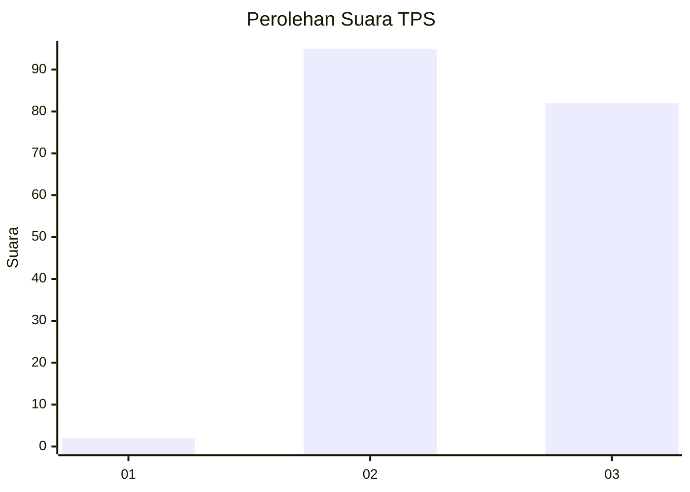
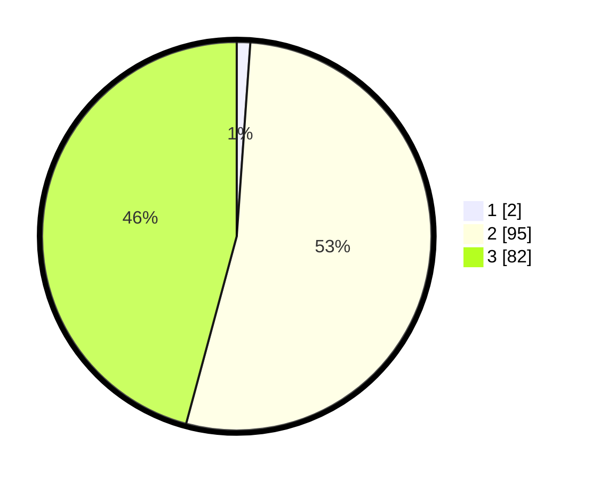

# Hasil

## Grafik

## Tabel

| No. | Nama Paslon    | Suara | Suara (raw) | Persentase |
|:--- |:-------------- | -----:| -----------:| ----------:|
| 1   | ANIES MUHAIMIN | 2     | [2][p-1]    | 1,12       |
| 2   | PRABOWO GIBRAN | 95    | [95][p-2]   | 53,07      |
| 3   | GANJAR MAHFUD  | 82    | [82][p-3]   | 45,81      |

[p-1]: https://github.com/gigit-pemilu/pemilu-2024-51-bali/blob/main/pilpres/hitung-suara/sub/51-bali/sub/04-gianyar/sub/06-tegallalang/sub/2007-taro/sub/027-tps/sub/paslon-1.txt
[p-2]: https://github.com/gigit-pemilu/pemilu-2024-51-bali/blob/main/pilpres/hitung-suara/sub/51-bali/sub/04-gianyar/sub/06-tegallalang/sub/2007-taro/sub/027-tps/sub/paslon-2.txt
[p-3]: https://github.com/gigit-pemilu/pemilu-2024-51-bali/blob/main/pilpres/hitung-suara/sub/51-bali/sub/04-gianyar/sub/06-tegallalang/sub/2007-taro/sub/027-tps/sub/paslon-3.txt

## Foto C Plano

https://sirekap-obj-formc.kpu.go.id/fdd6/pemilu/ppwp/51/04/06/20/07/5104062007027-20240214-221629--d70406c8-54ac-4d86-85a7-132ad4048ed8.jpg

https://sirekap-obj-formc.kpu.go.id/fdd6/pemilu/ppwp/51/04/06/20/07/5104062007027-20240214-221825--09d99bff-d2f6-4b37-92b6-73377ee00f70.jpg

https://sirekap-obj-formc.kpu.go.id/fdd6/pemilu/ppwp/51/04/06/20/07/5104062007027-20240214-222001--0b597d2b-97e4-4447-a16b-ca2dcee7d022.jpg

## Metadata

| Key        | Value               |
| ---------- | ------------------- |
| Time Stamp | 2024-02-15 23:29:50 |

