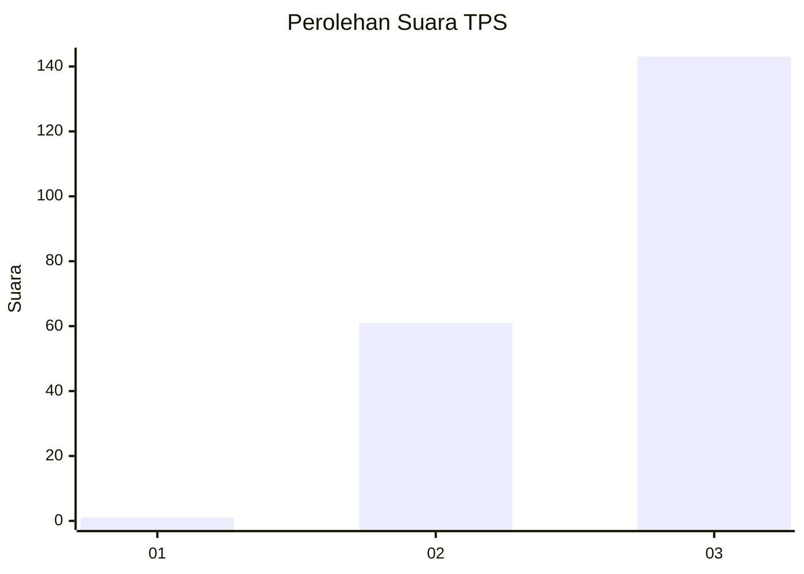
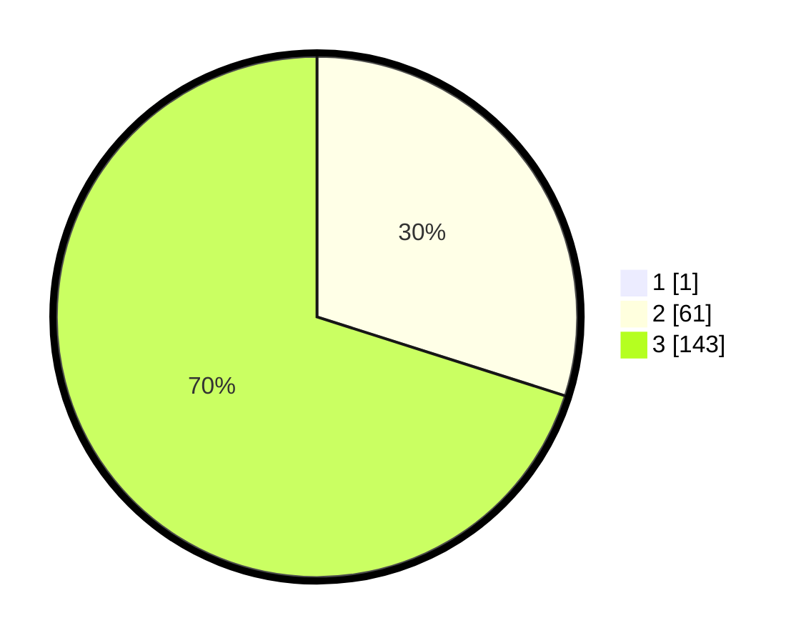

# Hasil

## Grafik

## Tabel

| No. | Nama Paslon    | Suara | Suara (raw) | Persentase |
|:--- |:-------------- | -----:| -----------:| ----------:|
| 1   | ANIES MUHAIMIN | 1     | [1][p-1]    | 0,49       |
| 2   | PRABOWO GIBRAN | 61    | [61][p-2]   | 29,76      |
| 3   | GANJAR MAHFUD  | 143   | [143][p-3]  | 69,76      |

[p-1]: https://github.com/gigit-pemilu/pemilu-2024-51-bali/blob/main/pilpres/hitung-suara/sub/51-bali/sub/04-gianyar/sub/06-tegallalang/sub/2007-taro/sub/031-tps/sub/paslon-1.txt
[p-2]: https://github.com/gigit-pemilu/pemilu-2024-51-bali/blob/main/pilpres/hitung-suara/sub/51-bali/sub/04-gianyar/sub/06-tegallalang/sub/2007-taro/sub/031-tps/sub/paslon-2.txt
[p-3]: https://github.com/gigit-pemilu/pemilu-2024-51-bali/blob/main/pilpres/hitung-suara/sub/51-bali/sub/04-gianyar/sub/06-tegallalang/sub/2007-taro/sub/031-tps/sub/paslon-3.txt

## Foto C Plano

https://sirekap-obj-formc.kpu.go.id/d96c/pemilu/ppwp/51/04/06/20/07/5104062007031-20240214-201354--0553e6ef-f7bf-4540-9177-33b2301a84e4.jpg

https://sirekap-obj-formc.kpu.go.id/d96c/pemilu/ppwp/51/04/06/20/07/5104062007031-20240214-225648--bc519a79-bd16-4815-9e1d-f46118b72e34.jpg

https://sirekap-obj-formc.kpu.go.id/d96c/pemilu/ppwp/51/04/06/20/07/5104062007031-20240214-201801--f955d492-fac5-4ee8-a40c-30646d69c9e8.jpg

## Metadata

| Key        | Value               |
| ---------- | ------------------- |
| Time Stamp | 2024-02-15 12:00:28 |

