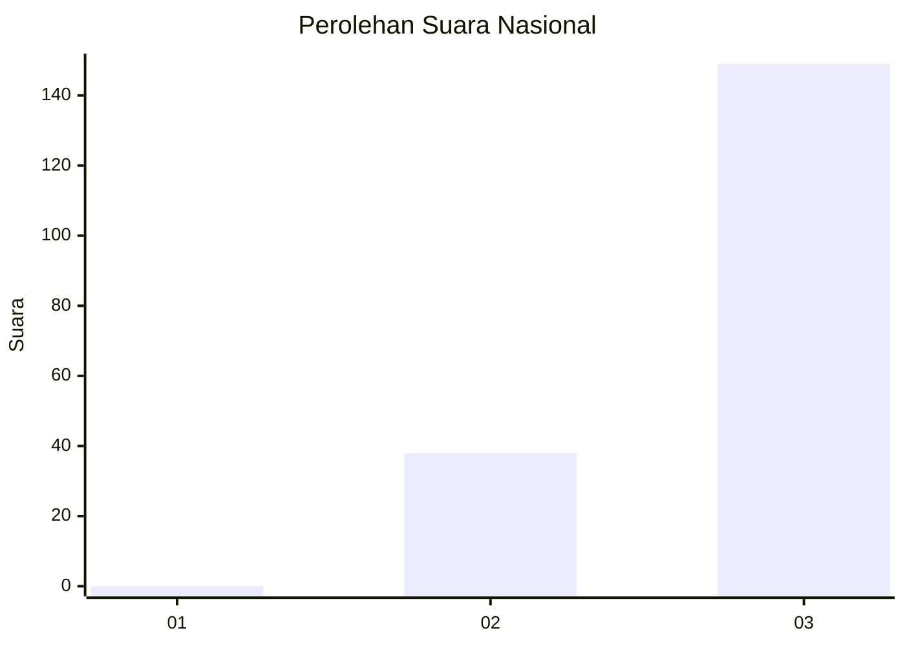
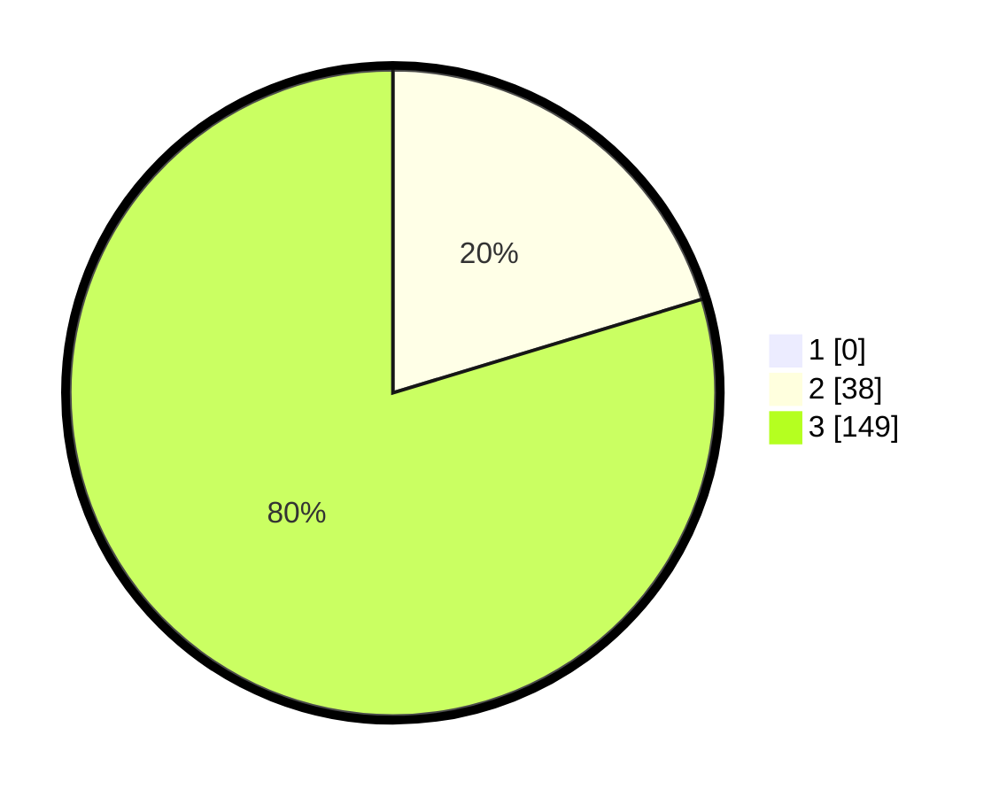

# Hasil

## Grafik

## Tabel

| No. | Nama Paslon    | Suara | Suara (raw) | Persentase |
|:--- |:-------------- | -----:| -----------:| ----------:|
| 1   | ANIES MUHAIMIN | 0     | [0][p-1]    | 0,00       |
| 2   | PRABOWO GIBRAN | 38    | [38][p-2]   | 20,32      |
| 3   | GANJAR MAHFUD  | 149   | [149][p-3]  | 79,68      |

[p-1]: https://github.com/gigit-pemilu/pemilu-2024/blob/main/pilpres/hitung-suara/sub/51-bali/sub/04-gianyar/sub/07-payangan/sub/2001-melinggih/sub/001-tps/sub/paslon-1.txt
[p-2]: https://github.com/gigit-pemilu/pemilu-2024/blob/main/pilpres/hitung-suara/sub/51-bali/sub/04-gianyar/sub/07-payangan/sub/2001-melinggih/sub/001-tps/sub/paslon-2.txt
[p-3]: https://github.com/gigit-pemilu/pemilu-2024/blob/main/pilpres/hitung-suara/sub/51-bali/sub/04-gianyar/sub/07-payangan/sub/2001-melinggih/sub/001-tps/sub/paslon-3.txt

## Foto C Plano

https://sirekap-obj-formc.kpu.go.id/6084/pemilu/ppwp/51/04/07/20/01/5104072001001-20240214-181246--3e29ab74-4ad0-4c00-9cab-10ae89b6f629.jpg

https://sirekap-obj-formc.kpu.go.id/6084/pemilu/ppwp/51/04/07/20/01/5104072001001-20240214-224227--e9558ffa-3907-48d0-bf22-eca3988ba493.jpg

https://sirekap-obj-formc.kpu.go.id/6084/pemilu/ppwp/51/04/07/20/01/5104072001001-20240214-194202--4adbf89d-0738-40d1-a63d-acdf9c0b0386.jpg

## Metadata

| Key        | Value               |
| ---------- | ------------------- |
| Time Stamp | 2024-02-15 12:00:28 |

## DATA PEMILIH TETAP

Jumlah pemilih dalam DPT: **251**.
 * L: **121**.
 * P: **130**.

## DATA PENGGUNA HAK PILIH

Jumlah pengguna hak pilih dalam DPT: **226**.
 * L: **109**.
 * P: **117**.

Jumlah pengguna hak pilih dalam DPTb: **2**.
 * L: **2**.
 * P: **0**.

Jumlah pengguna hak pilih dalam DPK: **0**.
 * L: **0**.
 * P: **0**.

Jumlah pengguna hak pilih: **228**.
 * L: **111**.
 * P: **117**.

## JUMLAH SUARA SAH DAN TIDAK SAH

JUMLAH SELURUH SUARA SAH: **187**.

JUMLAH SUARA TIDAK SAH: **41**.

JUMLAH SELURUH SUARA SAH DAN SUARA TIDAK SAH: **228**.

