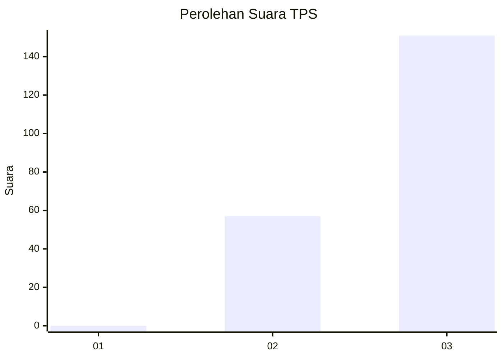
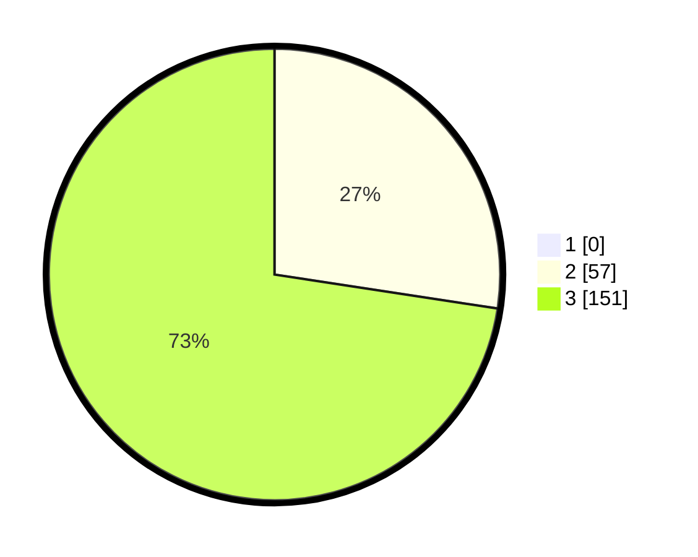

# Hasil

## Grafik

## Tabel

| No. | Nama Paslon    | Suara | Suara (raw) | Persentase |
|:--- |:-------------- | -----:| -----------:| ----------:|
| 1   | ANIES MUHAIMIN | 0     | [0][p-1]    | 0,00       |
| 2   | PRABOWO GIBRAN | 57    | [57][p-2]   | 27,40      |
| 3   | GANJAR MAHFUD  | 151   | [151][p-3]  | 72,60      |

[p-1]: https://github.com/gigit-pemilu/pemilu-2024-51-bali/blob/main/pilpres/hitung-suara/sub/51-bali/sub/04-gianyar/sub/07-payangan/sub/2001-melinggih/sub/003-tps/sub/paslon-1.txt
[p-2]: https://github.com/gigit-pemilu/pemilu-2024-51-bali/blob/main/pilpres/hitung-suara/sub/51-bali/sub/04-gianyar/sub/07-payangan/sub/2001-melinggih/sub/003-tps/sub/paslon-2.txt
[p-3]: https://github.com/gigit-pemilu/pemilu-2024-51-bali/blob/main/pilpres/hitung-suara/sub/51-bali/sub/04-gianyar/sub/07-payangan/sub/2001-melinggih/sub/003-tps/sub/paslon-3.txt

## Foto C Plano

https://sirekap-obj-formc.kpu.go.id/96eb/pemilu/ppwp/51/04/07/20/01/5104072001003-20240216-074635--fd9e69cb-20ac-4828-b798-d312479b12db.jpg

https://sirekap-obj-formc.kpu.go.id/96eb/pemilu/ppwp/51/04/07/20/01/5104072001003-20240216-074636--749503b8-7965-4b69-a0ea-660d458ea626.jpg

https://sirekap-obj-formc.kpu.go.id/96eb/pemilu/ppwp/51/04/07/20/01/5104072001003-20240216-074635--f4ad129f-0807-485f-9d2c-011e25e0f088.jpg

## Metadata

| Key        | Value               |
| ---------- | ------------------- |
| Time Stamp | 2024-02-16 09:30:28 |

## DATA PEMILIH TETAP

Jumlah pemilih dalam DPT: **251**.
 * L: **118**.
 * P: **133**.

## DATA PENGGUNA HAK PILIH

Jumlah pengguna hak pilih dalam DPT: **236**.
 * L: **115**.
 * P: **121**.

Jumlah pengguna hak pilih dalam DPTb: **0**.
 * L: **0**.
 * P: **0**.

Jumlah pengguna hak pilih dalam DPK: **0**.
 * L: **0**.
 * P: **0**.

Jumlah pengguna hak pilih: **236**.
 * L: **115**.
 * P: **121**.

## JUMLAH SUARA SAH DAN TIDAK SAH

JUMLAH SELURUH SUARA SAH: **208**.

JUMLAH SUARA TIDAK SAH: **28**.

JUMLAH SELURUH SUARA SAH DAN SUARA TIDAK SAH: **236**.

