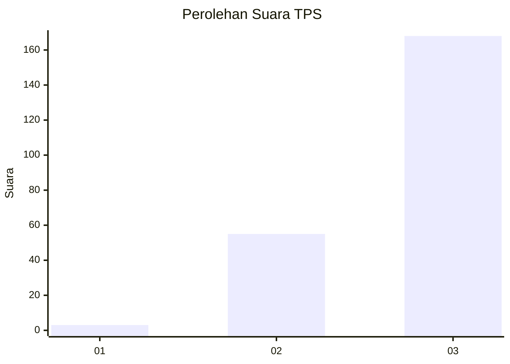
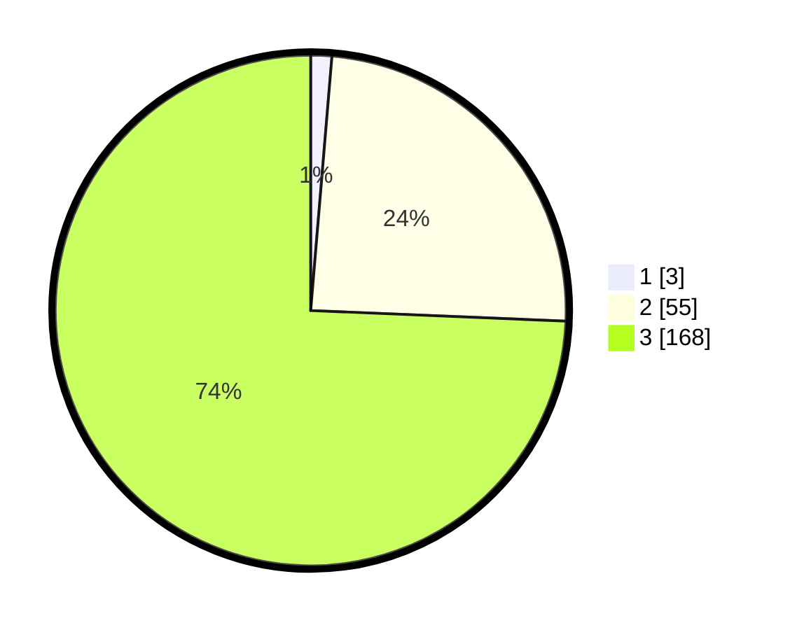

# Hasil

## Grafik

## Tabel

| No. | Nama Paslon    | Suara | Suara (raw) | Persentase |
|:--- |:-------------- | -----:| -----------:| ----------:|
| 1   | ANIES MUHAIMIN | 3     | [3][p-1]    | 1,33       |
| 2   | PRABOWO GIBRAN | 55    | [55][p-2]   | 24,34      |
| 3   | GANJAR MAHFUD  | 168   | [168][p-3]  | 74,34      |

[p-1]: https://github.com/gigit-pemilu/pemilu-2024-51-bali/blob/main/pilpres/hitung-suara/sub/51-bali/sub/04-gianyar/sub/07-payangan/sub/2001-melinggih/sub/004-tps/sub/paslon-1.txt
[p-2]: https://github.com/gigit-pemilu/pemilu-2024-51-bali/blob/main/pilpres/hitung-suara/sub/51-bali/sub/04-gianyar/sub/07-payangan/sub/2001-melinggih/sub/004-tps/sub/paslon-2.txt
[p-3]: https://github.com/gigit-pemilu/pemilu-2024-51-bali/blob/main/pilpres/hitung-suara/sub/51-bali/sub/04-gianyar/sub/07-payangan/sub/2001-melinggih/sub/004-tps/sub/paslon-3.txt

## Foto C Plano

https://sirekap-obj-formc.kpu.go.id/a341/pemilu/ppwp/51/04/07/20/01/5104072001004-20240214-132634--55f5321f-f55d-481b-9b44-de7e7d7ae679.jpg

https://sirekap-obj-formc.kpu.go.id/a341/pemilu/ppwp/51/04/07/20/01/5104072001004-20240214-215227--e98a6dd4-8c88-4150-848c-01bddaa1073a.jpg

https://sirekap-obj-formc.kpu.go.id/a341/pemilu/ppwp/51/04/07/20/01/5104072001004-20240214-200207--039174c8-21ae-43df-b9e7-6ce7756ba7c9.jpg

## Metadata

| Key        | Value               |
| ---------- | ------------------- |
| Time Stamp | 2024-02-15 15:00:29 |

## DATA PEMILIH TETAP

Jumlah pemilih dalam DPT: **266**.
 * L: **129**.
 * P: **137**.

## DATA PENGGUNA HAK PILIH

Jumlah pengguna hak pilih dalam DPT: **247**.
 * L: **120**.
 * P: **127**.

Jumlah pengguna hak pilih dalam DPTb: **0**.
 * L: **0**.
 * P: **0**.

Jumlah pengguna hak pilih dalam DPK: **0**.
 * L: **0**.
 * P: **0**.

Jumlah pengguna hak pilih: **243**.
 * L: **120**.
 * P: **123**.

## JUMLAH SUARA SAH DAN TIDAK SAH

JUMLAH SELURUH SUARA SAH: **226**.

JUMLAH SUARA TIDAK SAH: **17**.

JUMLAH SELURUH SUARA SAH DAN SUARA TIDAK SAH: **243**.

