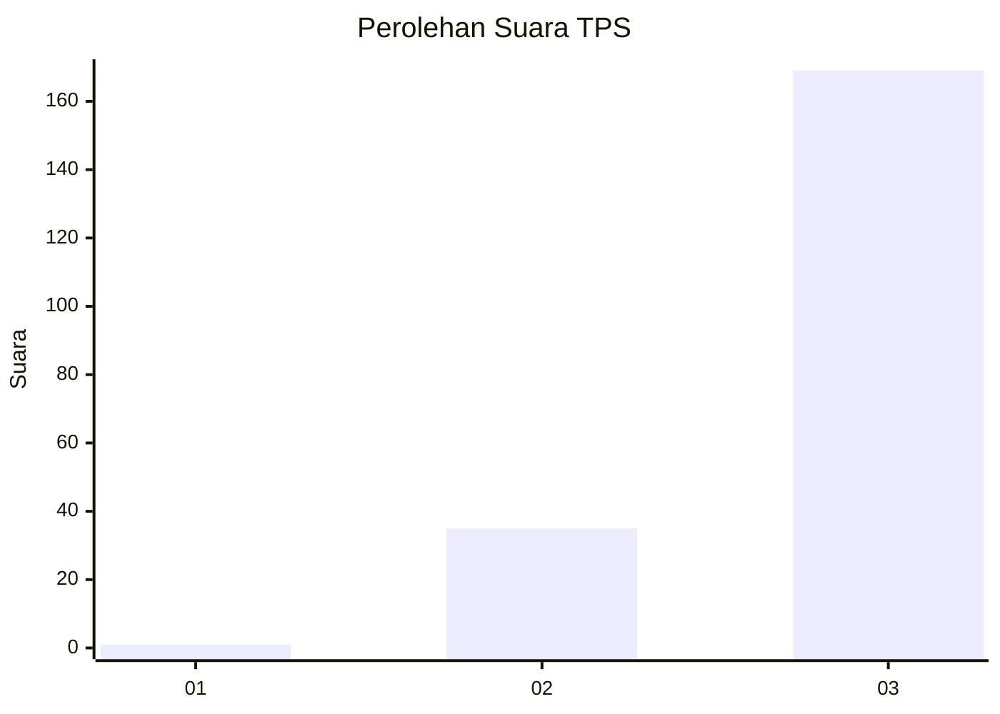
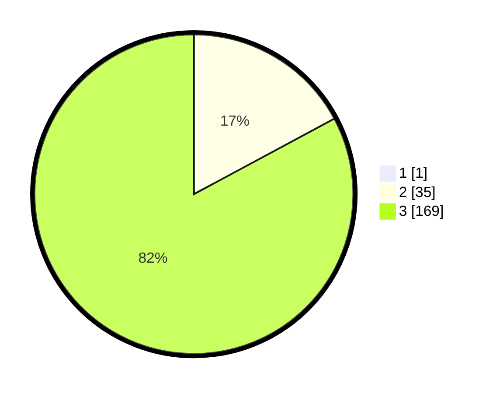

# Hasil

## Grafik

## Tabel

| No. | Nama Paslon    | Suara | Suara (raw) | Persentase |
|:--- |:-------------- | -----:| -----------:| ----------:|
| 1   | ANIES MUHAIMIN | 1     | [1][p-1]    | 0,49       |
| 2   | PRABOWO GIBRAN | 35    | [35][p-2]   | 17,07      |
| 3   | GANJAR MAHFUD  | 169   | [169][p-3]  | 82,44      |

[p-1]: https://github.com/gigit-pemilu/pemilu-2024-51-bali/blob/main/pilpres/hitung-suara/sub/51-bali/sub/04-gianyar/sub/07-payangan/sub/2001-melinggih/sub/005-tps/sub/paslon-1.txt
[p-2]: https://github.com/gigit-pemilu/pemilu-2024-51-bali/blob/main/pilpres/hitung-suara/sub/51-bali/sub/04-gianyar/sub/07-payangan/sub/2001-melinggih/sub/005-tps/sub/paslon-2.txt
[p-3]: https://github.com/gigit-pemilu/pemilu-2024-51-bali/blob/main/pilpres/hitung-suara/sub/51-bali/sub/04-gianyar/sub/07-payangan/sub/2001-melinggih/sub/005-tps/sub/paslon-3.txt

## Foto C Plano

https://sirekap-obj-formc.kpu.go.id/5e68/pemilu/ppwp/51/04/07/20/01/5104072001005-20240216-015040--3b63e02f-f02f-43fd-b53d-7549ba8c5121.jpg

https://sirekap-obj-formc.kpu.go.id/5e68/pemilu/ppwp/51/04/07/20/01/5104072001005-20240216-015049--468db6d8-bb47-467b-9745-b3bc93d9b07b.jpg

https://sirekap-obj-formc.kpu.go.id/5e68/pemilu/ppwp/51/04/07/20/01/5104072001005-20240216-015048--1fc0a7f2-38e5-4e88-ada7-9e4a50e18c9e.jpg

## Metadata

| Key        | Value               |
| ---------- | ------------------- |
| Time Stamp | 2024-02-16 09:30:28 |

## DATA PEMILIH TETAP

Jumlah pemilih dalam DPT: **246**.
 * L: **123**.
 * P: **123**.

## DATA PENGGUNA HAK PILIH

Jumlah pengguna hak pilih dalam DPT: **228**.
 * L: **111**.
 * P: **117**.

Jumlah pengguna hak pilih dalam DPTb: **0**.
 * L: **0**.
 * P: **0**.

Jumlah pengguna hak pilih dalam DPK: **0**.
 * L: **0**.
 * P: **0**.

Jumlah pengguna hak pilih: **228**.
 * L: **111**.
 * P: **117**.

## JUMLAH SUARA SAH DAN TIDAK SAH

JUMLAH SELURUH SUARA SAH: **205**.

JUMLAH SUARA TIDAK SAH: **23**.

JUMLAH SELURUH SUARA SAH DAN SUARA TIDAK SAH: **228**.

