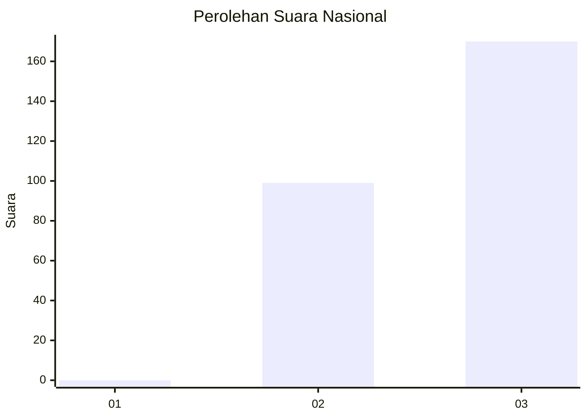
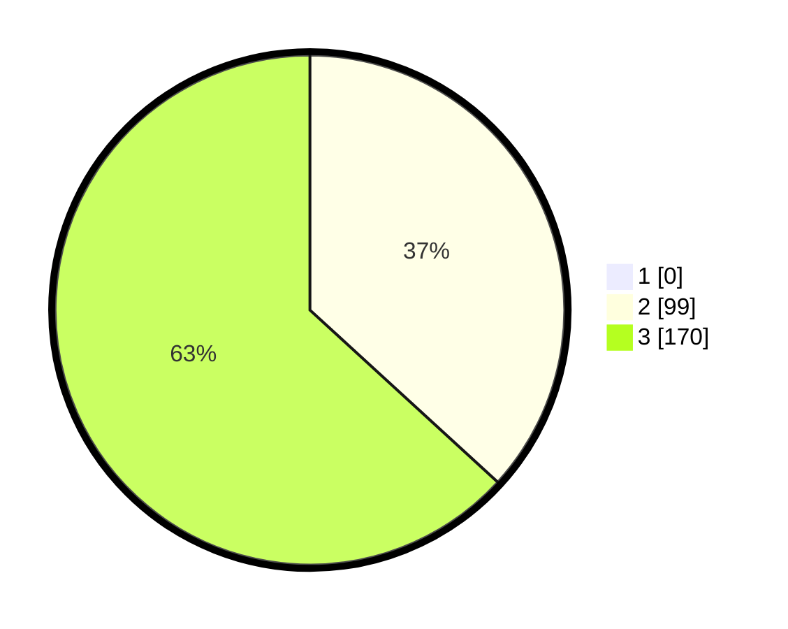

# Hasil

## Grafik

## Tabel

| No. | Nama Paslon    | Suara | Suara (raw) | Persentase |
|:--- |:-------------- | -----:| -----------:| ----------:|
| 1   | ANIES MUHAIMIN | 0     | [0][p-1]    | 0,00       |
| 2   | PRABOWO GIBRAN | 99    | [99][p-2]   | 36,80      |
| 3   | GANJAR MAHFUD  | 170   | [170][p-3]  | 63,20      |

[p-1]: https://github.com/gigit-pemilu/pemilu-2024/blob/main/pilpres/hitung-suara/sub/51-bali/sub/04-gianyar/sub/07-payangan/sub/2001-melinggih/sub/016-tps/sub/paslon-1.txt
[p-2]: https://github.com/gigit-pemilu/pemilu-2024/blob/main/pilpres/hitung-suara/sub/51-bali/sub/04-gianyar/sub/07-payangan/sub/2001-melinggih/sub/016-tps/sub/paslon-2.txt
[p-3]: https://github.com/gigit-pemilu/pemilu-2024/blob/main/pilpres/hitung-suara/sub/51-bali/sub/04-gianyar/sub/07-payangan/sub/2001-melinggih/sub/016-tps/sub/paslon-3.txt

## Foto C Plano

https://sirekap-obj-formc.kpu.go.id/3ed0/pemilu/ppwp/51/04/07/20/01/5104072001016-20240215-004303--59f9777e-5ce3-470e-a1e7-8f72e5f4b902.jpg

https://sirekap-obj-formc.kpu.go.id/3ed0/pemilu/ppwp/51/04/07/20/01/5104072001016-20240214-225427--dd4d7961-b473-4f0e-8c88-c7c25c8fffd5.jpg

https://sirekap-obj-formc.kpu.go.id/3ed0/pemilu/ppwp/51/04/07/20/01/5104072001016-20240214-225531--d15f5193-099e-4d13-9687-b676a45f0fa0.jpg

## Metadata

| Key        | Value               |
| ---------- | ------------------- |
| Time Stamp | 2024-02-15 12:00:28 |

