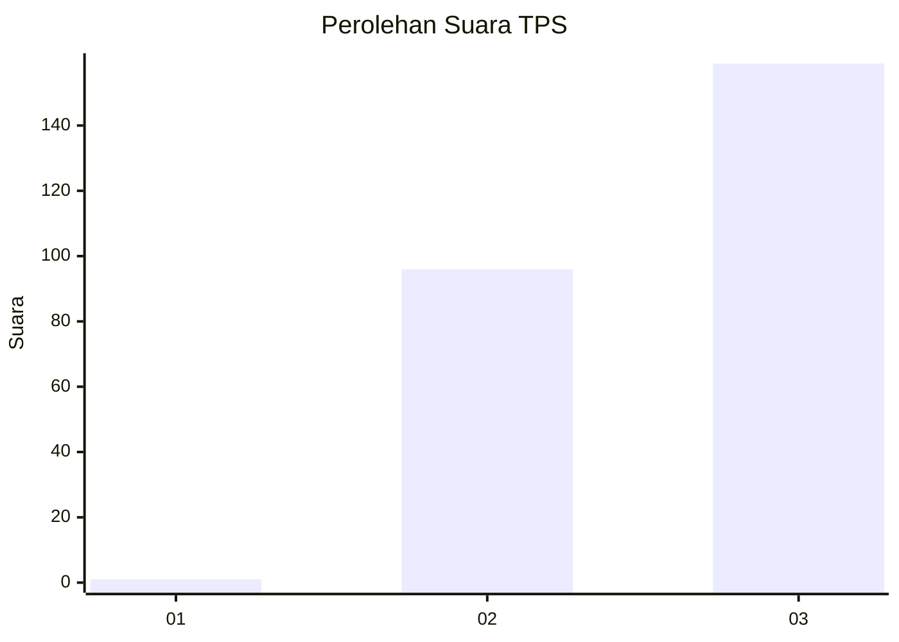
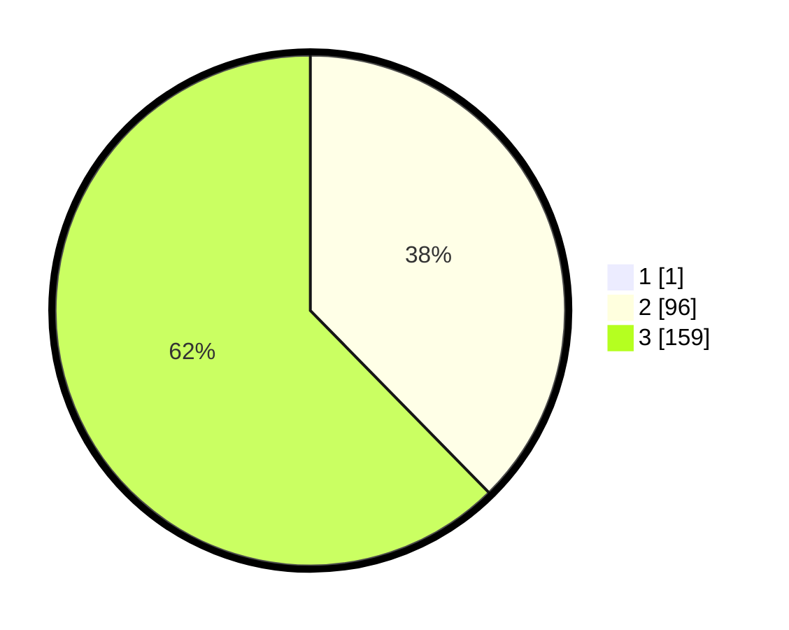

# Hasil

## Grafik

## Tabel

| No. | Nama Paslon    | Suara | Suara (raw) | Persentase |
|:--- |:-------------- | -----:| -----------:| ----------:|
| 1   | ANIES MUHAIMIN | 1     | [1][p-1]    | 0,39       |
| 2   | PRABOWO GIBRAN | 96    | [96][p-2]   | 37,50      |
| 3   | GANJAR MAHFUD  | 159   | [159][p-3]  | 62,11      |

[p-1]: https://github.com/gigit-pemilu/pemilu-2024-51-bali/blob/main/pilpres/hitung-suara/sub/51-bali/sub/04-gianyar/sub/07-payangan/sub/2001-melinggih/sub/023-tps/sub/paslon-1.txt
[p-2]: https://github.com/gigit-pemilu/pemilu-2024-51-bali/blob/main/pilpres/hitung-suara/sub/51-bali/sub/04-gianyar/sub/07-payangan/sub/2001-melinggih/sub/023-tps/sub/paslon-2.txt
[p-3]: https://github.com/gigit-pemilu/pemilu-2024-51-bali/blob/main/pilpres/hitung-suara/sub/51-bali/sub/04-gianyar/sub/07-payangan/sub/2001-melinggih/sub/023-tps/sub/paslon-3.txt

## Foto C Plano

https://sirekap-obj-formc.kpu.go.id/17bc/pemilu/ppwp/51/04/07/20/01/5104072001023-20240214-185935--3c193d0c-8692-4b98-9bcc-cd0415bf1df0.jpg

https://sirekap-obj-formc.kpu.go.id/17bc/pemilu/ppwp/51/04/07/20/01/5104072001023-20240214-185725--f3594ced-9e58-41b3-91fb-827a186f7cf0.jpg

https://sirekap-obj-formc.kpu.go.id/17bc/pemilu/ppwp/51/04/07/20/01/5104072001023-20240214-185752--dc79246b-d780-4ec0-bb76-c7acfc83a508.jpg

## Metadata

| Key        | Value               |
| ---------- | ------------------- |
| Time Stamp | 2024-02-15 12:00:28 |

