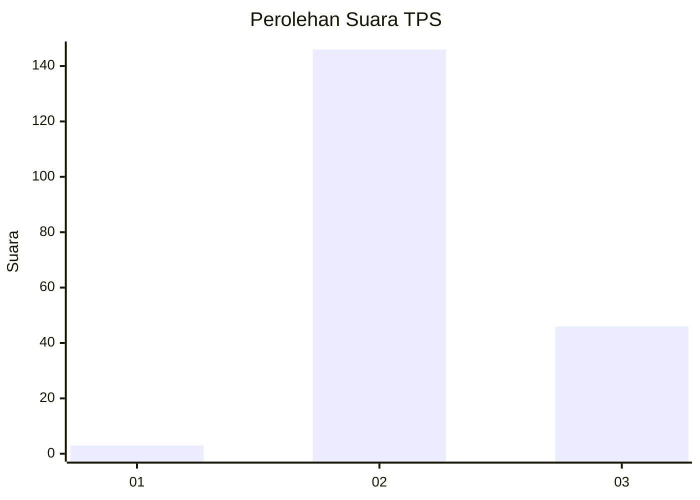
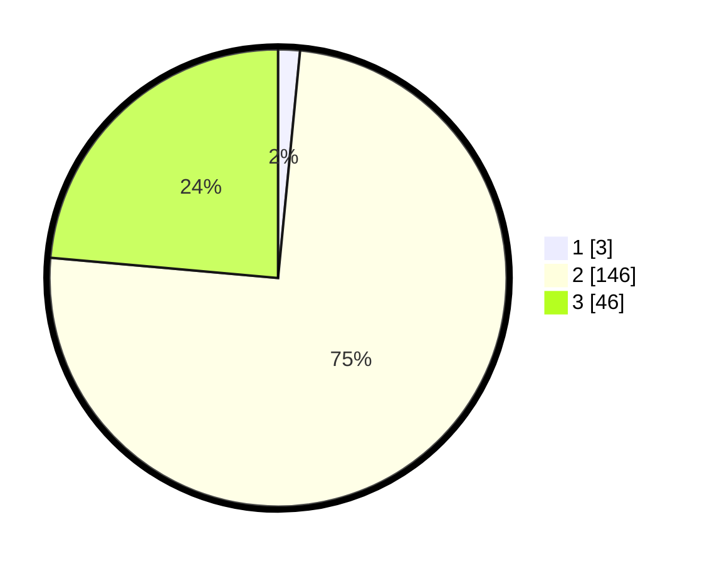

# Hasil

## Grafik

## Tabel

| No. | Nama Paslon    | Suara | Suara (raw) | Persentase |
|:--- |:-------------- | -----:| -----------:| ----------:|
| 1   | ANIES MUHAIMIN | 3     | [3][p-1]    | 1,54       |
| 2   | PRABOWO GIBRAN | 146   | [146][p-2]  | 74,87      |
| 3   | GANJAR MAHFUD  | 46    | [46][p-3]   | 23,59      |

[p-1]: https://github.com/gigit-pemilu/pemilu-2024-51-bali/blob/main/pilpres/hitung-suara/sub/51-bali/sub/04-gianyar/sub/07-payangan/sub/2002-kelusa/sub/005-tps/sub/paslon-1.txt
[p-2]: https://github.com/gigit-pemilu/pemilu-2024-51-bali/blob/main/pilpres/hitung-suara/sub/51-bali/sub/04-gianyar/sub/07-payangan/sub/2002-kelusa/sub/005-tps/sub/paslon-2.txt
[p-3]: https://github.com/gigit-pemilu/pemilu-2024-51-bali/blob/main/pilpres/hitung-suara/sub/51-bali/sub/04-gianyar/sub/07-payangan/sub/2002-kelusa/sub/005-tps/sub/paslon-3.txt

## Foto C Plano

https://sirekap-obj-formc.kpu.go.id/ba48/pemilu/ppwp/51/04/07/20/02/5104072002005-20240214-231352--d99b8645-301f-44b7-932f-51610f6856c1.jpg

https://sirekap-obj-formc.kpu.go.id/ba48/pemilu/ppwp/51/04/07/20/02/5104072002005-20240215-001519--a14a1b9a-726b-47d8-9679-31e294647c5d.jpg

https://sirekap-obj-formc.kpu.go.id/ba48/pemilu/ppwp/51/04/07/20/02/5104072002005-20240215-002734--f7cb1322-da1b-4ffd-9046-6d022387afa1.jpg

## Metadata

| Key        | Value               |
| ---------- | ------------------- |
| Time Stamp | 2024-02-15 12:00:28 |

