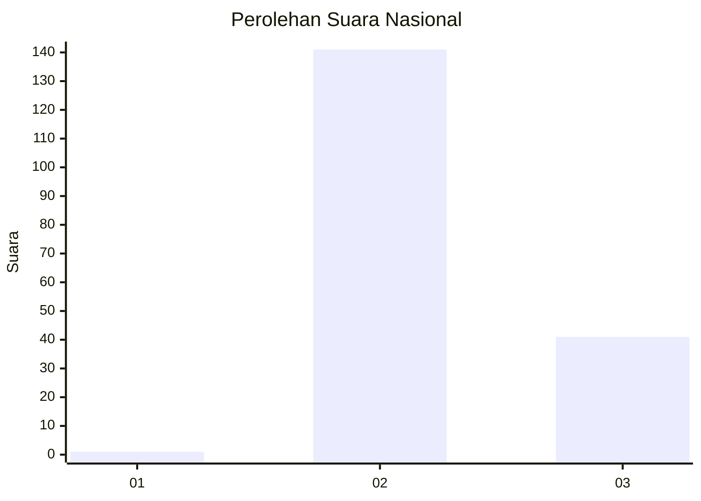
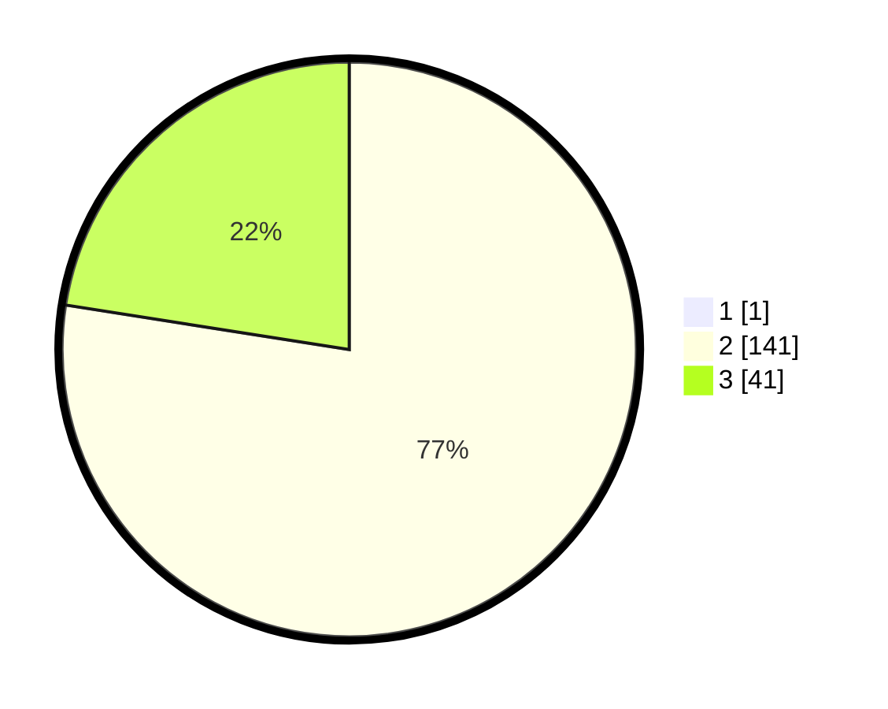

# Hasil

## Grafik

## Tabel

| No. | Nama Paslon    | Suara | Suara (raw) | Persentase |
|:--- |:-------------- | -----:| -----------:| ----------:|
| 1   | ANIES MUHAIMIN | 1     | [1][p-1]    | 0,55       |
| 2   | PRABOWO GIBRAN | 141   | [141][p-2]  | 77,05      |
| 3   | GANJAR MAHFUD  | 41    | [41][p-3]   | 22,40      |

[p-1]: https://github.com/gigit-pemilu/pemilu-2024/blob/main/pilpres/hitung-suara/sub/51-bali/sub/04-gianyar/sub/07-payangan/sub/2003-bukian/sub/002-tps/sub/paslon-1.txt
[p-2]: https://github.com/gigit-pemilu/pemilu-2024/blob/main/pilpres/hitung-suara/sub/51-bali/sub/04-gianyar/sub/07-payangan/sub/2003-bukian/sub/002-tps/sub/paslon-2.txt
[p-3]: https://github.com/gigit-pemilu/pemilu-2024/blob/main/pilpres/hitung-suara/sub/51-bali/sub/04-gianyar/sub/07-payangan/sub/2003-bukian/sub/002-tps/sub/paslon-3.txt

## Foto C Plano

https://sirekap-obj-formc.kpu.go.id/d43e/pemilu/ppwp/51/04/07/20/03/5104072003002-20240214-220009--efa44b0d-9c05-4a26-b597-3fb41068b743.jpg

https://sirekap-obj-formc.kpu.go.id/d43e/pemilu/ppwp/51/04/07/20/03/5104072003002-20240214-222302--63357577-e745-4c62-abfe-65a4a6890d16.jpg

https://sirekap-obj-formc.kpu.go.id/d43e/pemilu/ppwp/51/04/07/20/03/5104072003002-20240214-222440--7650c71a-3ce2-4c9a-97cb-a6ca01988852.jpg

## Metadata

| Key        | Value               |
| ---------- | ------------------- |
| Time Stamp | 2024-02-15 22:30:27 |

