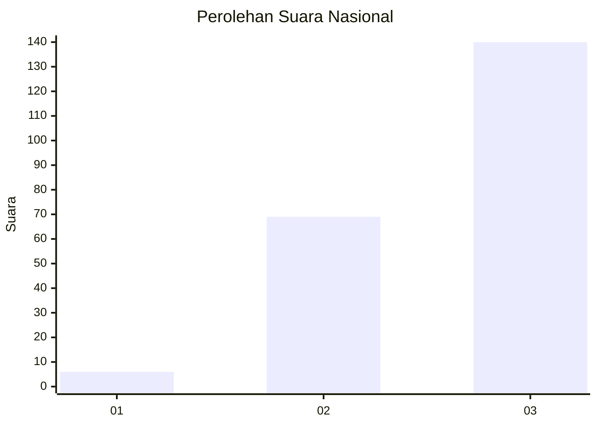
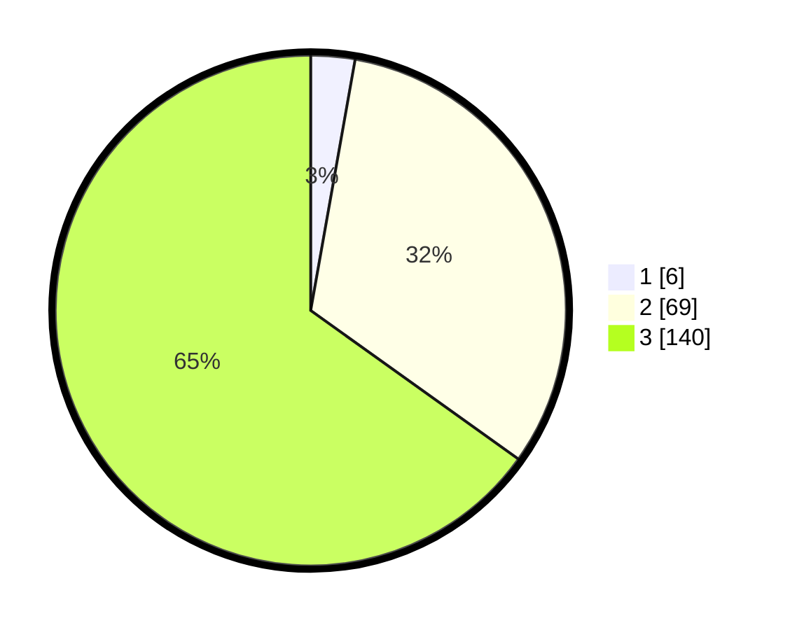

# Hasil

## Grafik

## Tabel

| No. | Nama Paslon    | Suara | Suara (raw) | Persentase |
|:--- |:-------------- | -----:| -----------:| ----------:|
| 1   | ANIES MUHAIMIN | 6     | [6][p-1]    | 2,79       |
| 2   | PRABOWO GIBRAN | 69    | [69][p-2]   | 32,09      |
| 3   | GANJAR MAHFUD  | 140   | [140][p-3]  | 65,12      |

[p-1]: https://github.com/gigit-pemilu/pemilu-2024/blob/main/pilpres/hitung-suara/sub/51-bali/sub/04-gianyar/sub/07-payangan/sub/2003-bukian/sub/014-tps/sub/paslon-1.txt
[p-2]: https://github.com/gigit-pemilu/pemilu-2024/blob/main/pilpres/hitung-suara/sub/51-bali/sub/04-gianyar/sub/07-payangan/sub/2003-bukian/sub/014-tps/sub/paslon-2.txt
[p-3]: https://github.com/gigit-pemilu/pemilu-2024/blob/main/pilpres/hitung-suara/sub/51-bali/sub/04-gianyar/sub/07-payangan/sub/2003-bukian/sub/014-tps/sub/paslon-3.txt

## Foto C Plano

https://sirekap-obj-formc.kpu.go.id/c38f/pemilu/ppwp/51/04/07/20/03/5104072003014-20240214-194107--1e4c1ad5-8f50-422b-87e8-c5fa80301f3a.jpg

https://sirekap-obj-formc.kpu.go.id/c38f/pemilu/ppwp/51/04/07/20/03/5104072003014-20240214-194222--107086a1-fa71-4a4a-b925-f10ee437df6e.jpg

https://sirekap-obj-formc.kpu.go.id/c38f/pemilu/ppwp/51/04/07/20/03/5104072003014-20240214-194304--b50b6f93-7e0e-40fa-8e35-1f4f05e3c5bc.jpg

## Metadata

| Key        | Value               |
| ---------- | ------------------- |
| Time Stamp | 2024-02-15 12:00:28 |

