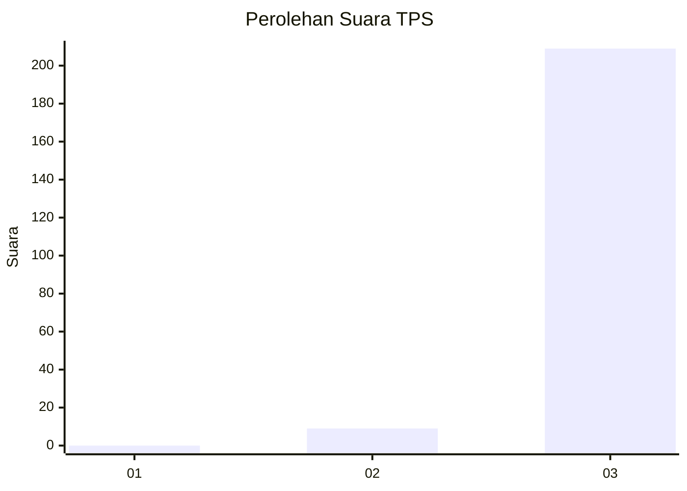
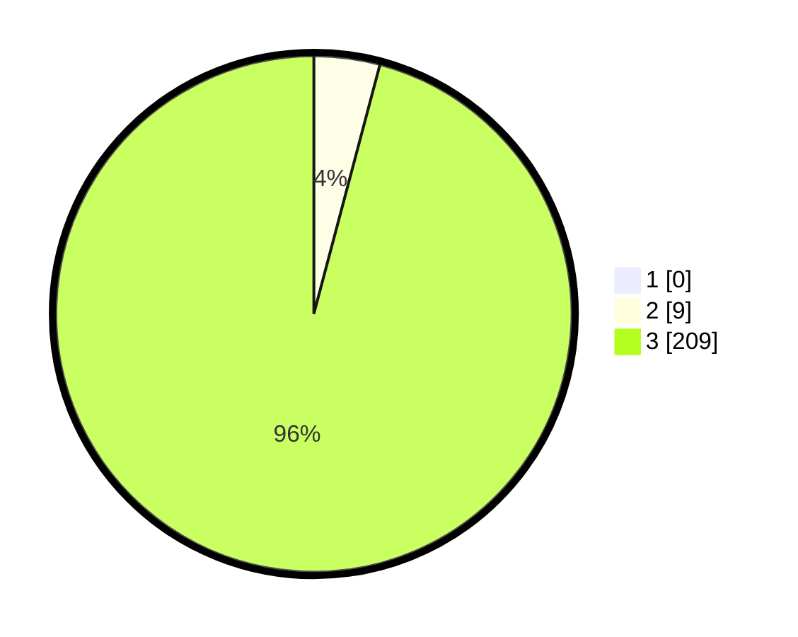

# Hasil

## Grafik

## Tabel

| No. | Nama Paslon    | Suara | Suara (raw) | Persentase |
|:--- |:-------------- | -----:| -----------:| ----------:|
| 1   | ANIES MUHAIMIN | 0     | [0][p-1]    | 0,00       |
| 2   | PRABOWO GIBRAN | 9     | [9][p-2]    | 4,13       |
| 3   | GANJAR MAHFUD  | 209   | [209][p-3]  | 95,87      |

[p-1]: https://github.com/gigit-pemilu/pemilu-2024-51-bali/blob/main/pilpres/hitung-suara/sub/51-bali/sub/04-gianyar/sub/07-payangan/sub/2003-bukian/sub/022-tps/sub/paslon-1.txt
[p-2]: https://github.com/gigit-pemilu/pemilu-2024-51-bali/blob/main/pilpres/hitung-suara/sub/51-bali/sub/04-gianyar/sub/07-payangan/sub/2003-bukian/sub/022-tps/sub/paslon-2.txt
[p-3]: https://github.com/gigit-pemilu/pemilu-2024-51-bali/blob/main/pilpres/hitung-suara/sub/51-bali/sub/04-gianyar/sub/07-payangan/sub/2003-bukian/sub/022-tps/sub/paslon-3.txt

## Foto C Plano

https://sirekap-obj-formc.kpu.go.id/4985/pemilu/ppwp/51/04/07/20/03/5104072003022-20240214-194418--c102990d-d284-4429-b395-0d550ddba551.jpg

https://sirekap-obj-formc.kpu.go.id/4985/pemilu/ppwp/51/04/07/20/03/5104072003022-20240214-194425--105730b3-5171-4d17-acb2-0644ad2c4a14.jpg

https://sirekap-obj-formc.kpu.go.id/4985/pemilu/ppwp/51/04/07/20/03/5104072003022-20240214-194432--da8a20da-8631-4546-a4a5-c1f64398a929.jpg

## Metadata

| Key        | Value               |
| ---------- | ------------------- |
| Time Stamp | 2024-02-15 12:00:28 |

