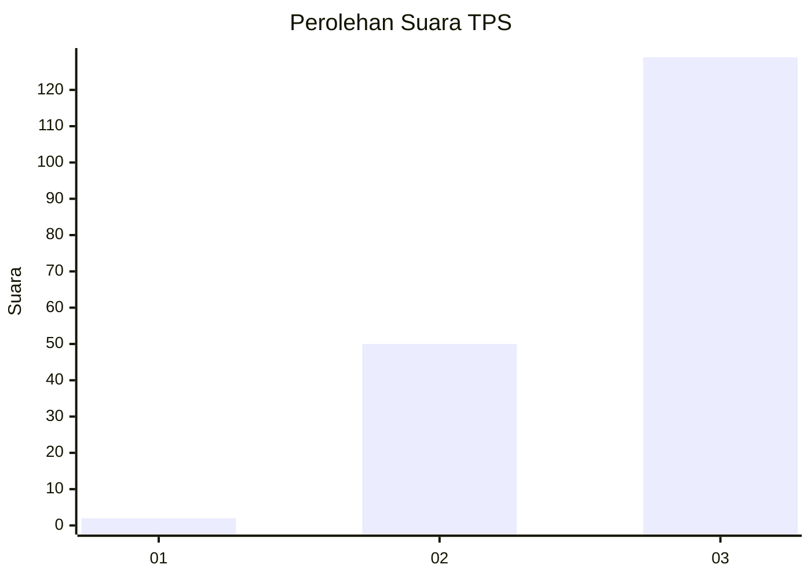
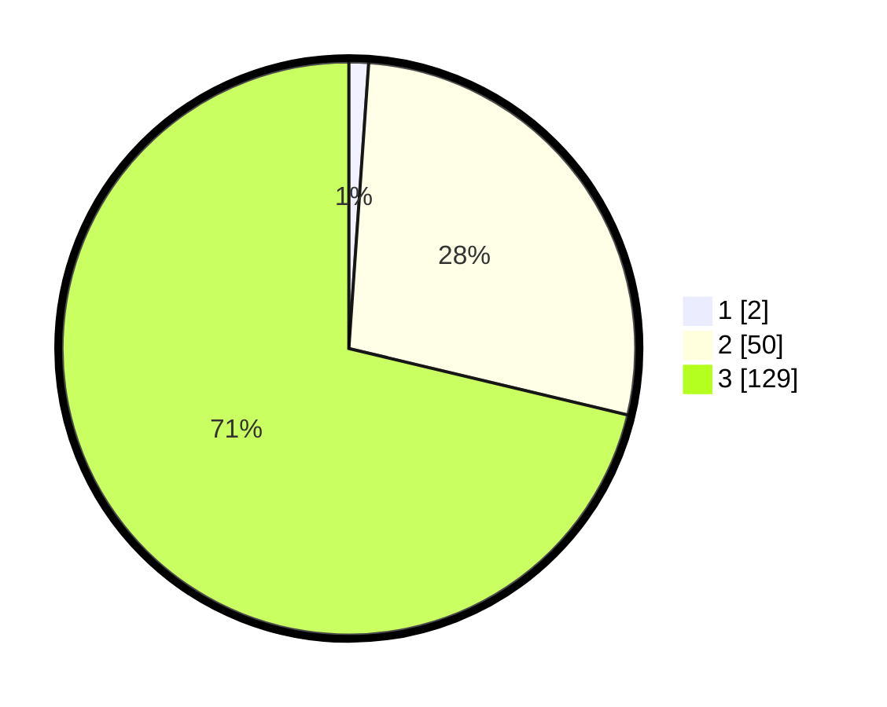

# Hasil

## Grafik

## Tabel

| No. | Nama Paslon    | Suara | Suara (raw) | Persentase |
|:--- |:-------------- | -----:| -----------:| ----------:|
| 1   | ANIES MUHAIMIN | 2     | [2][p-1]    | 1,10       |
| 2   | PRABOWO GIBRAN | 50    | [50][p-2]   | 27,62      |
| 3   | GANJAR MAHFUD  | 129   | [129][p-3]  | 71,27      |

[p-1]: https://github.com/gigit-pemilu/pemilu-2024-51-bali/blob/main/pilpres/hitung-suara/sub/51-bali/sub/04-gianyar/sub/07-payangan/sub/2004-puhu/sub/008-tps/sub/paslon-1.txt
[p-2]: https://github.com/gigit-pemilu/pemilu-2024-51-bali/blob/main/pilpres/hitung-suara/sub/51-bali/sub/04-gianyar/sub/07-payangan/sub/2004-puhu/sub/008-tps/sub/paslon-2.txt
[p-3]: https://github.com/gigit-pemilu/pemilu-2024-51-bali/blob/main/pilpres/hitung-suara/sub/51-bali/sub/04-gianyar/sub/07-payangan/sub/2004-puhu/sub/008-tps/sub/paslon-3.txt

## Foto C Plano

https://sirekap-obj-formc.kpu.go.id/28bd/pemilu/ppwp/51/04/07/20/04/5104072004008-20240214-214443--a4a27c75-26d5-4ad1-85f5-19182c3d4663.jpg

https://sirekap-obj-formc.kpu.go.id/28bd/pemilu/ppwp/51/04/07/20/04/5104072004008-20240214-205653--eaeb49b8-514b-4c5f-96a3-4a569cf5f759.jpg

https://sirekap-obj-formc.kpu.go.id/28bd/pemilu/ppwp/51/04/07/20/04/5104072004008-20240214-205832--a0f33b6d-e7da-45d8-b87e-bee5701c4952.jpg

## Metadata

| Key        | Value               |
| ---------- | ------------------- |
| Time Stamp | 2024-02-15 12:00:28 |

