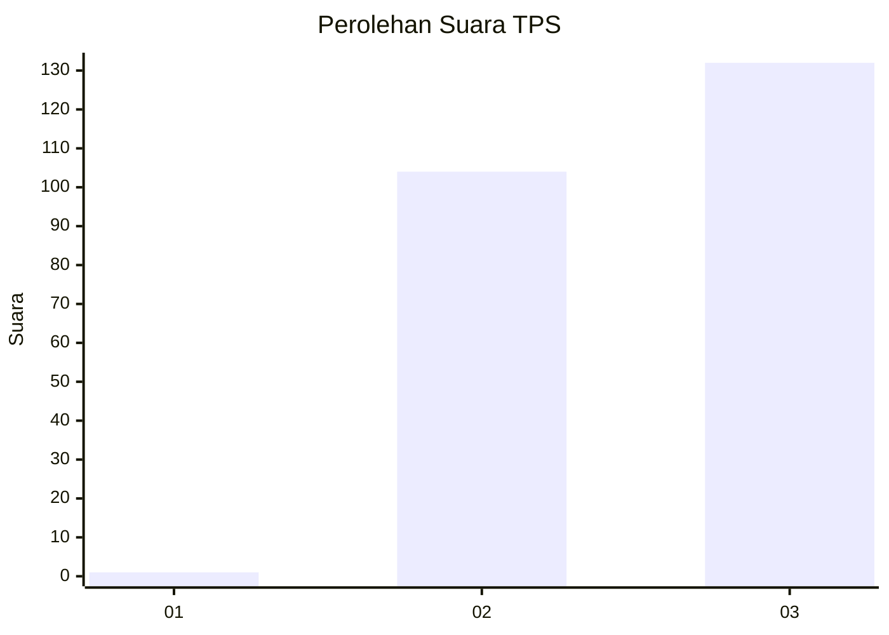
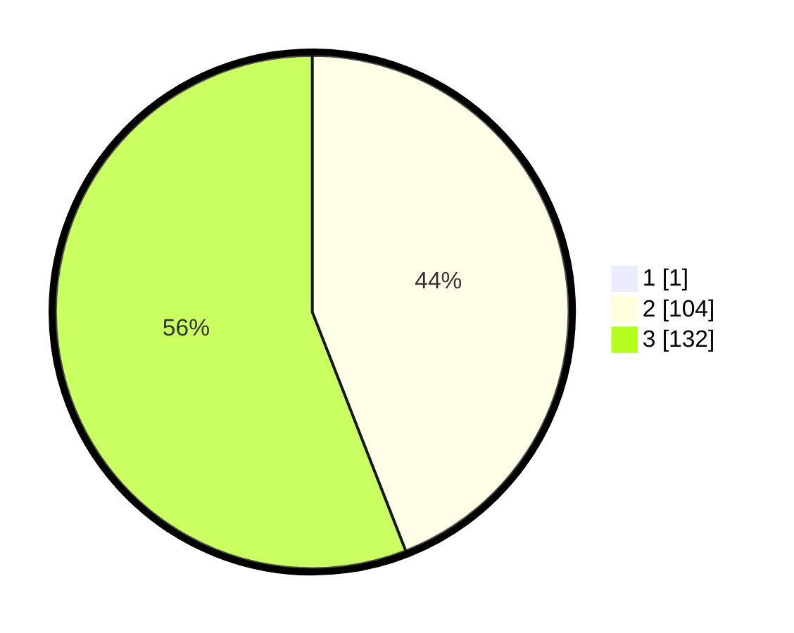

# Hasil

## Grafik

## Tabel

| No. | Nama Paslon    | Suara | Suara (raw) | Persentase |
|:--- |:-------------- | -----:| -----------:| ----------:|
| 1   | ANIES MUHAIMIN | 1     | [1][p-1]    | 0,42       |
| 2   | PRABOWO GIBRAN | 104   | [104][p-2]  | 43,88      |
| 3   | GANJAR MAHFUD  | 132   | [132][p-3]  | 55,70      |

[p-1]: https://github.com/gigit-pemilu/pemilu-2024-51-bali/blob/main/pilpres/hitung-suara/sub/51-bali/sub/04-gianyar/sub/07-payangan/sub/2004-puhu/sub/015-tps/sub/paslon-1.txt
[p-2]: https://github.com/gigit-pemilu/pemilu-2024-51-bali/blob/main/pilpres/hitung-suara/sub/51-bali/sub/04-gianyar/sub/07-payangan/sub/2004-puhu/sub/015-tps/sub/paslon-2.txt
[p-3]: https://github.com/gigit-pemilu/pemilu-2024-51-bali/blob/main/pilpres/hitung-suara/sub/51-bali/sub/04-gianyar/sub/07-payangan/sub/2004-puhu/sub/015-tps/sub/paslon-3.txt

## Foto C Plano

https://sirekap-obj-formc.kpu.go.id/3403/pemilu/ppwp/51/04/07/20/04/5104072004015-20240214-211910--626a44eb-ab7c-45f2-9f6f-83aa4e3e157a.jpg

https://sirekap-obj-formc.kpu.go.id/3403/pemilu/ppwp/51/04/07/20/04/5104072004015-20240214-212103--6f66d5da-a703-428c-b203-4976df071397.jpg

https://sirekap-obj-formc.kpu.go.id/3403/pemilu/ppwp/51/04/07/20/04/5104072004015-20240214-212257--90b576e0-49f9-46ef-84ec-4eae344a28c8.jpg

## Metadata

| Key        | Value               |
| ---------- | ------------------- |
| Time Stamp | 2024-02-15 12:00:28 |

