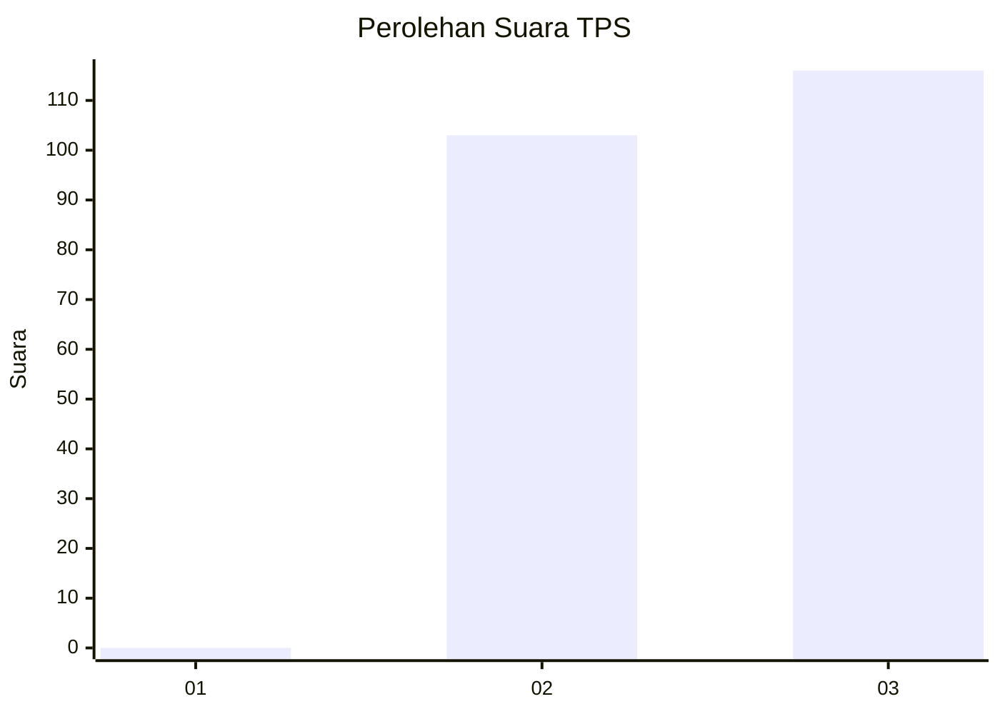
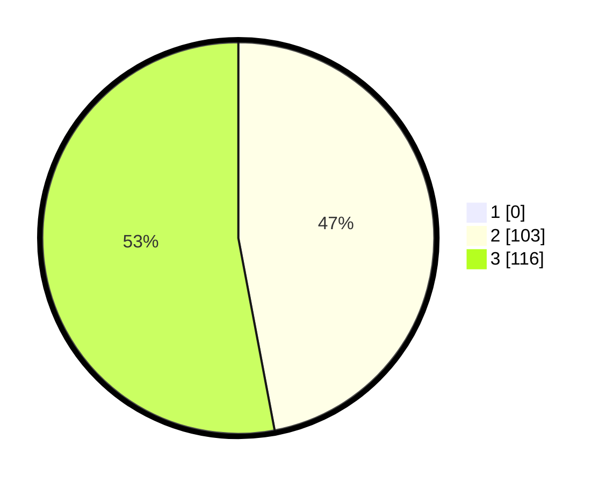

# Hasil

## Grafik

## Tabel

| No. | Nama Paslon    | Suara | Suara (raw) | Persentase |
|:--- |:-------------- | -----:| -----------:| ----------:|
| 1   | ANIES MUHAIMIN | 0     | [0][p-1]    | 0,00       |
| 2   | PRABOWO GIBRAN | 103   | [103][p-2]  | 47,03      |
| 3   | GANJAR MAHFUD  | 116   | [116][p-3]  | 52,97      |

[p-1]: https://github.com/gigit-pemilu/pemilu-2024-51-bali/blob/main/pilpres/hitung-suara/sub/51-bali/sub/04-gianyar/sub/07-payangan/sub/2004-puhu/sub/017-tps/sub/paslon-1.txt
[p-2]: https://github.com/gigit-pemilu/pemilu-2024-51-bali/blob/main/pilpres/hitung-suara/sub/51-bali/sub/04-gianyar/sub/07-payangan/sub/2004-puhu/sub/017-tps/sub/paslon-2.txt
[p-3]: https://github.com/gigit-pemilu/pemilu-2024-51-bali/blob/main/pilpres/hitung-suara/sub/51-bali/sub/04-gianyar/sub/07-payangan/sub/2004-puhu/sub/017-tps/sub/paslon-3.txt

## Foto C Plano

https://sirekap-obj-formc.kpu.go.id/f95b/pemilu/ppwp/51/04/07/20/04/5104072004017-20240214-191959--424f955d-71fb-43b0-898e-3cac1a152a91.jpg

https://sirekap-obj-formc.kpu.go.id/f95b/pemilu/ppwp/51/04/07/20/04/5104072004017-20240214-192052--f5beac9a-738c-42b3-94ef-6afa9c3e7865.jpg

https://sirekap-obj-formc.kpu.go.id/f95b/pemilu/ppwp/51/04/07/20/04/5104072004017-20240214-192141--728c48ac-af32-4493-82d2-fbdcca09d705.jpg

## Metadata

| Key        | Value               |
| ---------- | ------------------- |
| Time Stamp | 2024-02-15 12:00:28 |

