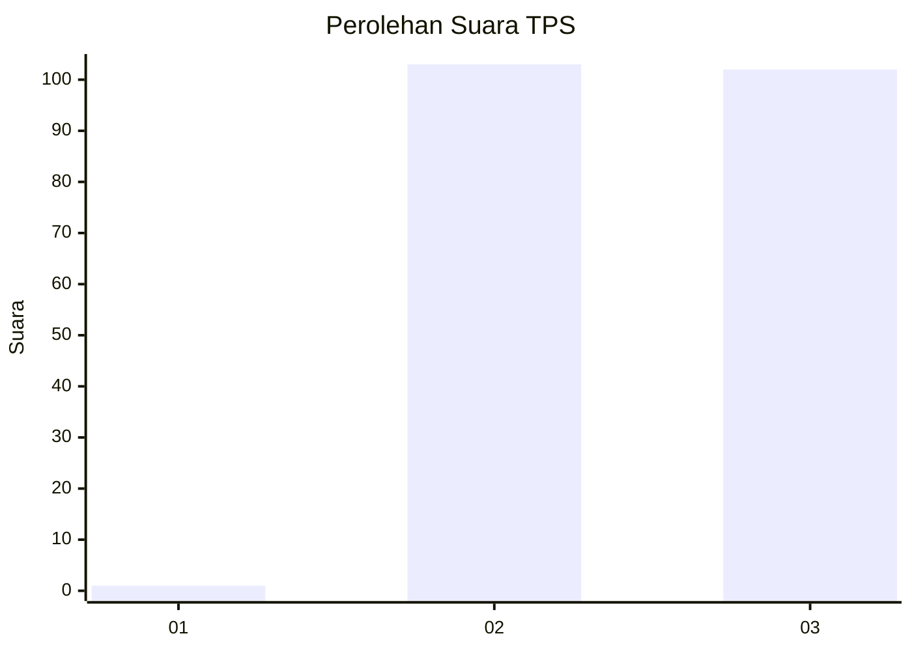
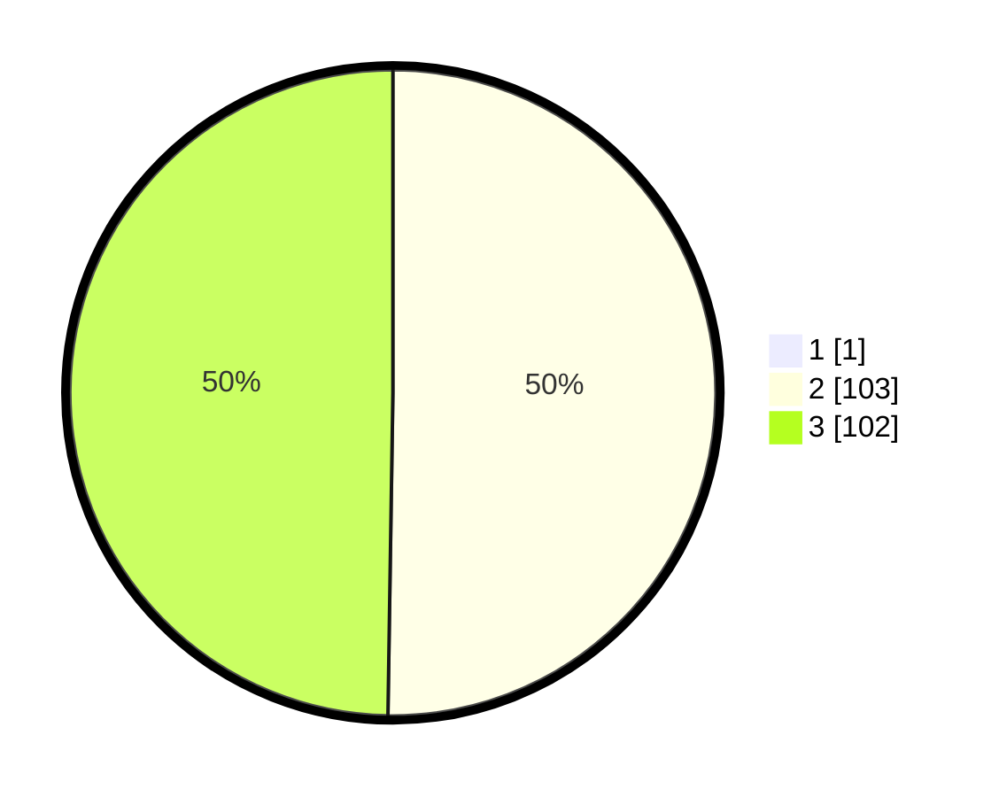

# Hasil

## Grafik

## Tabel

| No. | Nama Paslon    | Suara | Suara (raw) | Persentase |
|:--- |:-------------- | -----:| -----------:| ----------:|
| 1   | ANIES MUHAIMIN | 1     | [1][p-1]    | 0,49       |
| 2   | PRABOWO GIBRAN | 103   | [103][p-2]  | 50,00      |
| 3   | GANJAR MAHFUD  | 102   | [102][p-3]  | 49,51      |

[p-1]: https://github.com/gigit-pemilu/pemilu-2024-51-bali/blob/main/pilpres/hitung-suara/sub/51-bali/sub/04-gianyar/sub/07-payangan/sub/2004-puhu/sub/018-tps/sub/paslon-1.txt
[p-2]: https://github.com/gigit-pemilu/pemilu-2024-51-bali/blob/main/pilpres/hitung-suara/sub/51-bali/sub/04-gianyar/sub/07-payangan/sub/2004-puhu/sub/018-tps/sub/paslon-2.txt
[p-3]: https://github.com/gigit-pemilu/pemilu-2024-51-bali/blob/main/pilpres/hitung-suara/sub/51-bali/sub/04-gianyar/sub/07-payangan/sub/2004-puhu/sub/018-tps/sub/paslon-3.txt

## Foto C Plano

https://sirekap-obj-formc.kpu.go.id/9aa3/pemilu/ppwp/51/04/07/20/04/5104072004018-20240214-210959--ded97b8e-66c0-4ff7-b362-1bae040d9ddf.jpg

https://sirekap-obj-formc.kpu.go.id/9aa3/pemilu/ppwp/51/04/07/20/04/5104072004018-20240214-211109--21af8edc-ab25-40a8-8871-7b5cb4f9c6f9.jpg

https://sirekap-obj-formc.kpu.go.id/9aa3/pemilu/ppwp/51/04/07/20/04/5104072004018-20240214-211229--5eec786b-5159-4905-9dd9-6a1c71dfd3b1.jpg

## Metadata

| Key        | Value               |
| ---------- | ------------------- |
| Time Stamp | 2024-02-24 22:31:28 |

