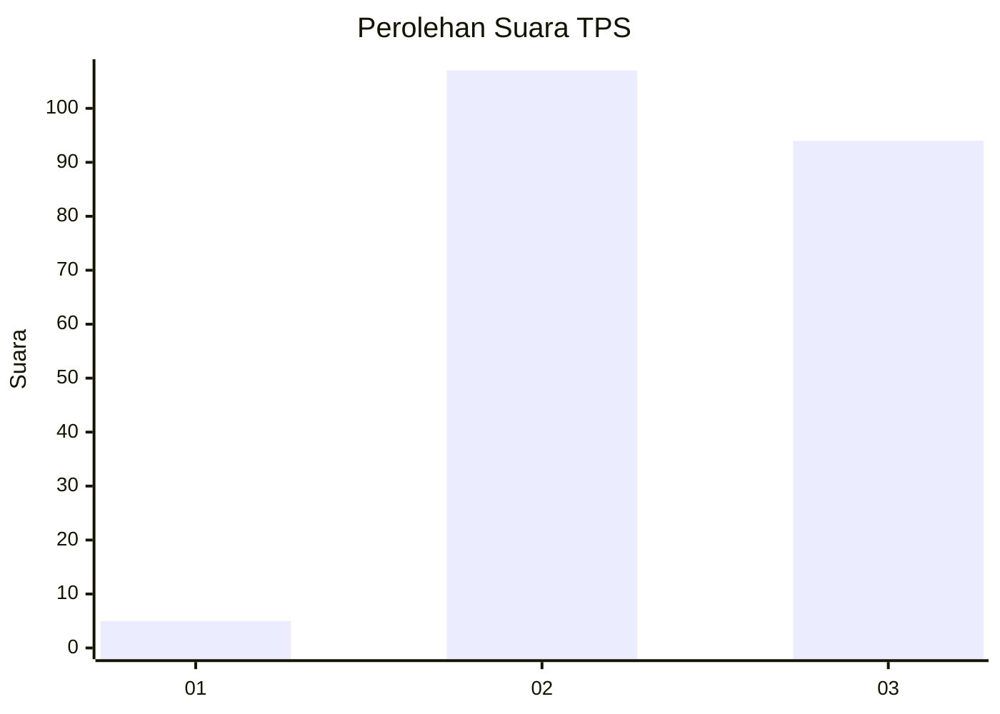
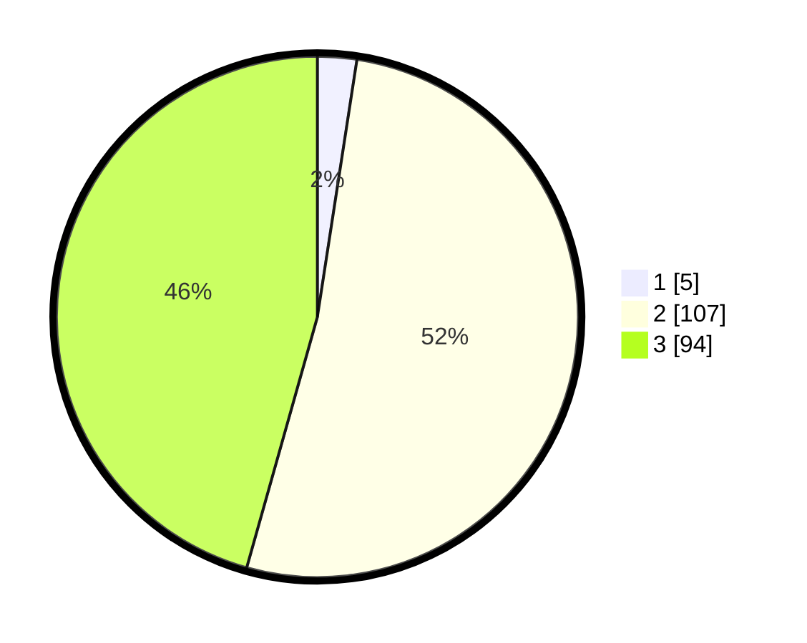

# Hasil

## Grafik

## Tabel

| No. | Nama Paslon    | Suara | Suara (raw) | Persentase |
|:--- |:-------------- | -----:| -----------:| ----------:|
| 1   | ANIES MUHAIMIN | 5     | [5][p-1]    | 2,43       |
| 2   | PRABOWO GIBRAN | 107   | [107][p-2]  | 51,94      |
| 3   | GANJAR MAHFUD  | 94    | [94][p-3]   | 45,63      |

[p-1]: https://github.com/gigit-pemilu/pemilu-2024-51-bali/blob/main/pilpres/hitung-suara/sub/51-bali/sub/04-gianyar/sub/07-payangan/sub/2005-buahan/sub/008-tps/sub/paslon-1.txt
[p-2]: https://github.com/gigit-pemilu/pemilu-2024-51-bali/blob/main/pilpres/hitung-suara/sub/51-bali/sub/04-gianyar/sub/07-payangan/sub/2005-buahan/sub/008-tps/sub/paslon-2.txt
[p-3]: https://github.com/gigit-pemilu/pemilu-2024-51-bali/blob/main/pilpres/hitung-suara/sub/51-bali/sub/04-gianyar/sub/07-payangan/sub/2005-buahan/sub/008-tps/sub/paslon-3.txt

## Foto C Plano

https://sirekap-obj-formc.kpu.go.id/4e6a/pemilu/ppwp/51/04/07/20/05/5104072005008-20240215-053553--879cc375-9851-4057-8cb9-52b235b3d75b.jpg

https://sirekap-obj-formc.kpu.go.id/4e6a/pemilu/ppwp/51/04/07/20/05/5104072005008-20240215-061530--b631f2f8-1a7a-4f50-a1da-fe6c4c79728f.jpg

https://sirekap-obj-formc.kpu.go.id/4e6a/pemilu/ppwp/51/04/07/20/05/5104072005008-20240215-061840--ab5fc79f-3c1a-4ad6-b472-46be7b33acd6.jpg

## Metadata

| Key        | Value               |
| ---------- | ------------------- |
| Time Stamp | 2024-02-15 12:00:28 |

