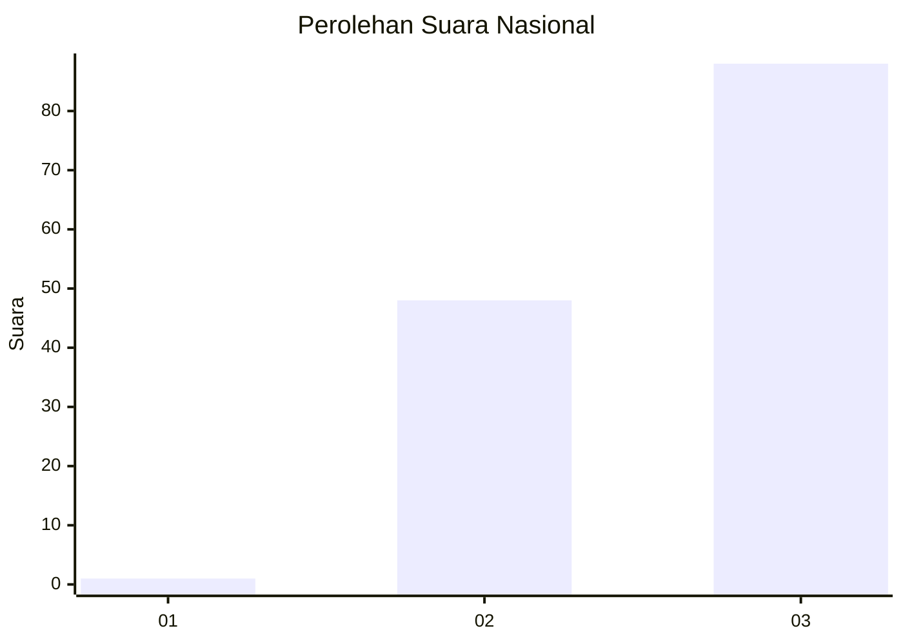
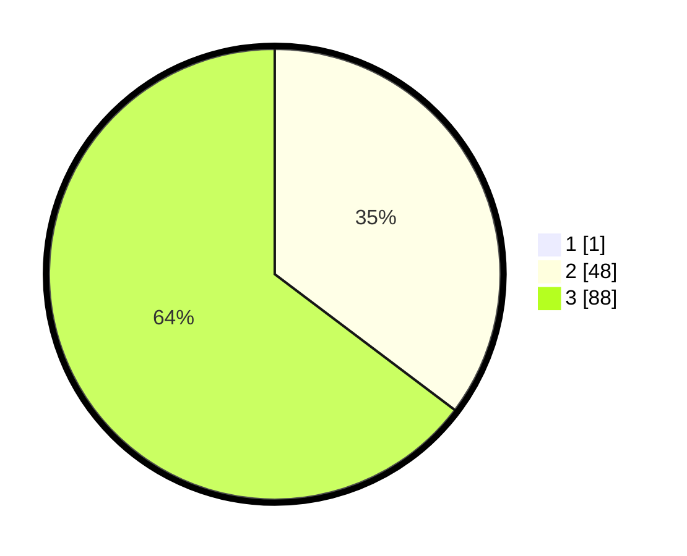

# Hasil

## Grafik

## Tabel

| No. | Nama Paslon    | Suara | Suara (raw) | Persentase |
|:--- |:-------------- | -----:| -----------:| ----------:|
| 1   | ANIES MUHAIMIN | 1     | [1][p-1]    | 0,73       |
| 2   | PRABOWO GIBRAN | 48    | [48][p-2]   | 35,04      |
| 3   | GANJAR MAHFUD  | 88    | [88][p-3]   | 64,23      |

[p-1]: https://github.com/gigit-pemilu/pemilu-2024/blob/main/pilpres/hitung-suara/sub/51-bali/sub/04-gianyar/sub/07-payangan/sub/2005-buahan/sub/009-tps/sub/paslon-1.txt
[p-2]: https://github.com/gigit-pemilu/pemilu-2024/blob/main/pilpres/hitung-suara/sub/51-bali/sub/04-gianyar/sub/07-payangan/sub/2005-buahan/sub/009-tps/sub/paslon-2.txt
[p-3]: https://github.com/gigit-pemilu/pemilu-2024/blob/main/pilpres/hitung-suara/sub/51-bali/sub/04-gianyar/sub/07-payangan/sub/2005-buahan/sub/009-tps/sub/paslon-3.txt

## Foto C Plano

https://sirekap-obj-formc.kpu.go.id/0f50/pemilu/ppwp/51/04/07/20/05/5104072005009-20240214-125849--47731ec6-9d0c-4db0-936f-24ab8657e68e.jpg

https://sirekap-obj-formc.kpu.go.id/0f50/pemilu/ppwp/51/04/07/20/05/5104072005009-20240216-002702--18a9f02e-e1ca-41e7-a893-31c6506dcaf2.jpg

https://sirekap-obj-formc.kpu.go.id/0f50/pemilu/ppwp/51/04/07/20/05/5104072005009-20240214-125845--38a7768f-bdac-406b-9d48-ea6d4ae454f0.jpg

## Metadata

| Key        | Value               |
| ---------- | ------------------- |
| Time Stamp | 2024-02-16 09:30:28 |

## DATA PEMILIH TETAP

Jumlah pemilih dalam DPT: **146**.
 * L: **74**.
 * P: **72**.

## DATA PENGGUNA HAK PILIH

Jumlah pengguna hak pilih dalam DPT: **135**.
 * L: **69**.
 * P: **66**.

Jumlah pengguna hak pilih dalam DPTb: **0**.
 * L: **0**.
 * P: **0**.

Jumlah pengguna hak pilih dalam DPK: **2**.
 * L: **1**.
 * P: **1**.

Jumlah pengguna hak pilih: **137**.
 * L: **70**.
 * P: **67**.

## JUMLAH SUARA SAH DAN TIDAK SAH

JUMLAH SELURUH SUARA SAH: **137**.

JUMLAH SUARA TIDAK SAH: **0**.

JUMLAH SELURUH SUARA SAH DAN SUARA TIDAK SAH: **137**.

