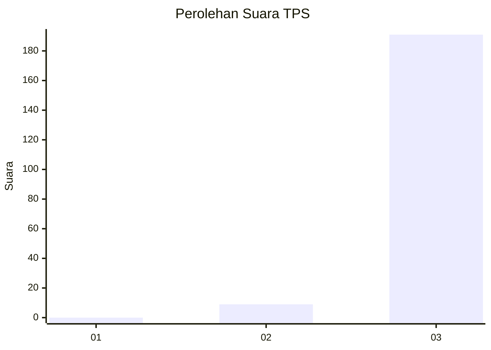
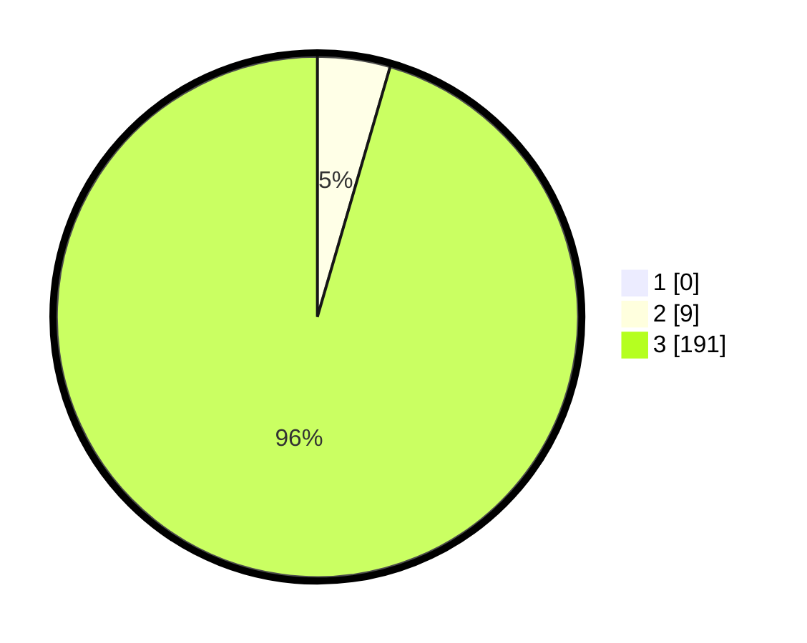

# Hasil

## Grafik

## Tabel

| No. | Nama Paslon    | Suara | Suara (raw) | Persentase |
|:--- |:-------------- | -----:| -----------:| ----------:|
| 1   | ANIES MUHAIMIN | 0     | [0][p-1]    | 0,00       |
| 2   | PRABOWO GIBRAN | 9     | [9][p-2]    | 4,50       |
| 3   | GANJAR MAHFUD  | 191   | [191][p-3]  | 95,50      |

[p-1]: https://github.com/gigit-pemilu/pemilu-2024-51-bali/blob/main/pilpres/hitung-suara/sub/51-bali/sub/04-gianyar/sub/07-payangan/sub/2006-kerta/sub/003-tps/sub/paslon-1.txt
[p-2]: https://github.com/gigit-pemilu/pemilu-2024-51-bali/blob/main/pilpres/hitung-suara/sub/51-bali/sub/04-gianyar/sub/07-payangan/sub/2006-kerta/sub/003-tps/sub/paslon-2.txt
[p-3]: https://github.com/gigit-pemilu/pemilu-2024-51-bali/blob/main/pilpres/hitung-suara/sub/51-bali/sub/04-gianyar/sub/07-payangan/sub/2006-kerta/sub/003-tps/sub/paslon-3.txt

## Foto C Plano

https://sirekap-obj-formc.kpu.go.id/393f/pemilu/ppwp/51/04/07/20/06/5104072006003-20240214-155548--724ac2c6-06b2-4ec8-8d7c-19f363f2fd81.jpg

https://sirekap-obj-formc.kpu.go.id/393f/pemilu/ppwp/51/04/07/20/06/5104072006003-20240214-155726--67fffdad-9578-4fd3-ba6c-c3c206ccc9aa.jpg

https://sirekap-obj-formc.kpu.go.id/393f/pemilu/ppwp/51/04/07/20/06/5104072006003-20240214-160120--ee991a6f-0562-42d5-9544-7d887e87d430.jpg

## Metadata

| Key        | Value               |
| ---------- | ------------------- |
| Time Stamp | 2024-02-15 12:00:28 |

