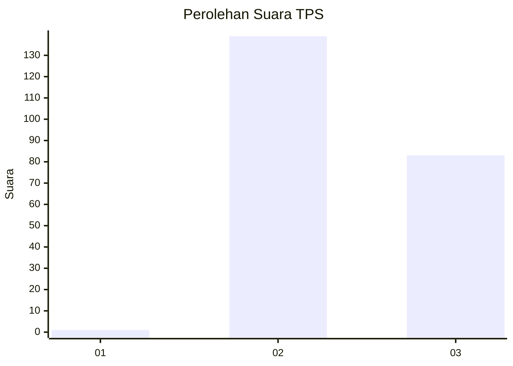
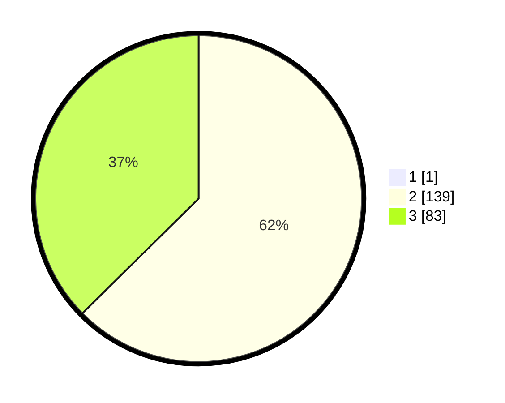

# Hasil

## Grafik

## Tabel

| No. | Nama Paslon    | Suara | Suara (raw) | Persentase |
|:--- |:-------------- | -----:| -----------:| ----------:|
| 1   | ANIES MUHAIMIN | 1     | [1][p-1]    | 0,45       |
| 2   | PRABOWO GIBRAN | 139   | [139][p-2]  | 62,33      |
| 3   | GANJAR MAHFUD  | 83    | [83][p-3]   | 37,22      |

[p-1]: https://github.com/gigit-pemilu/pemilu-2024-51-bali/blob/main/pilpres/hitung-suara/sub/51-bali/sub/04-gianyar/sub/07-payangan/sub/2006-kerta/sub/013-tps/sub/paslon-1.txt
[p-2]: https://github.com/gigit-pemilu/pemilu-2024-51-bali/blob/main/pilpres/hitung-suara/sub/51-bali/sub/04-gianyar/sub/07-payangan/sub/2006-kerta/sub/013-tps/sub/paslon-2.txt
[p-3]: https://github.com/gigit-pemilu/pemilu-2024-51-bali/blob/main/pilpres/hitung-suara/sub/51-bali/sub/04-gianyar/sub/07-payangan/sub/2006-kerta/sub/013-tps/sub/paslon-3.txt

## Foto C Plano

https://sirekap-obj-formc.kpu.go.id/9eb0/pemilu/ppwp/51/04/07/20/06/5104072006013-20240214-131651--65eac431-c74e-44bd-9338-045b2a0f05cf.jpg

https://sirekap-obj-formc.kpu.go.id/9eb0/pemilu/ppwp/51/04/07/20/06/5104072006013-20240214-131759--fe1d2823-14a9-4880-beef-d7c014b892bc.jpg

https://sirekap-obj-formc.kpu.go.id/9eb0/pemilu/ppwp/51/04/07/20/06/5104072006013-20240214-131833--996c4f42-d26a-44ea-9bb5-3b09c9928248.jpg

## Metadata

| Key        | Value               |
| ---------- | ------------------- |
| Time Stamp | 2024-02-15 12:00:28 |

