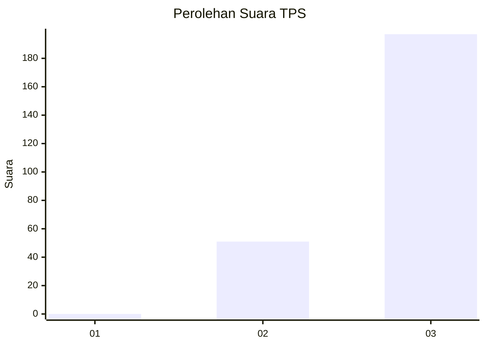
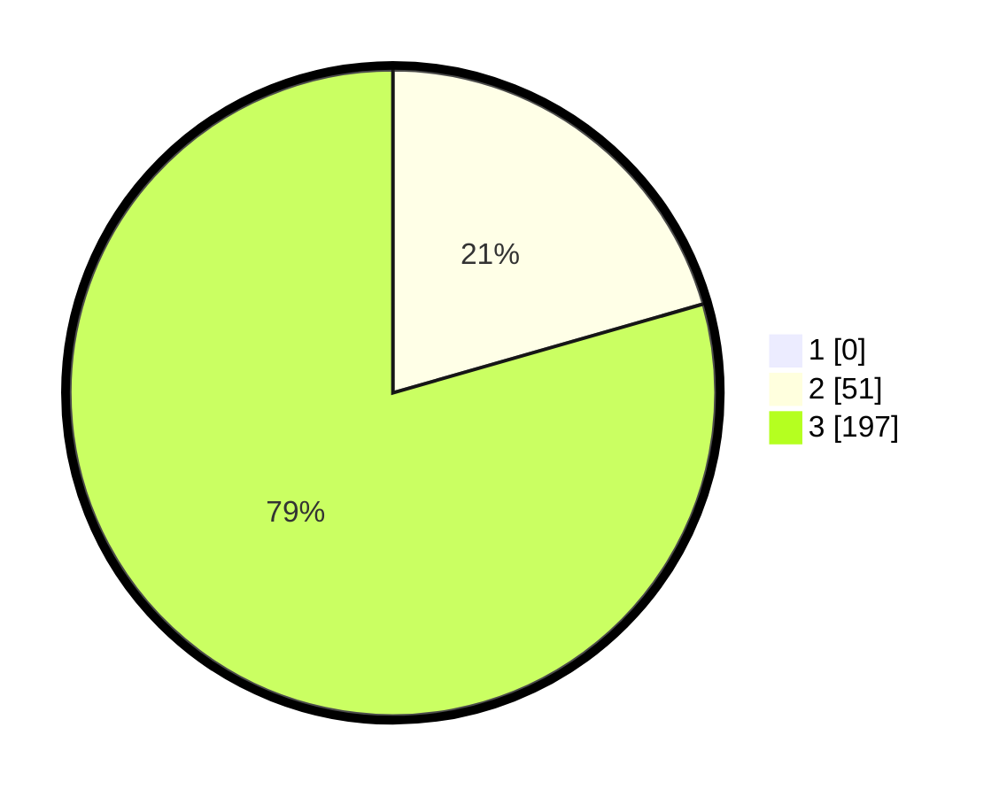

# Hasil

## Grafik

## Tabel

| No. | Nama Paslon    | Suara | Suara (raw) | Persentase |
|:--- |:-------------- | -----:| -----------:| ----------:|
| 1   | ANIES MUHAIMIN | 0     | [0][p-1]    | 0,00       |
| 2   | PRABOWO GIBRAN | 51    | [51][p-2]   | 20,56      |
| 3   | GANJAR MAHFUD  | 197   | [197][p-3]  | 79,44      |

[p-1]: https://github.com/gigit-pemilu/pemilu-2024-51-bali/blob/main/pilpres/hitung-suara/sub/51-bali/sub/04-gianyar/sub/07-payangan/sub/2006-kerta/sub/015-tps/sub/paslon-1.txt
[p-2]: https://github.com/gigit-pemilu/pemilu-2024-51-bali/blob/main/pilpres/hitung-suara/sub/51-bali/sub/04-gianyar/sub/07-payangan/sub/2006-kerta/sub/015-tps/sub/paslon-2.txt
[p-3]: https://github.com/gigit-pemilu/pemilu-2024-51-bali/blob/main/pilpres/hitung-suara/sub/51-bali/sub/04-gianyar/sub/07-payangan/sub/2006-kerta/sub/015-tps/sub/paslon-3.txt

## Foto C Plano

https://sirekap-obj-formc.kpu.go.id/6ee2/pemilu/ppwp/51/04/07/20/06/5104072006015-20240215-062722--b968d718-3c63-45cb-8270-4565983d8bc4.jpg

https://sirekap-obj-formc.kpu.go.id/6ee2/pemilu/ppwp/51/04/07/20/06/5104072006015-20240215-062732--a3a13ac0-6a85-4161-a482-23d8ef1b92b7.jpg

https://sirekap-obj-formc.kpu.go.id/6ee2/pemilu/ppwp/51/04/07/20/06/5104072006015-20240215-062739--9e0429a0-12b4-41b0-9148-bcbbfda2034a.jpg

## Metadata

| Key        | Value               |
| ---------- | ------------------- |
| Time Stamp | 2024-02-15 15:00:29 |

