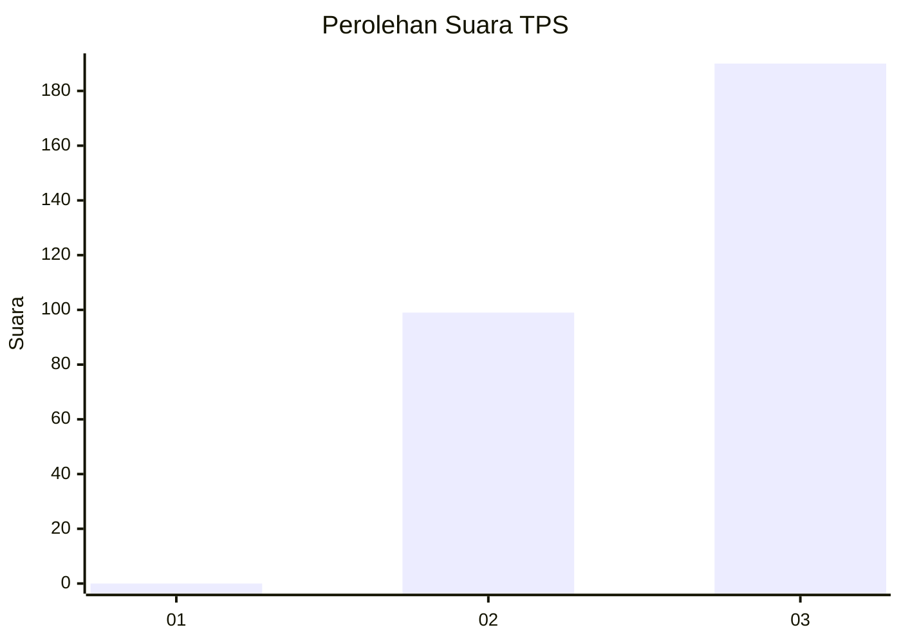
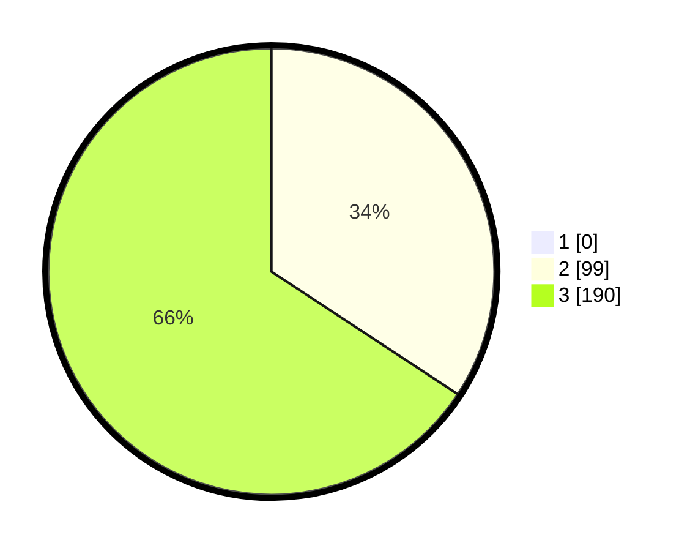

# Hasil

## Grafik

## Tabel

| No. | Nama Paslon    | Suara | Suara (raw) | Persentase |
|:--- |:-------------- | -----:| -----------:| ----------:|
| 1   | ANIES MUHAIMIN | 0     | [0][p-1]    | 0,00       |
| 2   | PRABOWO GIBRAN | 99    | [99][p-2]   | 34,26      |
| 3   | GANJAR MAHFUD  | 190   | [190][p-3]  | 65,74      |

[p-1]: https://github.com/gigit-pemilu/pemilu-2024-51-bali/blob/main/pilpres/hitung-suara/sub/51-bali/sub/04-gianyar/sub/07-payangan/sub/2006-kerta/sub/018-tps/sub/paslon-1.txt
[p-2]: https://github.com/gigit-pemilu/pemilu-2024-51-bali/blob/main/pilpres/hitung-suara/sub/51-bali/sub/04-gianyar/sub/07-payangan/sub/2006-kerta/sub/018-tps/sub/paslon-2.txt
[p-3]: https://github.com/gigit-pemilu/pemilu-2024-51-bali/blob/main/pilpres/hitung-suara/sub/51-bali/sub/04-gianyar/sub/07-payangan/sub/2006-kerta/sub/018-tps/sub/paslon-3.txt

## Foto C Plano

https://sirekap-obj-formc.kpu.go.id/4975/pemilu/ppwp/51/04/07/20/06/5104072006018-20240214-200122--2d9bda79-8819-44a0-800e-7067b2f31768.jpg

https://sirekap-obj-formc.kpu.go.id/4975/pemilu/ppwp/51/04/07/20/06/5104072006018-20240214-122738--928691a9-340b-486f-83da-f540f312e632.jpg

https://sirekap-obj-formc.kpu.go.id/4975/pemilu/ppwp/51/04/07/20/06/5104072006018-20240214-123054--58e96b47-261c-45a3-bfc3-24f52b179790.jpg

## Metadata

| Key        | Value               |
| ---------- | ------------------- |
| Time Stamp | 2024-02-15 12:00:28 |

