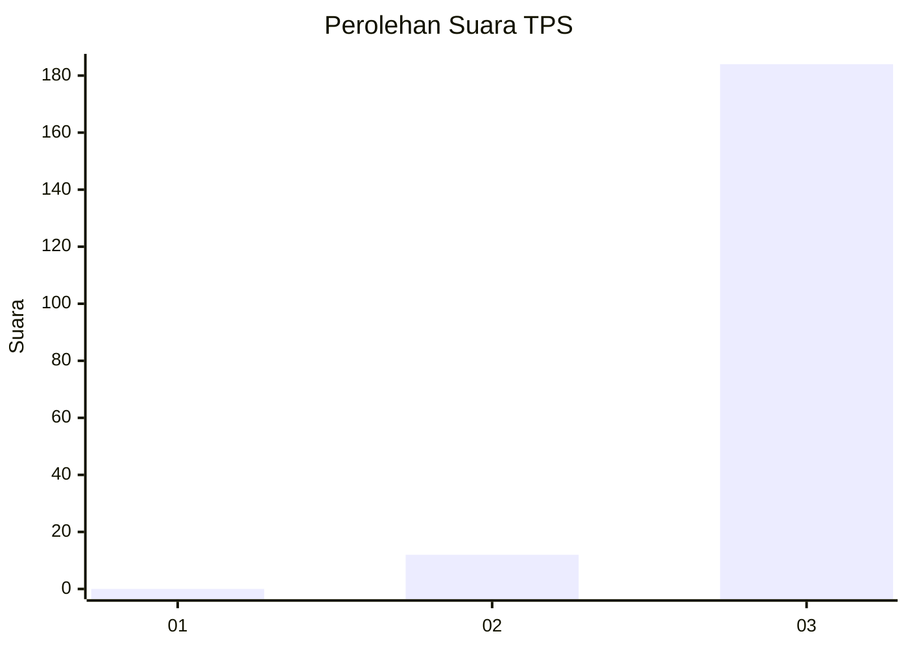
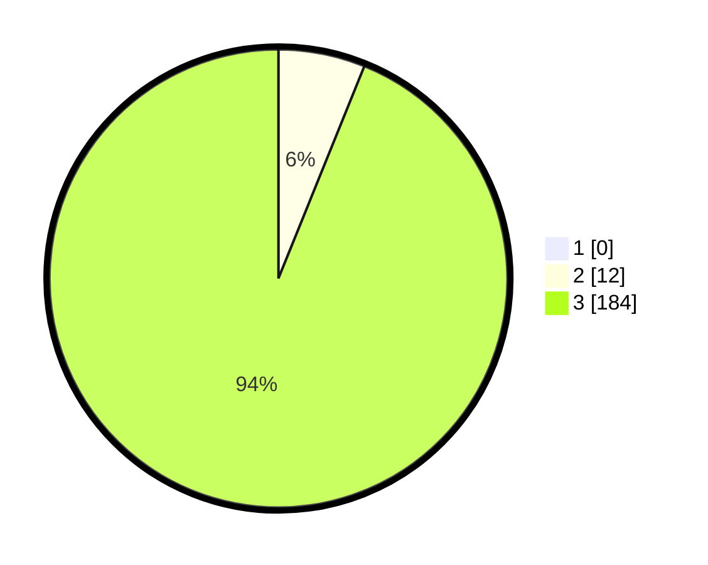

# Hasil

## Grafik

## Tabel

| No. | Nama Paslon    | Suara | Suara (raw) | Persentase |
|:--- |:-------------- | -----:| -----------:| ----------:|
| 1   | ANIES MUHAIMIN | 0     | [0][p-1]    | 0,00       |
| 2   | PRABOWO GIBRAN | 12    | [12][p-2]   | 6,12       |
| 3   | GANJAR MAHFUD  | 184   | [184][p-3]  | 93,88      |

[p-1]: https://github.com/gigit-pemilu/pemilu-2024-51-bali/blob/main/pilpres/hitung-suara/sub/51-bali/sub/04-gianyar/sub/07-payangan/sub/2007-melinggih-kelod/sub/008-tps/sub/paslon-1.txt
[p-2]: https://github.com/gigit-pemilu/pemilu-2024-51-bali/blob/main/pilpres/hitung-suara/sub/51-bali/sub/04-gianyar/sub/07-payangan/sub/2007-melinggih-kelod/sub/008-tps/sub/paslon-2.txt
[p-3]: https://github.com/gigit-pemilu/pemilu-2024-51-bali/blob/main/pilpres/hitung-suara/sub/51-bali/sub/04-gianyar/sub/07-payangan/sub/2007-melinggih-kelod/sub/008-tps/sub/paslon-3.txt

## Foto C Plano

https://sirekap-obj-formc.kpu.go.id/27d9/pemilu/ppwp/51/04/07/20/07/5104072007008-20240214-192218--fe836799-ba93-4f63-b7f1-e3eb7fd1ddad.jpg

https://sirekap-obj-formc.kpu.go.id/27d9/pemilu/ppwp/51/04/07/20/07/5104072007008-20240216-013446--60d76094-3aac-4c94-b41d-8f714f7fa4ab.jpg

https://sirekap-obj-formc.kpu.go.id/27d9/pemilu/ppwp/51/04/07/20/07/5104072007008-20240214-190611--c099cedd-09c4-41ae-bda1-bd13289d74c0.jpg

## Metadata

| Key        | Value               |
| ---------- | ------------------- |
| Time Stamp | 2024-02-16 09:30:28 |

