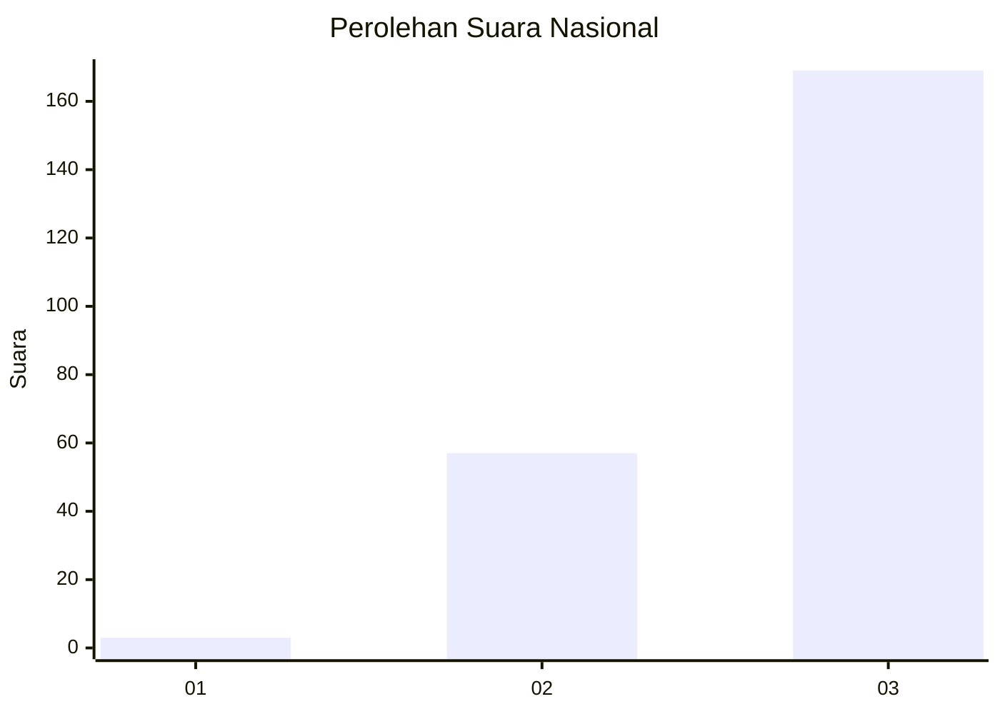
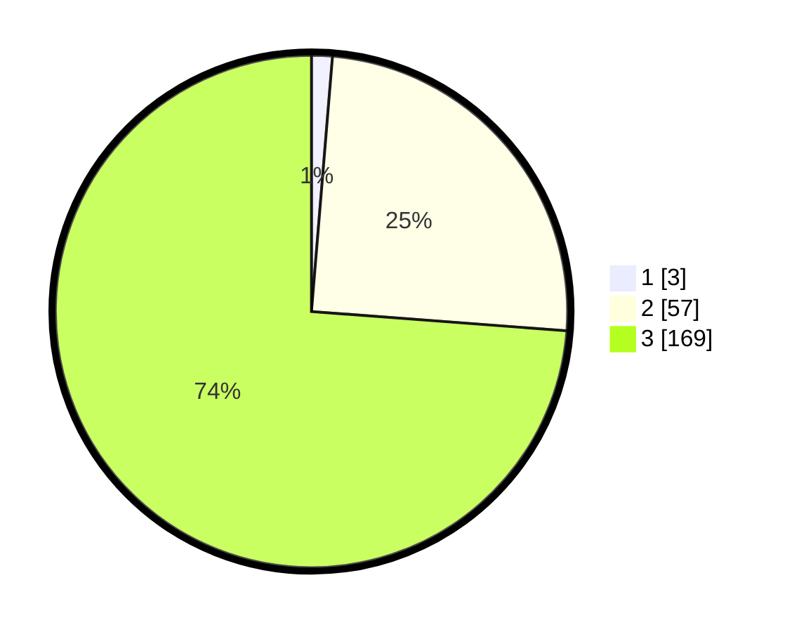

# Hasil

## Grafik

## Tabel

| No. | Nama Paslon    | Suara | Suara (raw) | Persentase |
|:--- |:-------------- | -----:| -----------:| ----------:|
| 1   | ANIES MUHAIMIN | 3     | [3][p-1]    | 1,31       |
| 2   | PRABOWO GIBRAN | 57    | [57][p-2]   | 24,89      |
| 3   | GANJAR MAHFUD  | 169   | [169][p-3]  | 73,80      |

[p-1]: https://github.com/gigit-pemilu/pemilu-2024/blob/main/pilpres/hitung-suara/sub/51-bali/sub/04-gianyar/sub/07-payangan/sub/2008-buahan-kaja/sub/001-tps/sub/paslon-1.txt
[p-2]: https://github.com/gigit-pemilu/pemilu-2024/blob/main/pilpres/hitung-suara/sub/51-bali/sub/04-gianyar/sub/07-payangan/sub/2008-buahan-kaja/sub/001-tps/sub/paslon-2.txt
[p-3]: https://github.com/gigit-pemilu/pemilu-2024/blob/main/pilpres/hitung-suara/sub/51-bali/sub/04-gianyar/sub/07-payangan/sub/2008-buahan-kaja/sub/001-tps/sub/paslon-3.txt

## Foto C Plano

https://sirekap-obj-formc.kpu.go.id/0a4e/pemilu/ppwp/51/04/07/20/08/5104072008001-20240214-190514--7c5b5a92-44d9-4030-b3df-18b613305b8e.jpg

https://sirekap-obj-formc.kpu.go.id/0a4e/pemilu/ppwp/51/04/07/20/08/5104072008001-20240214-190748--7114fac0-bfa8-4ade-a6e0-27dd53b962b4.jpg

https://sirekap-obj-formc.kpu.go.id/0a4e/pemilu/ppwp/51/04/07/20/08/5104072008001-20240214-191109--fec449a3-2677-41bc-b124-3cb18ab80e4e.jpg

## Metadata

| Key        | Value               |
| ---------- | ------------------- |
| Time Stamp | 2024-02-14 21:46:01 |

## DATA PEMILIH TETAP

Jumlah pemilih dalam DPT: **241**.
 * L: **121**.
 * P: **120**.

## DATA PENGGUNA HAK PILIH

Jumlah pengguna hak pilih dalam DPT: **230**.
 * L: **120**.
 * P: **110**.

Jumlah pengguna hak pilih dalam DPTb: **0**.
 * L: **4**.
 * P: **0**.

Jumlah pengguna hak pilih dalam DPK: **0**.
 * L: **0**.
 * P: **0**.

Jumlah pengguna hak pilih: **234**.
 * L: **124**.
 * P: **110**.

## JUMLAH SUARA SAH DAN TIDAK SAH

JUMLAH SELURUH SUARA SAH: **229**.

JUMLAH SUARA TIDAK SAH: **5**.

JUMLAH SELURUH SUARA SAH DAN SUARA TIDAK SAH: **234**.

