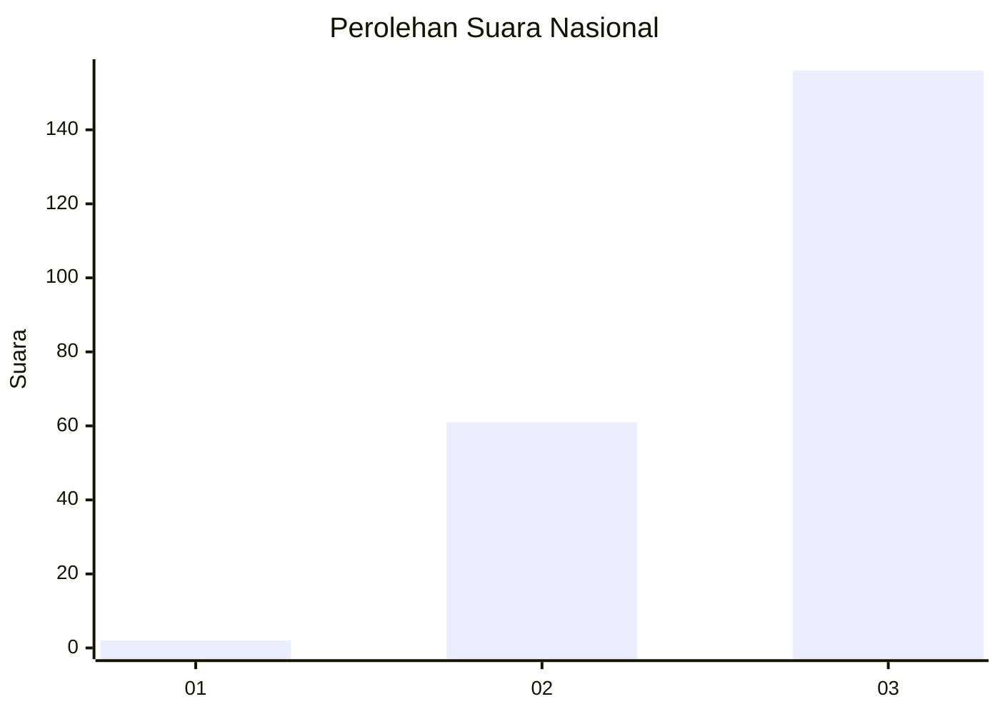
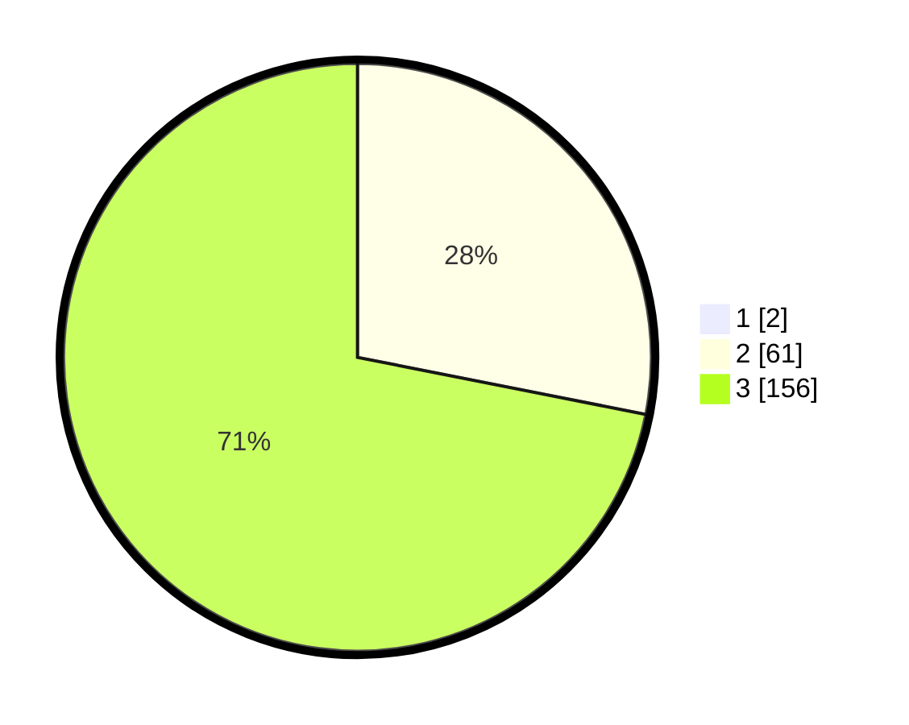

# Hasil

## Grafik

## Tabel

| No. | Nama Paslon    | Suara | Suara (raw) | Persentase |
|:--- |:-------------- | -----:| -----------:| ----------:|
| 1   | ANIES MUHAIMIN | 2     | [2][p-1]    | 0,91       |
| 2   | PRABOWO GIBRAN | 61    | [61][p-2]   | 27,85      |
| 3   | GANJAR MAHFUD  | 156   | [156][p-3]  | 71,23      |

[p-1]: https://github.com/gigit-pemilu/pemilu-2024/blob/main/pilpres/hitung-suara/sub/51-bali/sub/04-gianyar/sub/07-payangan/sub/2008-buahan-kaja/sub/010-tps/sub/paslon-1.txt
[p-2]: https://github.com/gigit-pemilu/pemilu-2024/blob/main/pilpres/hitung-suara/sub/51-bali/sub/04-gianyar/sub/07-payangan/sub/2008-buahan-kaja/sub/010-tps/sub/paslon-2.txt
[p-3]: https://github.com/gigit-pemilu/pemilu-2024/blob/main/pilpres/hitung-suara/sub/51-bali/sub/04-gianyar/sub/07-payangan/sub/2008-buahan-kaja/sub/010-tps/sub/paslon-3.txt

## Foto C Plano

https://sirekap-obj-formc.kpu.go.id/48e2/pemilu/ppwp/51/04/07/20/08/5104072008010-20240214-200752--a7cd43c9-533f-46a5-a652-02bfe547866c.jpg

https://sirekap-obj-formc.kpu.go.id/48e2/pemilu/ppwp/51/04/07/20/08/5104072008010-20240214-200920--ab0b68b4-bc14-4e4a-a11d-7fab17700988.jpg

https://sirekap-obj-formc.kpu.go.id/48e2/pemilu/ppwp/51/04/07/20/08/5104072008010-20240214-200912--49b7b41f-db90-42ad-ac1f-0c52ac3b55b0.jpg

## Metadata

| Key        | Value               |
| ---------- | ------------------- |
| Time Stamp | 2024-02-15 12:00:28 |

