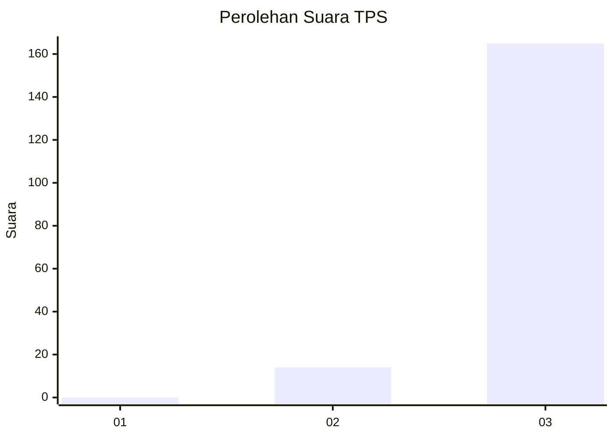
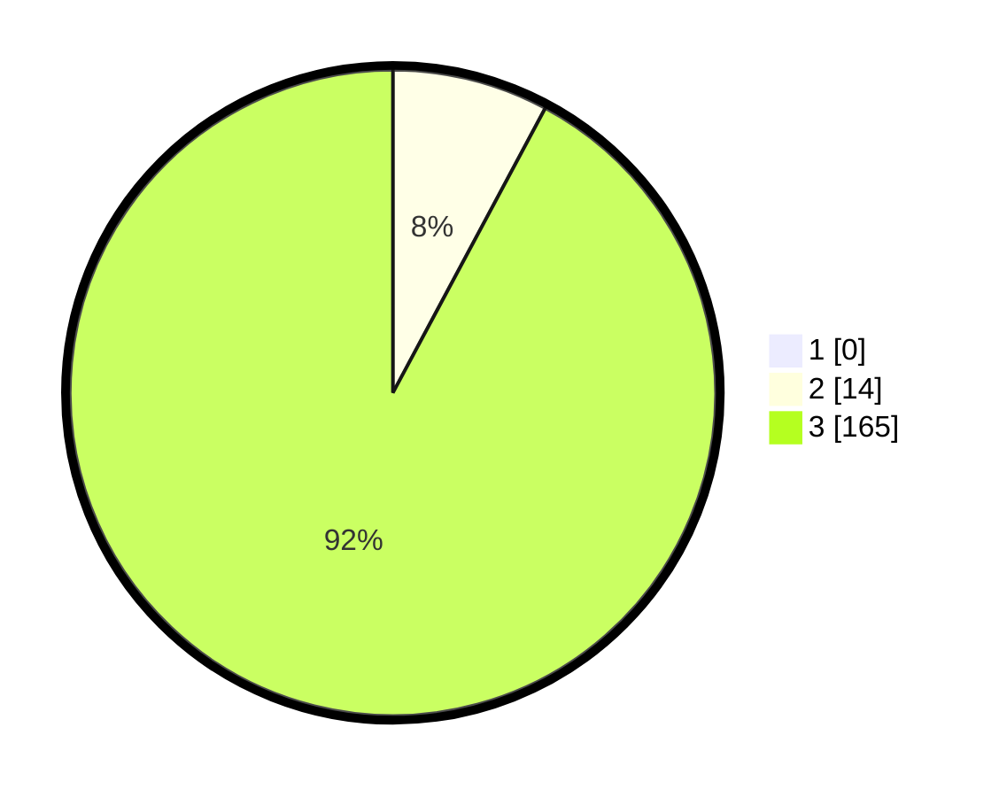

# Hasil

## Grafik

## Tabel

| No. | Nama Paslon    | Suara | Suara (raw) | Persentase |
|:--- |:-------------- | -----:| -----------:| ----------:|
| 1   | ANIES MUHAIMIN | 0     | [0][p-1]    | 0,00       |
| 2   | PRABOWO GIBRAN | 14    | [14][p-2]   | 7,82       |
| 3   | GANJAR MAHFUD  | 165   | [165][p-3]  | 92,18      |

[p-1]: https://github.com/gigit-pemilu/pemilu-2024-51-bali/blob/main/pilpres/hitung-suara/sub/51-bali/sub/04-gianyar/sub/07-payangan/sub/2008-buahan-kaja/sub/013-tps/sub/paslon-1.txt
[p-2]: https://github.com/gigit-pemilu/pemilu-2024-51-bali/blob/main/pilpres/hitung-suara/sub/51-bali/sub/04-gianyar/sub/07-payangan/sub/2008-buahan-kaja/sub/013-tps/sub/paslon-2.txt
[p-3]: https://github.com/gigit-pemilu/pemilu-2024-51-bali/blob/main/pilpres/hitung-suara/sub/51-bali/sub/04-gianyar/sub/07-payangan/sub/2008-buahan-kaja/sub/013-tps/sub/paslon-3.txt

## Foto C Plano

https://sirekap-obj-formc.kpu.go.id/c867/pemilu/ppwp/51/04/07/20/08/5104072008013-20240214-130643--d499a28e-a42a-4090-9ea0-1feaf9d0225f.jpg

https://sirekap-obj-formc.kpu.go.id/c867/pemilu/ppwp/51/04/07/20/08/5104072008013-20240214-130744--904ad1ef-fed2-47b7-8099-125b2c65705f.jpg

https://sirekap-obj-formc.kpu.go.id/c867/pemilu/ppwp/51/04/07/20/08/5104072008013-20240214-130844--1ff71a12-e7c6-4824-a183-780c94f54676.jpg

## Metadata

| Key        | Value               |
| ---------- | ------------------- |
| Time Stamp | 2024-02-15 12:00:28 |

