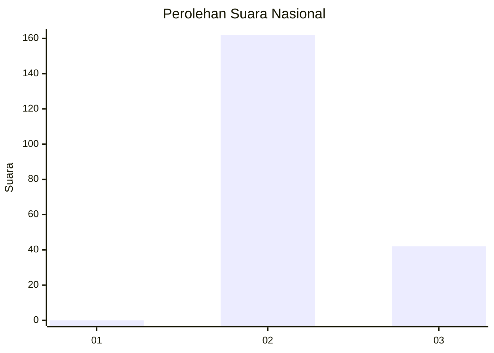
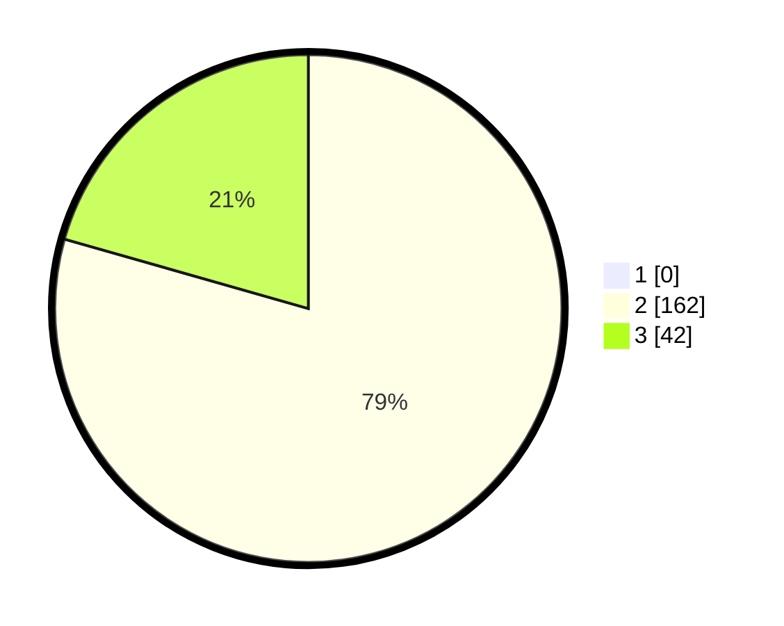

# Hasil

## Grafik

## Tabel

| No. | Nama Paslon    | Suara | Suara (raw) | Persentase |
|:--- |:-------------- | -----:| -----------:| ----------:|
| 1   | ANIES MUHAIMIN | 0     | [0][p-1]    | 0,00       |
| 2   | PRABOWO GIBRAN | 162   | [162][p-2]  | 79,41      |
| 3   | GANJAR MAHFUD  | 42    | [42][p-3]   | 20,59      |

[p-1]: https://github.com/gigit-pemilu/pemilu-2024/blob/main/pilpres/hitung-suara/sub/51-bali/sub/05-klungkung/sub/01-nusa-penida/sub/2001-sakti/sub/001-tps/sub/paslon-1.txt
[p-2]: https://github.com/gigit-pemilu/pemilu-2024/blob/main/pilpres/hitung-suara/sub/51-bali/sub/05-klungkung/sub/01-nusa-penida/sub/2001-sakti/sub/001-tps/sub/paslon-2.txt
[p-3]: https://github.com/gigit-pemilu/pemilu-2024/blob/main/pilpres/hitung-suara/sub/51-bali/sub/05-klungkung/sub/01-nusa-penida/sub/2001-sakti/sub/001-tps/sub/paslon-3.txt

## Foto C Plano

https://sirekap-obj-formc.kpu.go.id/3bc5/pemilu/ppwp/51/05/01/20/01/5105012001001-20240216-151029--d620b4fc-4cad-4588-ba8f-abd476ccecfa.jpg

https://sirekap-obj-formc.kpu.go.id/3bc5/pemilu/ppwp/51/05/01/20/01/5105012001001-20240216-151030--b3ac9484-cb27-4018-81b5-a20f256d3cbf.jpg

https://sirekap-obj-formc.kpu.go.id/3bc5/pemilu/ppwp/51/05/01/20/01/5105012001001-20240216-151030--a38c97dd-634e-4574-a9c6-ce78fb88e8db.jpg

## Metadata

| Key        | Value               |
| ---------- | ------------------- |
| Time Stamp | 2024-02-16 21:01:00 |

## DATA PEMILIH TETAP

Jumlah pemilih dalam DPT: **226**.
 * L: **108**.
 * P: **118**.

## DATA PENGGUNA HAK PILIH

Jumlah pengguna hak pilih dalam DPT: **194**.
 * L: **96**.
 * P: **98**.

Jumlah pengguna hak pilih dalam DPTb: **10**.
 * L: **5**.
 * P: **5**.

Jumlah pengguna hak pilih dalam DPK: **3**.
 * L: **2**.
 * P: **1**.

Jumlah pengguna hak pilih: **207**.
 * L: **103**.
 * P: **104**.

## JUMLAH SUARA SAH DAN TIDAK SAH

JUMLAH SELURUH SUARA SAH: **204**.

JUMLAH SUARA TIDAK SAH: **3**.

JUMLAH SELURUH SUARA SAH DAN SUARA TIDAK SAH: **207**.

